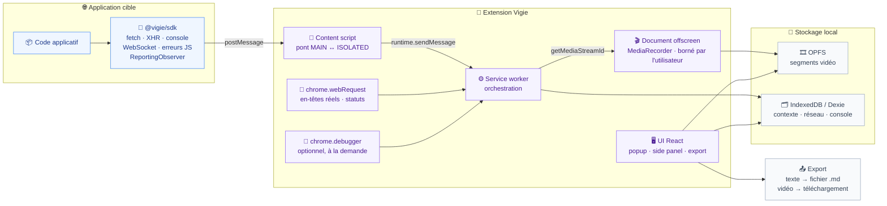

# INSTALL.md - `vigie`

Technical vision and installation guide.

## Vision

A Chrome extension that continuously captures the technical context of a browser session, producing a bug report that a developer or an AI can act on directly. Screen recording ships alongside it as a separate, user-driven action.

Vigie targets B2B product owners, QA engineers, and developers debugging their own applications. Its differentiator is the rewind: when a bug appears, up to the last hour of context is already captured — network traffic, console output, JS errors, and application state — with no prior action from the user. That capture runs only on the domains the user designated; everywhere else the extension observes nothing. An embeddable JS SDK lets the host application enrich the capture with business context (environment, user, page state, backend and library versions) that no browser API can infer.

The rewind covers text only. An unanticipated bug will never have video, because video requires an explicit start — that trade is deliberate, not a limitation to work around.

## Decisions

| Decision     | Choice                                                                   | Why                                                                                                                     |
| ------------ | ------------------------------------------------------------------------ | ----------------------------------------------------------------------------------------------------------------------- |
| Architecture | Modular monolith in a monorepo                                           | Extension and SDK share one TypeScript event contract. Two repos would turn that contract into a versioned npm artifact — the exact overhead a solo developer cannot absorb. |
| Front-end    | React 19 + Tailwind + shadcn/ui on WXT entrypoints                       | Team expertise (block 3). The extension UI is a set of small panels — popup, side panel, options — where the React ecosystem pays off immediately. |
| Back-end     | None. MV3 service worker (orchestration) + offscreen document (video)    | No server was chosen for the MVP (block 1). The service worker owns capture orchestration; the offscreen document owns the video pipeline, because MV3 service workers are terminated after ~30s idle. |
| Database     | IndexedDB via Dexie (context) + OPFS (video segments)                    | Everything stays local. Dexie handles structured, queryable context; OPFS handles binary video segments, which IndexedDB stores less efficiently. |
| Auth         | None                                                                     | No backend, no accounts, nothing to protect server-side.                                                                |
| Hosting      | Chrome Web Store (extension) · npm (SDK) · GitHub Pages (privacy policy) | ~0 EUR budget (block 3). The CWS requires a publicly hosted privacy policy; GitHub Pages covers it at no cost.          |

### Product constraints acted on

These are not stack choices, but they shaped the architecture and must not be silently reverted.

| Constraint                          | Decision                                                                                                 |
| ----------------------------------- | -------------------------------------------------------------------------------------------------------- |
| `chrome.tabCapture` requires a per-tab user gesture | Video is a user-bounded recording — start, stop, download — not a buffer. The gesture requirement is satisfied by the start button, so it stops being a constraint. The "always-on invisible recorder" is not achievable under Chrome's security model, and is not attempted. |
| Capture scope                       | Context capture runs **only on domains the user added** in the options. This bounds storage, consent disclosure, and the blast radius of a leaked export. The permission mechanism behind it — required host permissions versus optional ones requested per domain — is still open. |
| Export shape                        | One click, active tab only, over a window of 5, 15, 30, or 60 minutes. One hour is a hard ceiling. Everything inside the window ships unsorted; the user writes nothing. Text downloads as a Markdown file, video downloads separately. |
| First slice                         | Browser context only: `webRequest`, console, rolling storage, Markdown export. No SDK, no video, no CDP. Proves the report carries value before the expensive surfaces are built. |
| Capture strategy                    | Three layers: SDK (primary) + `chrome.webRequest` (observation) + `chrome.debugger` (opt-in via `optional_permissions`). Each covers the others' blind spots. |
| Redaction                           | **Deliberately out of scope for the MVP.** Raw export, accepted risk. Tracked as identified v2 debt.       |
| Video profile                       | 1080p / 24fps, exposed as a setting with a documented 720p fallback. To be measured before freezing.        |
| CWS disclosure                      | First-run consent screen listing screen video, raw network payloads, and console content. Mandated by the CWS policy update of 2026-08-01. |

## Stack summary

- **Front-end:** React 19, Tailwind CSS, shadcn/ui
- **Extension framework:** WXT (pin the exact version — 0.21.3 was current on 2026-08-06; the project is still pre-1.0)
- **Back-end:** none — MV3 service worker + `chrome.offscreen` document
- **Database:** Dexie over IndexedDB (context, network log, console log) · OPFS (video segments)
- **Auth:** none
- **Hosting:** Chrome Web Store · npm (`@vigie/sdk`) · GitHub Pages (privacy policy)
- **Monorepo:** pnpm workspaces + Turborepo
- **SDK bundling:** tsup
- **Tests:** Vitest (unit) + Playwright (e2e, loads the unpacked extension)
- **Key integrations:** none in the MVP

## Architecture



The boundary is the content script. The SDK runs in the page's `MAIN` world and has no access to `chrome.*` APIs — it emits via `postMessage`, and the content script relays to the service worker. The service worker concentrates all three capture sources but never writes video itself: it delegates to the offscreen document, the only context that survives service worker termination. Storage is split by nature — Dexie for queryable structured data, OPFS for binary segments.

## Folder structure

```
vigie/
├── apps/
│   └── extension/                       # the WXT extension
│       ├── src/
│       │   ├── entrypoints/             # WXT convention
│       │   │   ├── background.ts        # service worker: orchestration
│       │   │   ├── offscreen/           # video pipeline
│       │   │   │   ├── index.html
│       │   │   │   └── main.ts
│       │   │   ├── popup/               # export, record, capture status
│       │   │   ├── sidepanel/           # inspect captured context
│       │   │   ├── options/             # watched domains, settings, capture profile
│       │   │   ├── content.ts           # ISOLATED world bridge
│       │   │   └── injected.ts          # MAIN world, SDK receiver
│       │   ├── capture/
│       │   │   ├── video/               # MediaRecorder, segments, download
│       │   │   ├── network/             # webRequest listeners + extraHeaders
│       │   │   ├── cdp/                 # chrome.debugger, opt-in
│       │   │   └── sdk-bridge/          # SDK event ingestion
│       │   ├── storage/
│       │   │   ├── opfs.ts              # video segments for the running recording
│       │   │   └── db.ts                # Dexie schema
│       │   ├── export/
│       │   │   ├── bundle.ts            # report assembly
│       │   │   ├── markdown.ts          # AI-consumable format
│       │   │   ├── download.ts          # blob + anchor, no permission
│       │   │   └── filename.ts          # vigie-<domain>-<date>-<time>.md
│       │   ├── consent/                 # first-run consent screen, CWS requirement
│       │   ├── ui/                      # shared React components
│       │   └── shared/
│       │       └── chrome-apis.d.ts     # missing MV3 typings
│       ├── wxt.config.ts
│       └── package.json
├── packages/
│   ├── sdk/                             # @vigie/sdk, published to npm
│   │   ├── src/
│   │   │   ├── index.ts
│   │   │   ├── instrument/              # fetch, xhr, console, ws, beacon
│   │   │   ├── observers/               # ReportingObserver, Performance, errors
│   │   │   ├── context.ts               # application metadata
│   │   │   └── transport.ts             # postMessage to the content script
│   │   ├── tsup.config.ts
│   │   └── package.json
│   └── contract/                        # @vigie/contract, shared types
│       ├── src/
│       │   ├── events.ts
│       │   ├── report.ts
│       │   └── version.ts               # schemaVersion
│       └── package.json
├── e2e/                                 # Playwright, loads the extension
├── docs/
│   ├── privacy-policy.md                # published to GitHub Pages
│   └── sdk.md
├── aidd_docs/
│   └── INSTALL.md
├── turbo.json
├── pnpm-workspace.yaml
└── package.json
```

## Install steps

Manual install - the framework does not yet scaffold these automatically.

1. Initialise the monorepo: `pnpm init` at the root, add `pnpm-workspace.yaml` declaring `apps/*` and `packages/*`, add Turborepo, and make the first commit (the repo currently has none).
2. Scaffold the extension under `apps/extension` with the WXT React starter. **Pin the exact WXT version** in `package.json` — no version range, the project is pre-1.0.
3. Create `packages/contract` (shared event and report types, with a `schemaVersion` field) and `packages/sdk` (tsup build, ESM + CJS + `.d.ts` output). Wire both as workspace dependencies of the extension.
4. Declare the MV3 permissions in `wxt.config.ts`: `tabCapture`, `offscreen`, `storage`, `webRequest` as required permissions; `debugger` under `optional_permissions` so it is requested on demand, never at install time. **Host permissions are still open**: capture is scoped to user-designated domains, so requesting them per domain through `optional_host_permissions` fits the model better than a blanket install-time grant — verify that `webRequest` behaves as expected under an optional grant before committing.
5. Set up the test harness: Vitest for units, Playwright configured to load the unpacked build (`--load-extension`), plus a `turbo.json` pipeline covering `build`, `test`, and `lint`.
6. Register the Chrome Web Store developer account (one-off USD 5 fee) and publish `docs/privacy-policy.md` to GitHub Pages — the CWS requires a publicly reachable privacy policy URL before submission.
7. Run two measurement spikes before freezing anything. **Context:** one hour of network and console capture on a busy application, sized in IndexedDB — this is the store that runs permanently, so it decides whether the one-hour ceiling is livable. **Video:** a 1080p/24fps `MediaRecorder` on a long recording, tracking CPU, RAM, and disk, since nothing forces the user to press stop. Fall back to 720p if the numbers do not hold.

## Audit summary

Results of the multi-agent audit run during action 03:

| Candidate                      | Verdict | Notes                                                                                                                     |
| ------------------------------ | ------- | --------------------------------------------------------------------------------------------------------------------------- |
| **A - WXT + monorepo**         | ⚠️      | Proven combination with production prior art (`mohsen1/session-recorder-chrome-extension`). WXT active (10.3k stars, ~554k weekly downloads, daily commits) but still pre-1.0 two years after announcing an imminent 1.0. **Selected.** |
| B - Plasmo + separate repos    | ⚠️      | Effectively abandoned: last real commit on `main` 2025-05-17, last release the same day, 371 open issues, no PR merged in 2026, both founders gone (issue #1345). 70 unfixable npm vulnerabilities. **Eliminated.** |
| C - Vite + CRXJS + WebCodecs   | ⚠️      | CRXJS active again (v2.7.1, 2026-07) after nearly being archived, but `mp4-muxer` and `webm-muxer` were deprecated by their own author in 2025-07 in favour of the much younger `mediabunny`. Several extra weeks of low-level work for no MVP gain. |

### Known risks and mitigations

| Risk                                                                | Mitigation                                                                                                             |
| ------------------------------------------------------------------- | ------------------------------------------------------------------------------------------------------------------------ |
| WXT still pre-1.0                                                   | Pin the exact version. WXT is a build layer only — migrating to Vite + CRXJS would preserve the business code.            |
| TypeScript typings lag behind `offscreen` and `debugger`            | Declare the missing surfaces in `src/shared/chrome-apis.d.ts`, as the official WXT example does.                          |
| `chrome.debugger` shows a non-dismissable banner and is ejected the moment DevTools opens on the tab (`canceled_by_user`) | Opt-in only. The SDK and `webRequest` remain the default path. Surface the DevTools conflict explicitly in the UI.        |
| OPFS is not covered by `unlimitedStorage` — silent eviction possible | Request `navigator.storage.persist()` at first run. A recording has no upper bound, so a long one can be evicted mid-capture: surface the failure to the user rather than losing it quietly. |
| One hour of context in IndexedDB has never been sized              | Measurement spike before freezing the ceiling (install step 7). Prune on write, never on a timer.                          |
| A 1080p/24fps encode on an unbounded recording has never been benchmarked | Measurement spike before freezing (install step 7), documented 720p fallback.                                        |
| Nothing outside a watched domain must ever reach disk               | The scope filter belongs at the write path, not at export time. Covered by a mandatory unit test — it is the product's own privacy claim. |
| CWS policy tightened on 2026-08-01: prominent disclosure of all collected data | First-run consent screen, not just a privacy policy link. List screen video, raw network payloads, and console content explicitly. |
| Raw export with no redaction                                        | **Accepted risk**, deliberate MVP choice. Tracked as identified v2 debt, to revisit before any regulated-industry customer. |

### Capability matrix behind the three-layer capture strategy

Verified during the audit. Explains why no single mechanism is sufficient.

| Data                                                        | SDK                          | `webRequest`         | CDP  |
| ----------------------------------------------------------- | ---------------------------- | -------------------- | ---- |
| URL, method, HTTP status                                    | ✅                           | ✅                   | ✅   |
| Real request headers (Cookie, User-Agent, Origin, Sec-*)    | ❌ forbidden header names    | ✅ with `extraHeaders` | ✅ |
| Response headers                                            | ⚠️ 7 cross-origin, never `Set-Cookie` | ✅ incl. `Set-Cookie` | ✅ |
| Request body                                                | ✅                           | ⚠️ no streams        | ✅   |
| Response body                                               | ✅ app `fetch`/XHR only      | ❌ never             | ✅   |
| Requests before the SDK loads                               | ⚠️ timing only, retroactive  | ✅                   | ✅   |
| Static resources (images, CSS, fonts)                       | ❌                           | ✅                   | ✅   |
| Application console logs                                    | ✅                           | ❌                   | ✅   |
| Browser-generated console messages (CORS, CSP, mixed content, failed loads) | ❌ never       | ❌                   | ✅ `Log.entryAdded` |
| Uncaught JS errors                                          | ✅                           | ❌                   | ✅   |
| CSP violations, deprecations                                | ✅ via `ReportingObserver`   | ❌                   | ✅   |
| WebSocket frames                                            | ✅                           | ⚠️ handshake only    | ✅   |
