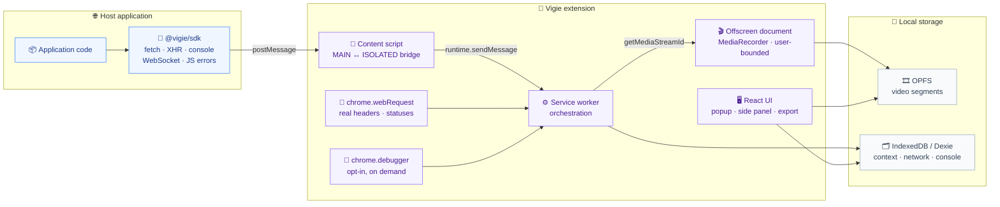

# Architecture

The macro technical shape: the stack, how the pieces fit, and the decisions behind them. Point to the code, do not restate it.

> **State:** the repository is not scaffolded yet — every path below is the target layout from `aidd_docs/INSTALL.md`, not a file on disk. The decisions are settled; the code is not written.

## Stack

- TypeScript throughout, on a pnpm workspaces monorepo driven by Turborepo. One repository so the SDK and the extension share a single event contract instead of a versioned npm artifact between them.
- WXT as the extension build layer (Manifest V3). Version pinned exactly in `apps/extension/package.json` — WXT is still pre-1.0.
- React with Tailwind and shadcn/ui for every extension surface. See `design.md`.
- No backend, no auth. Runtime is the browser only.
- Storage is split by nature: Dexie over IndexedDB for structured context, OPFS for binary video segments. See `database.md`.

## How it fits together

## Key decisions

- **The content script is the boundary.** The SDK runs in the page's `MAIN` world and has no access to `chrome.*`. It emits through `postMessage`; the content script relays to the service worker. Nothing else crosses.
- **The service worker never writes video.** MV3 terminates it after roughly 30 seconds idle, which would cut the recording. It orchestrates and hands the stream to the offscreen document, the only context that survives its termination.
- **Three capture layers, not one.** The SDK is the primary source, `chrome.webRequest` observes what the SDK cannot see, `chrome.debugger` fills the rest and stays opt-in. The full per-data-point capability matrix is in `aidd_docs/INSTALL.md` — do not duplicate it here.
- **Capture is scoped to watched domains.** Context capture runs only on the domains the user added in the options. This bounds what is stored, what the consent screen has to disclose, and what a leaked export could contain. The permission mechanism behind it — required host permissions versus optional ones requested when a domain is added — is not decided yet.
- **Video and context are two independent pipelines.** Context capture is continuous and produces the export. Video is a user-bounded recording: start, stop, download. There is no rolling video window, and a recording is never attached to an export. `chrome.tabCapture` still needs a user gesture, which the explicit start button satisfies naturally.
- **The CDP layer is user-bounded, like video.** A permanent `chrome.debugger` session is technically viable but puts a banner on every tab for as long as the extension is installed, with no way for the user to dismiss it. Attaching on an explicit start and detaching on stop makes the banner say something true and finite — see `aidd_docs/backlog/spikes/cdp-optin-usability.md`.
- **The CDP session follows the watched domains, not one tab.** Every watched tab is attached — those already open when the session starts and those entering the perimeter afterwards — and detached when it leaves. Attaching more costs nothing: six serial attaches complete in under 10 ms, and no renderer overhead is distinguishable from noise at one, three or six sessions. A tab opened mid-session is blind for 82 ms between `tabs.onCreated` and a usable `Network.enable`, which costs the navigation document's body and the first XHR's — never their entries, since `webRequest` keeps ownership of every request CDP never announced. No policy closes that window: the tab is born after the session starts. Closing an attached tab raises `target_closed` on that session alone and the others keep producing, unlike `canceled_by_user` which detaches all. The attachment policy does not bound what is stored — the URL filter does, and a tab stays attached for roughly 60 ms after leaving the perimeter. Measured, see `aidd_docs/backlog/spikes/cdp-attachment-scope.md`.
- **Response bodies are filtered, truncated at 256 kB, and read on the spot.** The filter is what keeps the one-hour window affordable — not a relevance call. A dense business SPA produces 6.9 GB/h of decoded bodies unfiltered against 224 MB/h once filtered and truncated, a factor of 31 against the 10.7 GB quota already granted without `unlimitedStorage`, so that permission is not declared. Bodies are read for `XHR`, `Fetch`, `Document`, `Manifest`, `EventSource` and `WebSocket`; the other thirteen resource types keep metadata only. Script and Stylesheet alone are 95 % of the body volume and say nothing about an incident, and `Preflight` and `Ping` have no body at all — every read on them fails. 256 kB leaves 98.4 % of JSON bodies whole, and every truncated remainder still closes at least one complete top-level element. `getResponseBody` must be called inside the `Network.loadingFinished` handler whenever that event comes; queueing, batching, or resuming after a service worker restart loses every body. What the call actually races is the page navigating, not the call stack — a deferred read at t+10 s on a still-live page returned all 6 bodies whole — but nothing else is worth relying on, since navigation is not announced in advance. Measured, see `aidd_docs/backlog/spikes/cdp-body-capture-calibration.md` and `cdp-response-body-storage-cost.md`.
- **An entry is its headers, and the one-hour window fits with a factor of 19 to 28 — not the two orders of magnitude previously assumed.** A network entry weighs 1.9 kB stored under browser-default headers and 3.9 kB once an application adds its own — `Bearer` token, session cookie, correlation id, quota and cache headers. Request headers alone are 55 to 57 % of it and both header sets together 75 to 86 %; everything else — method, domain, timestamp, ids, resource type, outcome, status, duration — fits under 250 bytes combined. IndexedDB adds a flat 645 bytes per record whatever its size, which is why the weight was measured through `navigator.storage.estimate()` rather than estimated from string lengths. At 84 000 network entries per hour that is 160 to 328 MB/h, on top of the 224 MB/h of bodies, against the 10.7 GB quota. So the window holds as it is, no field is dropped at the write path, and the two contract fields cost 42 bytes an entry — 1.3 % — without reopening the question. If the margin ever shrinks, the only lever that returns anything is a request-header allowlist. Measured, see `aidd_docs/backlog/spikes/store-entry-overhead.md`.
- **The calibrated layer ships with no throttle, and the cost is in the transport rather than in the code.** One attached tab costs 1.97 % of a core, six cost 9.3 %, and the tab the user is looking at loses neither a frame nor a request — its ttfb median takes 0.23 ms on a local server with no network latency, the regime where the relative gap is as large as it can get, and the figure holds under a saturated CPU. So none of the four levers considered — write batching, a rate cap, sampling, a narrower filter — is worth arming. If one ever becomes necessary it is none of those: synchronous time spent in the handlers is 3.3 % of the CPU the capture adds, and the rest lands on the browser process arbitrating the `debugger` event stream. The only lever that would move the number is filtering before the event crosses the IPC boundary; optimising the write path would target the part that weighs nothing. Hidden tabs pay what the visible one is spared — their p95 total is multiplied by 2.6 and three requests in a thousand stop completing. Measured, see `aidd_docs/backlog/spikes/cdp-capture-loop-cost.md`.
- **While attached, CDP replaces `webRequest` on that tab — it does not merge with it.** The two layers number the same request with two independent generators, so no shared key exists and any correlation is a heuristic. Measured, the heuristic works: pairing on `method + URL` in arrival order scored 147 correct out of 147 against a ground-truth header, including twenty concurrent requests to one identical URL. It is still not worth building. It needs a 1000 ms hold before every write, it says nothing about the requests only one layer sees, and on the attached tab `webRequest`'s exclusive requests are network-stack artifacts that make a report harder to read, not richer. So: the CDP layer owns every entry whose tab is attached, `webRequest` owns everything else — other tabs, and the 21 tab-less requests a page's service worker emits. No correlation key, no shared buffer, `RequestAssembler` untouched. What this does need is a provenance field per entry, and `requestId` documented as the producing layer's own id rather than `webRequest`'s — see `aidd_docs/backlog/spikes/cdp-webrequest-deduplication.md`.
- **Ownership is decided per request at its terminal event, not per tab at the attach instant.** `webRequest` observes everything, attached tab included, and holds an in-memory record for each in-flight request; nothing is suppressed at capture time. CDP owns a request only if it saw that request's `requestWillBeSent` during the session, and every `requestId` it never announced is discarded whole. The terminal event that triggers the write is the request's, whichever layer observes it — in practice `webRequest`'s, the only layer that never goes silent. At that event the CDP record is written if and only if CDP owns the request and the session is still live; otherwise the `webRequest` record is. A detach — whatever caused it — hands every request CDP had started back to `webRequest`. This yields exactly one entry per request at both boundaries, and needs no shared key: an announced-id set on the CDP side, a session mark per tab on the `webRequest` side. The trigger runs ahead of the record it has to read: `webRequest`'s terminal event precedes CDP's announcement of the same response for 98 % of requests, by 42.6 ms on average, so an immediate lookup at that instant finds nothing 294 times out of 299 while a 50 ms rung resolves nearly all of them. The write path therefore holds a queue, not a lookup. Measured, see `aidd_docs/backlog/spikes/cdp-session-boundaries.md`, `cdp-terminal-event-gap.md` and `cdp-capture-loop-cost.md`.
- **A response the page never reads gets no terminal CDP event at all — which is why the write is triggered by `webRequest`'s.** `ResourceLoader::DidFinishLoading` defers itself while `!has_seen_end_of_body_`, and `fetch()` drains its body as a `BytesConsumer`, so only the JavaScript consumer can pump the stream. A `Response` held without being read, a `body` never drained, and an ignored `fetch()` promise each get `responseReceived` and nothing more — 6 of 16 bench scenarios, at 1 kB as at 512 kB, with and without `enableDurableMessages`, the silence surviving 30 s and the document's destruction. An explicit abort is not affected: `AbortController` and `body.cancel()` both produce `loadingFailed`, and XHR always buffers, so it always concludes. `webRequest` reported `onCompleted` 200 on all six, which is the signal to write the entry on — and not the signal to read the body on. Those are two different signals: a body exists for `getResponseBody` only once `Network.loadingFinished` has been emitted, and it then stays readable as long as the page lives. Across 3 400 requests in eight runs, 330 reads out of 333 succeeded when that event had already arrived, none of 3 053 succeeded when it never came — every one of those carrying a complete `dataReceived`, so byte arrival is not what makes a body readable — and none of 8 on `loadingFailed`. A request CDP owns without concluding therefore keeps its entry and has no body, at any instant, and no guard delay changes that: waiting has nothing to make arrive. The earlier claim that the body was still reachable at `webRequest`'s signal does not reproduce, see `aidd_docs/backlog/spikes/cdp-body-read-timing.md`. Never observed on real traffic — 0 of 296 XHR and Fetch responses across four business applications — but it is an application code pattern, not a browser behaviour, so its frequency belongs to whoever wrote the page. Measured, see `aidd_docs/backlog/spikes/cdp-terminal-event-gap.md`.
- **A request that straddles a session boundary has no response body, and cannot be made to have one.** Attaching does not replay in-flight requests: they surface as orphan CDP events with no `requestWillBeSent`, sometimes with no URL at all when the response headers arrived first — a dripped body or an open SSE stream produces `dataReceived` and nothing else. `getResponseBody` fails on every one of them with `No resource with given identifier found`, including those whose URL is known, because the resource buffer only holds requests announced during the session. The boundary therefore costs bodies, not entries: coverage stays complete because `webRequest` never stops. Detaching is equally abrupt — zero CDP events after the call, no `loadingFailed`, no notice.
- **Recovering from a service worker death is a boot path, not a mechanism.** Chrome restarts the worker on the first event it has a listener for and `webRequest` traffic is enough to trigger it, so nothing has to provoke the revival — it happens. What a CDP layer owns is three gestures at boot: re-read the persisted state, re-attach the tabs it lists, refuse to do so if the cancellation mark is set. `chrome.storage.session` is a sufficient medium — it survives every death that has a revival and hands the in-flight `requestId → url` map back intact, 449 bytes for one tab and six in-flight requests — and a medium surviving a browser restart would have no purpose, since a restart closes every tab and leaves no in-flight request to re-attribute. The cost differs per death: a worker stop loses 0 entries and 6 bodies across a 296 ms outage, a crash 6 entries and 12 bodies across roughly 8.5 seconds, and an extension update loses everything because the worker never restarts at all. Bodies always outnumber entries, because a request that starts during the outage and ends after it has its entry recovered by `webRequest` and never its body by CDP. Measured, see `aidd_docs/backlog/spikes/cdp-service-worker-recovery.md`.
- **The capture resumes by itself and says so; the user is never asked to restart it.** Every death that revives already re-attaches at boot, so the only case that needed a decision is the extension update, and the decision is that it behaves like the others: at the next boot, whatever causes it, the worker re-reads the persisted state, re-attaches the tabs it lists and surfaces one message saying the extension was updated and the capture interrupted. No button, no confirmation, nothing to click — `chrome.debugger.attach` reopens its banner without asking for consent again, so the resume costs the user nothing. The single thing a user could be forced to do is accept a new permission — "when a new permission that triggers a warning is added, the extension will be disabled until the user accepts the new permission", per Chrome's permission-warnings guide — so the answer is to add capabilities through `optional_permissions` and `optional_host_permissions`, granted at runtime, rather than to handle the case. Growing the required `permissions` array of a published version is what must not happen — and the rule has a hole the `debugger` case measured: Chrome refuses some permissions as optional, silently, so a capability has to be _tested_ under `optional_permissions` before a version ships assuming it. What is still unmeasured is whether a published update boots the worker at all — see the `chrome.runtime.reload()` gotcha.
- **An export is a slice of one tab.** Scope is the active tab over a window of 5, 15, 30, or 60 minutes, capped at one hour. Everything inside that window is exported unsorted; the user adds nothing.
- **Monorepo over two repositories.** The shared event contract would otherwise become a versioned npm package to publish on every change — overhead a solo developer cannot absorb.
- **The interface is translated by a catalog of our own, the manifest by `_locales`, and the two never meet.** The four surfaces read a React catalog keyed on the user's stored choice, because the language is a product preference and has to change under a running capture without a reload. The extension's name and description come from `public/_locales/`, because a store listing has no other way to be localised. They are two mechanisms because they answer to two different owners — the user for one, the browser for the other — and the price is stated rather than papered over: a browser in English with Vigie set to French shows a French interface and an English description in `chrome://extensions`. The report stays English whatever the interface says (`prd.md:55`), so what pairs a French panel term with its report field is the glossary, not the surface.
- **`chrome.debugger` is a required permission, because Chrome grants it no other way.** It shipped under `optional_permissions` until the request was made inside a real click: Chromium 151.0.7922.34 answers `Only permissions specified in the manifest may be requested`, `permissions.getAll()` never lists it, and a control permission declared in the same array (`downloads`) opens its bubble on the same click. The key is dropped at load while `runtime.getManifest()` goes on reporting it, so nothing signals the gap — the popup's Start button simply did nothing. The earlier measurement that let the optional declaration stand asked without a user gesture and never reached the manifest check. The install-time warning is therefore paid by every user, and what the popup arms is the session, not the permission.

## Gotchas

- Opening DevTools on an attached tab does not eject `chrome.debugger`: the two coexist in either order of arrival. `canceled_by_user` is the banner's Cancel button, not DevTools — measured, see `aidd_docs/backlog/spikes/cdp-optin-usability.md`.
- `chrome.debugger` shows one banner per extension on every tab while attached, including tabs unrelated to capture. Its Cancel button detaches all of that extension's sessions at once, but Chrome keeps no memory of the refusal: an extension that re-attaches brings the banner back within a second. Only a policy-installed extension is exempt. Never re-attach after a `canceled_by_user` — treat it as the user stopping the capture.
- An attached `chrome.debugger` session keeps the service worker alive past the 30-second idle timeout, from Chrome 118 on. A CDP layer therefore needs no re-attach machinery in normal operation, and attaching needs no user gesture — measured, see `aidd_docs/backlog/spikes/cdp-mv3-feasibility.md`. The shipped manifest still declares `minimum_chrome_version: 114`, which predates that behaviour.
- `chrome.debugger.onDetach` never fires for a service worker death, and never for a detach the extension initiates itself. Zero emissions across six provoked deaths — crash, worker stop, `chrome.runtime.reload()`, user refusal, refusal followed by a crash, and a crash with `enableDurableMessages`. It is not a degraded death signal, it is silent, so the layer can only learn it was detached by observing it at the next boot, which makes the persisted state the single source of truth. A refusal written to `chrome.storage.session` does survive and does hold: it blocked two consecutive re-attach attempts in the generation that came back from the crash. `enableDurableMessages` changes nothing here — it rescues a body across a cross-process navigation, not across the death of the CDP client, where it left the loss identical on all five buckets. Measured, see `aidd_docs/backlog/spikes/cdp-service-worker-recovery.md`.
- `chrome.runtime.reload()` leaves the extension enabled but never restarts its service worker. The `chrome-extension://` origin still serves `manifest.json` while `Target.getTargets` lists no service worker, and neither ongoing `webRequest` traffic nor a fresh navigation on a watched tab wakes it within 60 seconds — 57 requests crossed the outage with nothing recorded by either layer. Registering `chrome.runtime.onInstalled` does not change it either: the listener fires once at install and never after the reload, which rules out an emptied listener registry as the explanation. An extension update therefore kills a running capture, and nothing inside the extension can resume it before something else boots the worker. Measured on an extension loaded through `--load-extension`, not installed from the Web Store, so the load path may carry the behaviour — a published update fires `onInstalled` with `reason: "update"`, which would boot a worker, and that path has not been measured. Until it is, the resume after an update is only guaranteed at the next browser start. See `aidd_docs/backlog/spikes/cdp-service-worker-recovery.md`.
- `chrome.i18n` resolves once, at load, against the browser's UI language, and accepts no override afterwards — there is no `setLocale`, and re-reading a message returns what it returned the first time. That is why it carries the manifest and nothing else: an interface built on it could not follow a language the user picks in the settings. The trap is that it looks like it would work, so anyone reaching for `_locales` to translate a surface pays the whole analysis again. Two measurements bound what a test can claim about it on macOS. `--lang`, `LANG`, `LANGUAGE` and `LC_ALL` all leave `getUILanguage()` at `en-US`, so no automated run here can put the browser in French — the shipped listing's French rendering belongs to the manual recipe. And `runtime.getManifest()` returns the _resolved_ name and description, never the `__MSG_*` placeholder the built file holds, so it is not the instrument for checking that the placeholders were written. The fallback chain is measurable and was measured: an announced locale with no directory of its own falls through to `default_locale`, and a message absent from the resolved locale is filled from `default_locale` per message rather than per file.
- Chrome's own typings lag behind `offscreen` and `debugger`. Missing surfaces are declared in `apps/extension/src/shared/chrome-apis.d.ts`.
- Response bodies are reachable through the SDK (application `fetch`/XHR only) and CDP, never through `webRequest`. A missing body is expected, not a bug, and it has three distinct causes: CDP evicts what exceeds `maxResourceBufferSize`; it drops everything the moment the page navigates — true at default parameters only, since `enableDurableMessages` makes a deferred read after a cross-process navigation succeed 60 times out of 60 against 1 out of 60 without it; it never had a body for a request that was already in flight when the session opened; and an out-of-process iframe is invisible to a `tabId` session, which is attached to the main frame's host and not to the tab's content. That fourth gap is total, not partial: on a cross-site iframe under `--site-per-process`, `webRequest` reported all 5 of its requests against the same tab and CDP reported none. `Target.setAutoAttach` with `flatten` is the only way in and stays deliberately out of the architecture — one OOPIF across four business applications, a video embed whose resource types the body filter already excludes. The entry still exists either way, since `webRequest` owns what CDP never announced; only the body is missing. Eviction never costs an applicative body in practice: reading inside `Network.loadingFinished` precedes it, measured at zero failures on 7 395 XHR and Fetch responses at both default and reduced buffer sizes. `getResponseBody`'s two failure messages differ, but only one of them is diagnostic. `No resource with given identifier found` is the orphan — a request the session never announced, nothing to be done. `No data found for resource with given identifier` covers three states it does not separate: a request CDP will never conclude, one concluded as `loadingFailed`, and the sub-millisecond race before `loadingFinished`. It must not be read as "still in flight, come back later" — no delay ever resolved it, at any rung of a ladder reaching 17.6 s. What the capture layer reads apart is the presence of `Network.loadingFinished`, which is also where the read belongs; the message says nothing the event has not already said — see `aidd_docs/backlog/spikes/cdp-body-read-timing.md`.
- `webRequest` reports one request twice when the renderer restarts it. A cache-only probe that ends in `net::ERR_CACHE_MISS`, or a navigation that ends in `net::ERR_ABORTED`, is immediately retried under a **new** `requestId` and succeeds. The report therefore shows a phantom failure followed by the real request, where the page made one. CDP reports one request. Measured at 6 occurrences out of 366 on one browsing tour — see `aidd_docs/backlog/spikes/cdp-webrequest-deduplication.md`.
- A CDP `RequestId` is `<renderer process id>.<counter>` for a subresource and the 32-hex `loaderId` for a document's main resource. The counter restarts on every renderer process swap, so the string is unique only within one process and one session. It is not a stable store key.
- A cross-origin navigation does not break the session: the target stays attached and no re-attach is needed. It does behave like a detach for the requests the destroyed renderer had open — no terminal CDP event, no body, while `webRequest` closes them as `error`.
- Enabling the CDP `Network` domain makes the watched tab's renderer retain memory the tab does not use, and that cost lands on the user's tab rather than on our storage. Read on the process, not deduced: at default sizes the attached renderer's RSS grows by 605 MB for 200 MB transferred and by 174 MB for 50 MB, while an identical page with no debugger attached grows not at all. At `maxTotalBufferSize` 10 MB and `maxResourceBufferSize` 2 MB nothing measurable grows, at 50, 200 or 400 MB transferred, for the same zero read failures. That zero-overhead reading holds at N sessions, not just one: attached against not attached, renderer RSS grew by +20, +30 and −18 MB per tab at one, three and six attached tabs, the sign inverting at the third point. Always pass explicit sizes to `Network.enable` — see `aidd_docs/backlog/spikes/cdp-body-capture-calibration.md` and `cdp-attachment-scope.md`.
- `Network.enable` takes five parameters, not two: `maxPostDataSize` and an experimental `enableDurableMessages` sit alongside the two buffer sizes. `enableDurableMessages` is rejected on its own with `maxTotalBufferSize is required with enableDurableMessages` (-32602), which the CDP reference does not mention. A rejected `Network.enable` also leaves the session attached, so retrying the attach only reports being already attached to oneself.
- The context store is a rolling one-hour window; the video store is bounded by the user stopping the recording. Neither is an archive, and OPFS can be evicted silently — see `database.md`.
- The consent screen is a Chrome Web Store requirement, not a UX choice — see `deployment.md`.

## Open measurement

- How many console lines an hour of real browsing produces. A console entry weighs 856 bytes stored under light traffic and 1.2 kB under dense traffic, but no tour has ever counted them, so the console's share of the hourly total is the last unknown in the window's sizing. See `aidd_docs/backlog/spikes/store-entry-overhead.md`.
- A 1080p/24fps `MediaRecorder` has never been benchmarked on a long recording. Nothing forces the user to stop, so an unattended recording can run for hours. The profile is exposed as a setting with a documented 720p fallback, and must be measured (CPU, RAM, disk) before being frozen.
