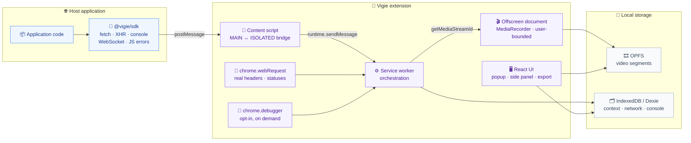

# Architecture

The macro technical shape: the stack, how the pieces fit, and the decisions behind them. Point to the code, do not restate it.

> **State:** the repository is not scaffolded yet — every path below is the target layout from `aidd_docs/INSTALL.md`, not a file on disk. The decisions are settled; the code is not written.

## Stack

- TypeScript throughout, on a pnpm workspaces monorepo driven by Turborepo. One repository so the SDK and the extension share a single event contract instead of a versioned npm artifact between them.
- WXT as the extension build layer (Manifest V3). Version pinned exactly in `apps/extension/package.json` — WXT is still pre-1.0.
- React with Tailwind and shadcn/ui for every extension surface. See `design.md`.
- No backend, no auth. Runtime is the browser only.
- Storage is split by nature: Dexie over IndexedDB for structured context, OPFS for binary video segments. See `database.md`.

## How it fits together

## Key decisions

- **The content script is the boundary.** The SDK runs in the page's `MAIN` world and has no access to `chrome.*`. It emits through `postMessage`; the content script relays to the service worker. Nothing else crosses.
- **The service worker never writes video.** MV3 terminates it after roughly 30 seconds idle, which would cut the recording. It orchestrates and hands the stream to the offscreen document, the only context that survives its termination.
- **Three capture layers, not one.** The SDK is the primary source, `chrome.webRequest` observes what the SDK cannot see, `chrome.debugger` fills the rest and stays opt-in. The full per-data-point capability matrix is in `aidd_docs/INSTALL.md` — do not duplicate it here.
- **Capture is scoped to watched domains.** Context capture runs only on the domains the user added in the options. This bounds what is stored, what the consent screen has to disclose, and what a leaked export could contain. The permission mechanism behind it — required host permissions versus optional ones requested when a domain is added — is not decided yet.
- **Video and context are two independent pipelines.** Context capture is continuous and produces the export. Video is a user-bounded recording: start, stop, download. There is no rolling video window, and a recording is never attached to an export. `chrome.tabCapture` still needs a user gesture, which the explicit start button satisfies naturally.
- **An export is a slice of one tab.** Scope is the active tab over a window of 5, 15, 30, or 60 minutes, capped at one hour. Everything inside that window is exported unsorted; the user adds nothing.
- **Monorepo over two repositories.** The shared event contract would otherwise become a versioned npm package to publish on every change — overhead a solo developer cannot absorb.
- **`chrome.debugger` under `optional_permissions`.** Requested at use time so install-time consent stays narrow.

## Gotchas

- Opening DevTools on a tab ejects `chrome.debugger` with `canceled_by_user`. The two cannot coexist. Surface the conflict in the UI rather than retrying.
- `chrome.debugger` shows a non-dismissable browser banner while attached. It is visible to the user by design and cannot be hidden.
- Chrome's own typings lag behind `offscreen` and `debugger`. Missing surfaces are declared in `apps/extension/src/shared/chrome-apis.d.ts`.
- Response bodies are reachable through the SDK (application `fetch`/XHR only) and CDP, never through `webRequest`. A missing body is expected, not a bug.
- The context store is a rolling one-hour window; the video store is bounded by the user stopping the recording. Neither is an archive, and OPFS can be evicted silently — see `database.md`.
- The consent screen is a Chrome Web Store requirement, not a UX choice — see `deployment.md`.

## Open measurement

- One hour of network and console capture in IndexedDB has never been sized. It is the store that runs permanently, so it is the one that decides whether the product is livable. Measure it before freezing the one-hour ceiling.
- A 1080p/24fps `MediaRecorder` has never been benchmarked on a long recording. Nothing forces the user to stop, so an unattended recording can run for hours. The profile is exposed as a setting with a documented 720p fallback, and must be measured (CPU, RAM, disk) before being frozen.
