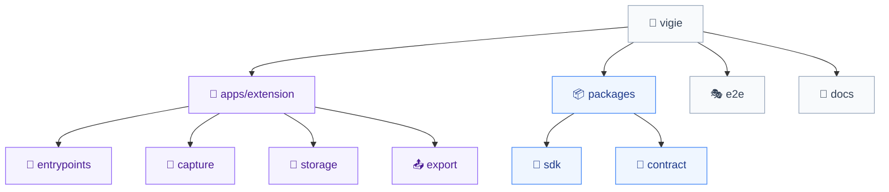

# Codebase Map

The macro layout: the top-level areas and what each holds. A map to navigate, not the full tree.

> **State:** the tree below is the target layout declared in `aidd_docs/INSTALL.md`. The repository is not scaffolded yet — nothing under `apps/` or `packages/` exists on disk. Refresh this file once the monorepo is initialised.

## Areas

- `apps/extension/src/entrypoints/`: the WXT convention directory. Every browser-registered surface starts here and nowhere else.
- `apps/extension/src/capture/`: one subdirectory per capture layer (`video/`, `network/`, `cdp/`, `sdk-bridge/`). Adding a source means adding a sibling, not branching inside an existing one.
- `apps/extension/src/storage/`: `db.ts` for the Dexie schema and the one-hour context pruning, `opfs.ts` for the segments of a running recording. The watched-domain filter sits on the write path here, so unwatched traffic never reaches disk. See `database.md`.
- `apps/extension/src/export/`: report assembly, the Markdown rendering an AI consumes, and the download that writes it to a file.
- `apps/extension/src/consent/`: the first-run consent screen. A Chrome Web Store requirement, not a UX nicety.
- `apps/extension/src/ui/`: shared React components across popup, side panel, and options.
- `apps/extension/src/shared/chrome-apis.d.ts`: local declarations for the MV3 surfaces Chrome's typings still miss.
- `e2e/`: Playwright, running against the unpacked build.
- `docs/`: `privacy-policy.md` (published to GitHub Pages) and `sdk.md`.

## Entry points

- `entrypoints/background.ts` — the service worker, orchestration only.
- `entrypoints/offscreen/` — the video pipeline, the only context that survives service worker termination.
- `entrypoints/content.ts` — `ISOLATED` world, the bridge to the service worker.
- `entrypoints/injected.ts` — `MAIN` world, receives SDK events.
- `entrypoints/popup/`, `sidepanel/`, `options/` — the three React surfaces.

## Packages

- `packages/contract` (`@vigie/contract`): the event and report types shared by SDK and extension, plus `schemaVersion`. Every cross-boundary shape is declared here.
- `packages/sdk` (`@vigie/sdk`): the embeddable library published to npm. See `package.md`.
- `apps/extension`: consumes both as workspace dependencies.
