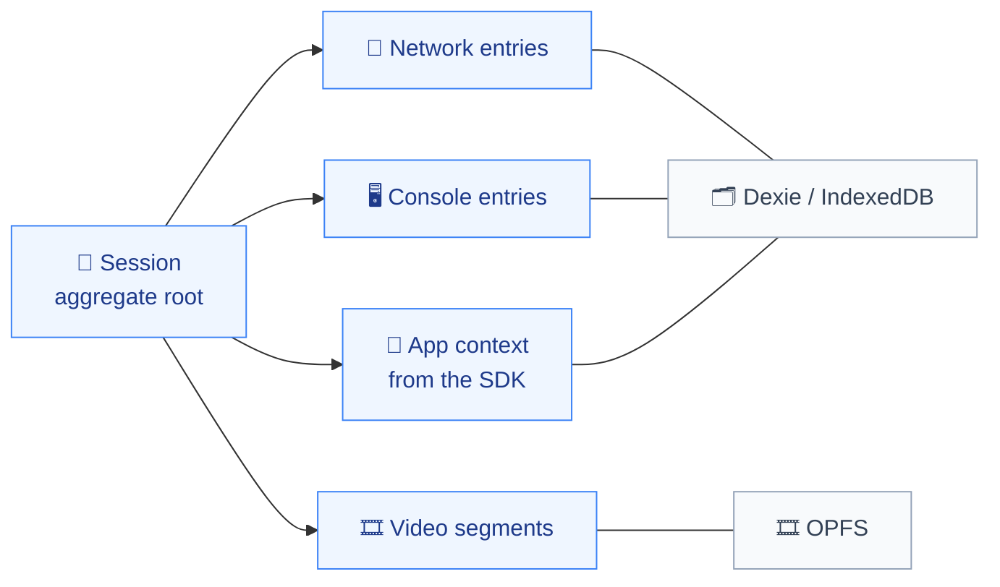

# Database

The data store: its type, the main entities, and the conventions. The macro model, not the full schema.

> **State:** the schema is not written yet. `apps/extension/src/storage/` does not exist on disk — see `aidd_docs/INSTALL.md`. What follows is the storage design that was decided; refresh it against `db.ts` once written.

## Setup

- Two stores, split by the nature of the data, both local to the browser. No server, no sync.
- **Dexie over IndexedDB** — structured, queryable context: session metadata, network log, console log, JS errors, SDK-supplied application context. Schema in `apps/extension/src/storage/db.ts`.
- **OPFS** — binary video segments only. IndexedDB stores large blobs less efficiently and OPFS gives direct file handles. Managed in `apps/extension/src/storage/opfs.ts`.

## Main entities

The session is the only aggregate root, scoped to a single tab on a watched domain. Everything else is owned by it and meaningless alone — an export is always a slice of one session, over a window of 5, 15, 30, or 60 minutes. Video segments are the exception to the storage split: they belong to the session domain but live in OPFS, referenced from Dexie by handle rather than embedded.

## Conventions

- **The two stores are bounded differently.** Context is a rolling one-hour window, pruned on write — never on a timer, since a service worker timer does not survive MV3 termination. Video is bounded only by the user stopping the recording, so nothing prunes it: segments accumulate until the download, then the recording is dropped.
- **Nothing is stored outside a watched domain.** The scope filter belongs at the write path, not at the read or export path, so unwatched traffic never reaches disk in the first place.
- **A quota is not a guarantee against eviction.** Chrome's permissions list does cover OPFS under `unlimitedStorage`, alongside `chrome.storage.local`, IndexedDB and Cache Storage — but raising the quota does not make storage persistent, which is why `navigator.storage.persist()` is requested at first run. Eviction is silent and unrecoverable, and since a recording has no upper bound a long one can be evicted mid-capture — surface the failure rather than losing it quietly.
- **`unlimitedStorage` is not declared, and does not need to be — because bodies are filtered.** Measured without it, the extension gets a 10.7 GB quota, a ceiling of its own rather than a fraction of free disk. The rolling window fits inside it only once the resource-type filter and the 256 kB truncation apply: a dense business SPA charges 224 MB/h filtered against 6.9 GB/h unfiltered, which would be 64 % of the quota in a single hour. The margin is a consequence of the capture rules, not a property of the store. It is also narrower than the bodies alone suggest — the entries around them weigh 160 to 328 MB/h, more than the bodies under dense headers, which puts the whole window at 384 to 552 MB/h and the quota at 19 to 28 times it rather than two orders of magnitude. See `aidd_docs/backlog/spikes/cdp-body-capture-calibration.md`, `cdp-response-body-storage-cost.md` and `store-entry-overhead.md`.
- Dexie owns migrations through its version chain. Never mutate an existing version block — append a new one, because installed extensions upgrade in place with live data.
- Entries are written by the service worker only. The React surfaces read; they never write capture data.
- Stored event shapes come from `packages/contract`. A change there is a storage migration, not just a type edit.
