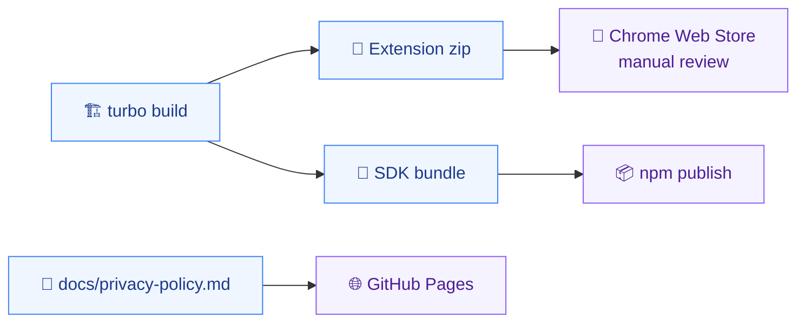

# Deployment

Where the project runs and how it ships: CI/CD, environments, and release.

> **State:** no CI configuration exists and no artifact has shipped. `turbo.json` is not written yet — see `aidd_docs/INSTALL.md` install steps 5 and 6. What follows is the agreed shipping model.

## Pipeline

- Turborepo orchestrates `build`, `test`, and `lint` across the workspaces. No CI provider is wired yet; the pipeline runs locally.
- Three independent release channels, no shared trigger. Nothing deploys automatically.

## Environments

- **Local** — the WXT dev build, loaded unpacked. The only development environment; there is no staging.
- **Chrome Web Store** — the published extension. Requires a developer account (one-off USD 5 fee).
- **npm** — `@vigie/sdk`, public.
- **GitHub Pages** — `docs/privacy-policy.md` and `docs/politique-de-confidentialite.md`. Both must be publicly reachable _before_ a Chrome Web Store submission is accepted, so they ship first. Two files because the consent screen links to the policy in the language it is being read in, and a French disclosure pointing at an English policy is the divergence the store rejects for. Neither is published yet: both `https://bryanberger98.github.io/vigie/privacy-policy.html` and `.../politique-de-confidentialite.html` answer 404, measured 2026-08-13. The site itself has never been turned on — this is not a regression the French page introduced.

## Release

- **Extension**: submit to the Chrome Web Store and wait for manual review. Review latency is measured in days and is outside the project's control — treat the store version as behind the repository, always.
- **Rollback**: publishing a corrected version and waiting for review again. The Chrome Web Store has no instant revert, which is why permission and consent changes carry the most risk.
- **SDK**: `npm publish` from `packages/sdk`. Independent of the extension release — see `package.md` for why the versions do not track each other.
- The Chrome Web Store policy update of 2026-08-01 requires prominent in-product disclosure of screen video, raw network payloads, and console content. A submission missing the consent screen is rejected regardless of the linked privacy policy.

## Monitoring

- None, deliberately. No backend, no telemetry, no crash reporting — sending diagnostics off-machine would contradict the product's own privacy claim. The only signal is Chrome Web Store reviews and user reports.
