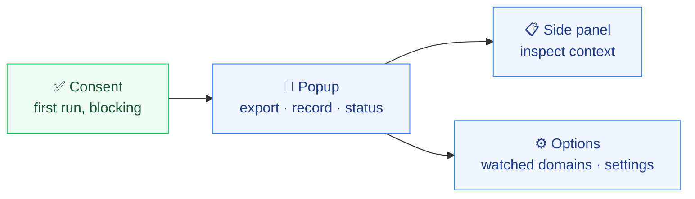

# Navigation

How the user moves through the app: routing and the page structure.

> **State:** no UI code exists yet. The structure below is the entrypoint set declared in `aidd_docs/INSTALL.md`.

## Routing

- **No router.** Navigation is Chrome's, not the application's: each surface is a separate WXT entrypoint with its own HTML document and its own React root. The popup and the side panel do not share a tree, and state does not survive between them.
- Cross-surface state lives in `chrome.storage` (settings) or Dexie (capture data). A React context cannot span two entrypoints.
- No public/protected distinction — there is no auth. The one gate is the first-run consent screen, which blocks the surfaces until acknowledged.
- Within a surface, use local view state rather than adding a router. Each panel is small enough that a router would cost more than it returns.

## Structure

The popup is the entry surface — the browser action opens it, and it carries the two actions of the product: export the context of the active tab, and start or stop a recording. Both need a user gesture anyway, which the popup provides by construction. It also reports whether the current domain is watched, since that determines whether an export is even possible.

The export control is a single click on the default window, with the other windows reachable beside it rather than behind a screen. Adding a step there would defeat the point.

The side panel is the reading surface, opened from the popup and staying open alongside the page. Options opens as its own tab, through Chrome's extension menu as well as from the popup; it owns the watched domain list, which is the one piece of configuration the product requires before it is useful at all.
