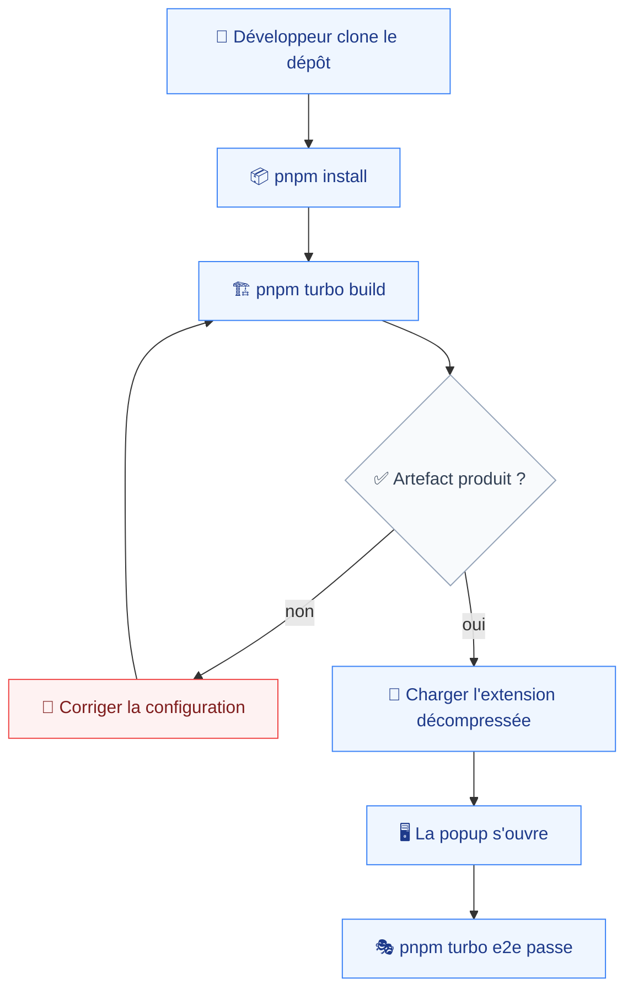
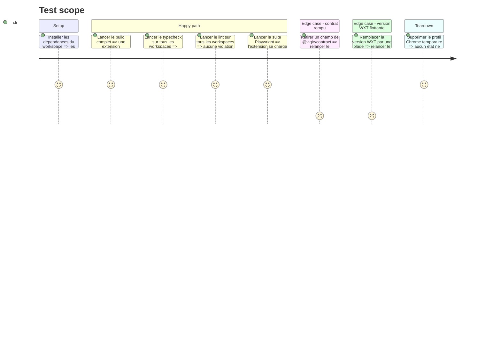

# Instruction: Socle monorepo et harnais de tests

Le dépôt est vide de code et n'a aucun commit. Cette phase produit une extension qui se charge dans Chrome et affiche une popup vide, plus les portes de qualité que toutes les phases suivantes invoquent.

## Architecture projection

> Tree of the final files. ✅ create · ✏️ modify · ❌ delete

```txt
.
├── ✅ package.json                          # racine du workspace, scripts turbo
├── ✅ pnpm-workspace.yaml                   # déclare apps/* et packages/*
├── ✅ turbo.json                            # pipeline build · test · lint · typecheck · e2e
├── ✅ .gitignore
├── ✅ tsconfig.base.json                    # options TypeScript partagées
├── apps/
│   └── extension/
│       ├── ✅ package.json                  # WXT épinglé à 0.21.3, sans plage
│       ├── ✅ wxt.config.ts                 # manifeste MV3, module React
│       ├── ✅ tsconfig.json
│       └── src/
│           ├── entrypoints/
│           │   ├── ✅ background.ts         # service worker, vide à ce stade
│           │   └── popup/
│           │       ├── ✅ index.html
│           │       ├── ✅ main.tsx
│           │       └── ✅ App.tsx           # coquille, remplie en phase 8
│           ├── ui/
│           │   ├── ✅ globals.css           # Tailwind et variables shadcn/ui
│           │   └── ✅ lib/utils.ts          # helper cn, prérequis shadcn/ui
│           └── shared/
│               └── ✅ chrome-apis.d.ts      # surfaces MV3 absentes des typages
├── packages/
│   └── contract/
│       ├── ✅ package.json                  # @vigie/contract, non publié
│       └── src/
│           ├── ✅ index.ts
│           ├── ✅ events.ts                 # NetworkEntry, ConsoleEntry, ErrorEntry
│           ├── ✅ report.ts                 # forme du bundle exporté
│           └── ✅ version.ts                # schemaVersion
└── e2e/
    ├── ✅ package.json
    ├── ✅ playwright.config.ts              # lance Chrome avec --load-extension
    └── ✅ specs/extension-loads.spec.ts
```

## User Journey



## Test Scope



## Tasks to do

### `1)` Initialiser le workspace

> Une racine pnpm plus Turborepo, capables d'orchestrer trois workspaces.

1. `pnpm init` à la racine, puis `pnpm-workspace.yaml` déclarant `apps/*` et `packages/*`.
2. Ajouter Turborepo et écrire `turbo.json` avec les tâches `build`, `test`, `lint`, `typecheck`, `e2e`, `e2e` dépendant de `build`.
3. Écrire `tsconfig.base.json` en mode strict, étendu par chaque workspace.
4. Écrire `.gitignore` couvrant `node_modules`, `.output`, `.wxt`, les rapports Playwright.
5. Premier commit — le dépôt n'en a aucun.

### `2)` Créer `packages/contract`

> Figer les formes traversant une frontière, avant qu'un seul consommateur n'existe.

1. `package.json` du paquet `@vigie/contract`, marqué `private`, exportant des types uniquement.
2. `version.ts` exportant `SCHEMA_VERSION`.
3. `events.ts` : `NetworkEntry`, `ConsoleEntry`, `ErrorEntry`, chacun portant un horodatage, l'identifiant d'onglet et le domaine.
4. `report.ts` : la forme du bundle exporté — fenêtre couverte, domaine, onglet, entrées, manques signalés.
5. Une garde de type par entrée, testée unitairement — `testing.md:22` la rend obligatoire.

### `3)` Échafauder l'extension

> Une extension WXT en React qui se charge, sans aucune capture.

1. Échafauder `apps/extension` avec le démarreur React de WXT, en **épinglant la version exacte `0.21.3`**, sans plage.
2. Ajouter Tailwind et les variables CSS de shadcn/ui dans `src/ui/globals.css`, plus le helper `cn` dans `src/ui/lib/utils.ts`.
3. Déclarer dans `wxt.config.ts` les permissions `storage` et `webRequest`, et `optional_host_permissions: ["*://*/*"]`. Aucune `host_permissions` statique.
4. Écrire `background.ts` réduit à un journal de démarrage.
5. Écrire la popup comme coquille React, remplie en phase 8.
6. Déclarer `@vigie/contract` en dépendance de workspace et l'importer une fois, pour prouver la liaison.
7. Créer `shared/chrome-apis.d.ts`, vide mais présent, pour les surfaces MV3 mal typées.

### `4)` Monter le harnais de tests

> Deux couches, conformes à `testing.md:8-16`.

1. Vitest à la racine, exécuté par workspace, collectant les tests voisins du code.
2. Playwright dans `e2e/`, lançant Chrome avec la build décompressée via `--load-extension` et un profil neuf par exécution.
3. Une spécification : l'extension se charge, son identifiant est résolu, la popup s'ouvre.
4. Vérifier que chaque commande de `coding-assertions.md:13-24` existe et répond.

## Test acceptance criteria

| Task | Acceptance criteria                                                                                                      |
| ---- | -------------------------------------------------------------------------------------------------------------------------- |
| 1    | Les cinq tâches Turborepo s'exécutent sur les trois workspaces ; `e2e` refuse de partir sans build préalable                |
| 2    | Une garde de type rejette une entrée mal formée ; retirer un champ du contrat casse la compilation de l'extension          |
| 3    | L'extension décompressée se charge dans Chrome sans erreur, et son manifeste ne contient aucune `host_permissions` statique |
| 4    | La suite Playwright ouvre la popup sur un profil neuf ; deux exécutions consécutives donnent le même résultat              |
