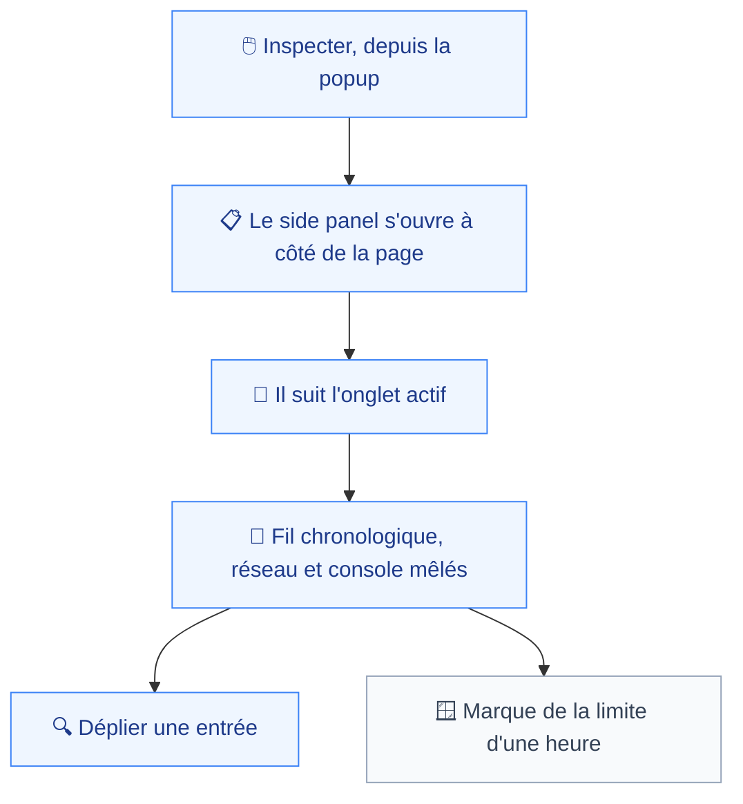
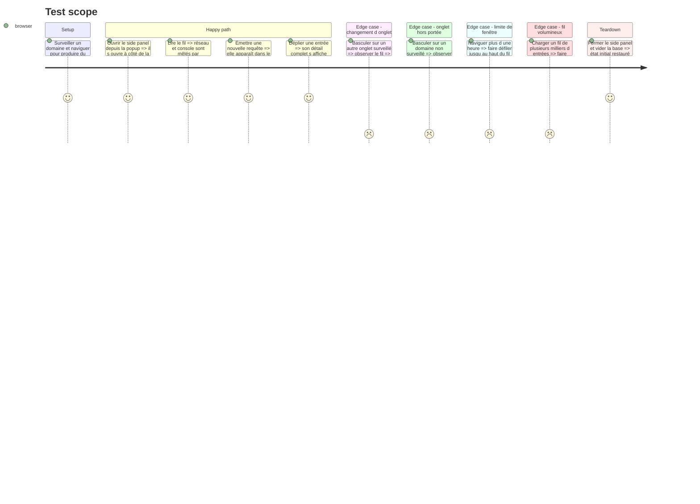

# Instruction: Side panel de lecture

La seule surface qui rend le contexte capté visible avant l'export. Elle sert la confiance : sans elle, l'utilisateur ne sait qu'au moment du rapport si la capture avait bien lieu.

**Aucun critère de `spec.md:38-46` ne la réclame.** Elle est livrable indépendamment et reportable sans invalider la version. Elle figure ici parce que `navigation.md:33` la décrit comme la surface de lecture du produit, et que la phase 8 lui câble déjà un bouton.

## Architecture projection

> Tree of the final files. ✅ create · ✏️ modify · ❌ delete

```txt
.
├── apps/
│   └── extension/
│       ├── ✏️ wxt.config.ts                          # déclare le side panel
│       └── src/
│           ├── entrypoints/
│           │   ├── sidepanel/
│           │   │   ├── ✅ index.html
│           │   │   ├── ✅ main.tsx
│           │   │   ├── ✅ App.tsx
│           │   │   ├── ✅ Timeline.tsx               # fil chronologique unique
│           │   │   ├── ✅ EntryRow.tsx               # une entrée, repliée par défaut
│           │   │   └── ✅ WindowEdge.tsx             # marque de la limite d'une heure
│           │   └── ✏️ popup/App.tsx                  # le bouton Inspecter devient actif
│           └── storage/
│               └── ✅ live-query.ts                  # lecture réactive Dexie, par onglet
└── e2e/
    └── specs/
        └── ✅ sidepanel-read.spec.ts
```

## User Journey



## Test Scope



## Wireframe

```txt
┌──────────────────────────────┐
│ (1) Onglet observé + portée   │
├──────────────────────────────┤
│ (2) Fil chronologique         │
│  ┌─────────────────────────┐  │
│  │ (3) entrée horodatée    │  │
│  └─────────────────────────┘  │
│         ⋮                     │
├──────────────────────────────┤
│ (4) Bord de fenêtre : 60 min  │
└──────────────────────────────┘
```

1. Quel onglet est lu, et s'il est dans la portée.
2. Un seul fil, réseau et console entremêlés par horodatage — le même ordre que le rapport exporté.
3. Une entrée : horodatage, nature, ligne de résumé, dépliable. Aucun filtre : `spec.md:14` interdit le tri à l'export, en ajouter un ici créerait deux vérités.
4. La limite explicite : ce qui précède a été purgé, ce n'est pas un vide de capture.

## Tasks to do

### `1)` Ouvrir le side panel

> Il suit l'onglet actif, sans état partagé avec la popup (`navigation.md:9`).

1. Déclarer le side panel dans `wxt.config.ts` et l'ouvrir depuis la popup — l'API exige un geste utilisateur.
2. S'abonner au changement d'onglet actif et recharger le fil correspondant.
3. Rendre les trois états de portée de la phase 8, réutilisés et non redéclarés.

### `2)` Lire en direct

> Les surfaces React lisent, elles n'écrivent jamais (`database.md:42`).

1. `live-query.ts` s'appuie sur la réactivité de Dexie, borné à l'onglet courant et à une heure.
2. Virtualiser le rendu : un fil d'une heure sur une application bavarde compte des milliers d'entrées.
3. Ne jamais écrire depuis cette surface, y compris pour marquer une entrée comme lue.

### `3)` Rendre le fil

> Le même ordre que le rapport, pour qu'une lecture ici prédise l'export.

1. `Timeline.tsx` : réseau et console dans un fil unique, horodatage croissant.
2. `EntryRow.tsx` : replié par défaut, dépliable pour le détail complet — en-têtes, corps de requête, pile.
3. Marquer visuellement une entrée dont le corps de réponse est indisponible, comme le fait le rapport.
4. `WindowEdge.tsx` : la limite d'une heure, ou la limite réelle si le quota a rétréci la fenêtre.

## Test acceptance criteria

| Task | Acceptance criteria                                                                                                          |
| ---- | -------------------------------------------------------------------------------------------------------------------------------- |
| 1    | Basculer d'onglet change le fil affiché ; un onglet hors portée annonce l'absence de capture au lieu d'un fil vide              |
| 2    | Une requête émise pendant que le panneau est ouvert y apparaît sans rechargement ; aucune écriture n'est émise par la surface   |
| 3    | L'ordre du fil correspond à celui du rapport exporté sur la même fenêtre ; la limite basse est marquée comme purge              |
