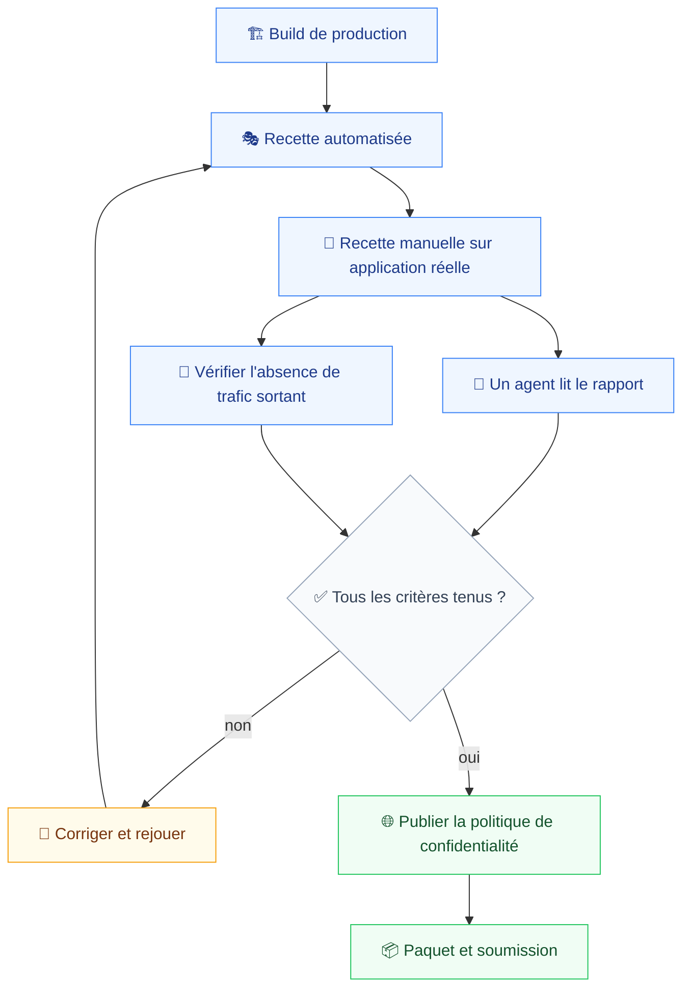
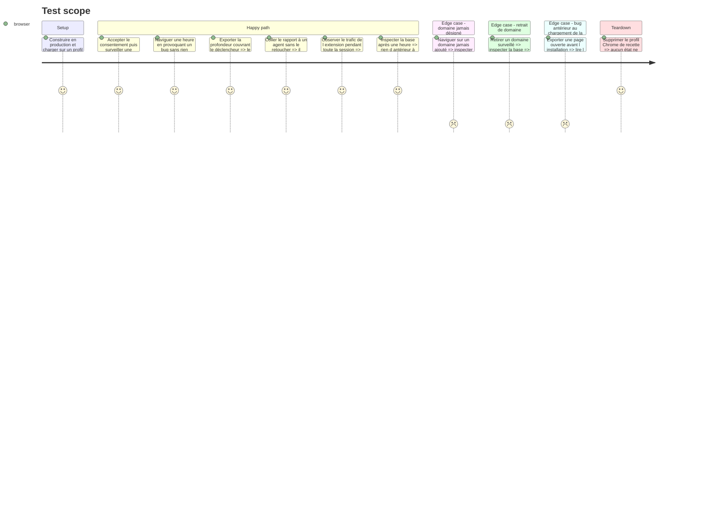

# Instruction: Recette de bout en bout et paquet CWS

Les critères de `spec.md:38-46` ne se vérifient pas phase par phase : ils portent sur le produit entier, sur une application réelle, sur une heure de navigation. Cette phase les exécute et prépare la soumission.

Deux d'entre eux ne sont pas des tests automatisables. « Un agent IA répond à *que s'est-il passé ?* à partir du seul rapport collé » se vérifie en le faisant. « Aucune requête sortante émise » se vérifie en observant le réseau, pas en relisant le code.

## Architecture projection

> Tree of the final files. ✅ create · ✏️ modify · ❌ delete

```txt
.
├── ✏️ turbo.json                                     # tâche de paquet pour le Chrome Web Store
├── apps/
│   └── extension/
│       └── ✏️ wxt.config.ts                          # métadonnées de publication, version
├── docs/
│   └── ✏️ privacy-policy.md                          # publiée sur GitHub Pages
├── e2e/
│   └── specs/
│       └── ✅ acceptance.spec.ts                     # les critères de spec.md, bout en bout
└── aidd_docs/
    └── tasks/2026_08/2026_08_06_extension-scope/
        ├── ✅ acceptance-report.md                   # les résultats de recette, en français
        └── ✅ cws-submission.md                      # justification des permissions
```

## User Journey



## Test Scope



## Tasks to do

### `1)` Automatiser ce qui peut l'être

> `acceptance.spec.ts` couvre les critères mécaniques de `spec.md:38-46`.

1. Un domaine jamais désigné ne laisse rien de stocké ni d'exportable.
2. Retirer un domaine arrête sa capture et efface ses données.
3. Choisir une profondeur et cliquer place le rapport dans le presse-papier, sans champ ni étape intermédiaire.
4. Le rapport nomme la fenêtre, le domaine et l'onglet, et déclare ses manques.
5. Rien d'antérieur à une heure ne subsiste après une heure simulée.

### `2)` Recetter à la main sur une application réelle

> `spec.md:60` en fait une dépendance : sans cible réelle, ces critères ne sont pas vérifiables.

1. La même application que la phase 6, pour que les chiffres de sobriété restent comparables.
2. Provoquer un bug **sans rien avoir enregistré au préalable** — c'est la promesse entière du produit, et le seul critère qui la teste.
3. Exporter une profondeur couvrant le déclencheur, pas seulement le symptôme.
4. Consigner les gestes réels entre le bug et le presse-papier.

### `3)` Vérifier les deux critères non automatisables

> Ni l'un ni l'autre ne se déduit du code.

1. **Exploitabilité par un agent** : coller le rapport tel quel, poser « que s'est-il passé ? », consigner la réponse. Si un reformatage est nécessaire, c'est la phase 7 qui est en cause, pas la recette.
2. **Aucune requête sortante** : observer tout le trafic émis par l'extension pendant une session complète, depuis la page de débogage des extensions ou un proxy. C'est une revendication produit, elle se prouve par observation.

### `4)` Préparer la soumission

> La politique de confidentialité doit être joignable **avant** que la soumission soit acceptée (`deployment.md:33`).

1. Publier `docs/privacy-policy.md` sur GitHub Pages et vérifier l'URL publique.
2. `cws-submission.md` : justifier chaque permission demandée. `webRequest` et les permissions d'hôte optionnelles sont les deux qui déclenchent l'examen ; la clause « Minimum Permission » attend un argument explicite pour chacune.
3. Produire le paquet de production et vérifier son chargement sur un profil neuf.
4. Enregistrer le compte développeur si ce n'est pas fait — frais unique de 5 USD, `deployment.md:31`.
5. **Ne pas soumettre sans accord explicite.** La publication est irréversible en pratique : le Chrome Web Store n'a pas de retour arrière instantané, et une correction repasse par un examen de plusieurs jours (`deployment.md:38`).

### `5)` Consigner la recette

> `acceptance-report.md`, en français.

1. Un critère de `spec.md:38-46` par ligne, avec ce qui a été observé.
2. Les écarts, et ce qu'ils impliquent.
3. Ce qui reste connu comme incomplet : messages générés par le navigateur, corps de réponse, absence de masquage des secrets.

## Test acceptance criteria

| Task | Acceptance criteria                                                                                                                   |
| ---- | ----------------------------------------------------------------------------------------------------------------------------------------- |
| 1    | La suite d'acceptation passe sur un profil neuf, sans intervention manuelle                                                              |
| 2    | Un rapport a été produit pour un bug non anticipé, sans enregistrement préalable, sur une application nommée                             |
| 3    | La réponse de l'agent au rapport brut est consignée ; l'observation réseau couvre une session complète et ne montre aucune sortie        |
| 4    | La politique de confidentialité est joignable publiquement ; chaque permission a sa justification écrite ; rien n'est soumis sans accord |
| 5    | `acceptance-report.md` couvre chaque critère de `spec.md:38-46` avec une observation, pas une déduction                                  |
