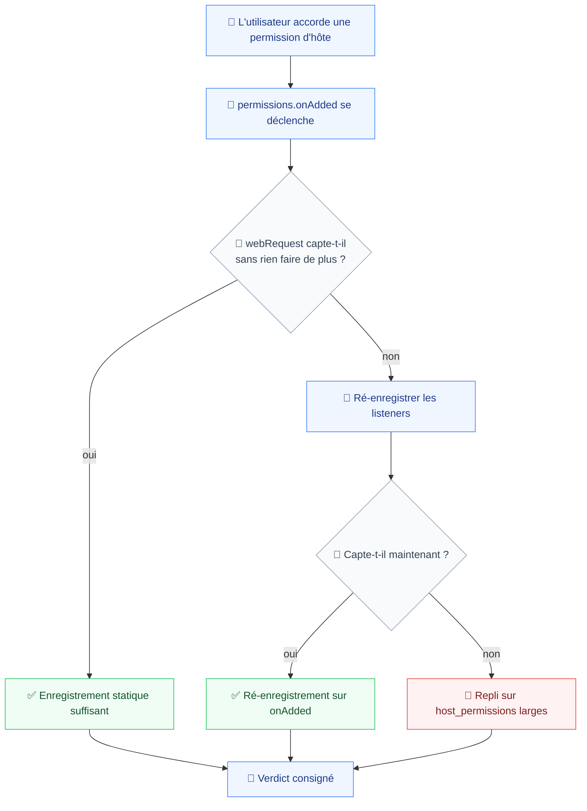
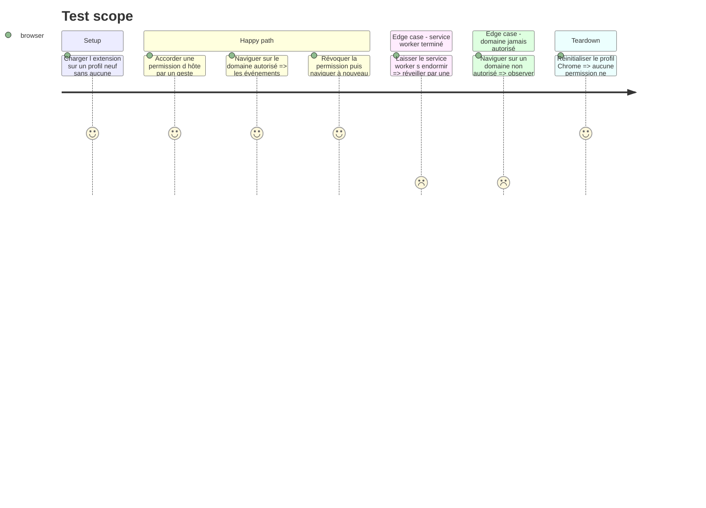

# Instruction: Mesure — permissions d'hôte optionnelles

Une seule question, et elle décide de l'architecture des permissions : quand l'utilisateur accorde une permission d'hôte à chaud, `chrome.webRequest` capte-t-il immédiatement, ou faut-il ré-enregistrer les listeners, voire redémarrer le service worker ?

La documentation officielle ne tranche pas. Si la réponse est « il faut ré-enregistrer » et qu'on l'ignore, un domaine ajouté ne capture rien jusqu'au redémarrage du navigateur — le défaut le plus silencieux que ce produit puisse avoir, puisque rien ne se voit avant l'export.

Cette phase ne livre pas de fonctionnalité. Elle produit un verdict et le code minimal qui l'incarne.

## Architecture projection

> Tree of the final files. ✅ create · ✏️ modify · ❌ delete

```txt
.
├── apps/
│   └── extension/
│       └── src/
│           ├── entrypoints/
│           │   └── ✏️ background.ts                # enregistre les sondes de mesure
│           └── capture/
│               └── network/
│                   ├── ✅ listener-lifecycle.ts    # (dés)enregistrement sur onAdded / onRemoved
│                   └── ✅ listener-lifecycle.test.ts
├── e2e/
│   └── specs/
│       └── ✅ optional-host-permission.spec.ts     # octroi à chaud puis observation
└── aidd_docs/
    └── tasks/2026_08/2026_08_06_extension-scope/
        └── ✅ measure-permissions.md               # le verdict, en français
```

## User Journey



## Test Scope



## Tasks to do

### `1)` Instrumenter la mesure

> Rendre observable ce qui, sinon, ne se voit qu'à l'export.

1. Enregistrer un listener `webRequest.onCompleted` au niveau supérieur de `background.ts`, sur `{ urls: ["<all_urls>"] }`, écrivant chaque événement dans un compteur `chrome.storage.session`.
2. Enregistrer `permissions.onAdded` et `permissions.onRemoved`, journalisant l'origine concernée et l'instant.
3. Exposer le compteur à la popup, pour lire le résultat sans DevTools.

### `2)` Exécuter les trois scénarios

> Trois questions, dans cet ordre — chacune n'a de sens que si la précédente a échoué.

1. **Sans rien faire** : accorder la permission, naviguer, compter. Si les événements arrivent, l'enregistrement statique suffit.
2. **Avec ré-enregistrement** : sur `onAdded`, retirer puis ré-ajouter le listener. Compter à nouveau.
3. **Après terminaison** : laisser passer plus de 30 secondes d'inactivité pour que le service worker s'arrête, provoquer une requête, vérifier que le réveil restaure la capture. C'est le scénario le plus proche d'un usage réel, et le plus susceptible de démentir les deux premiers.

### `3)` Écrire `listener-lifecycle.ts`

> Le code minimal qui incarne le verdict.

1. Une fonction d'enregistrement idempotente : retirer avant d'ajouter, jamais d'empilement de listeners.
2. Un abonnement à `permissions.onAdded` et `onRemoved` qui la rappelle, quel que soit le verdict — c'est bon marché et ça couvre le cas où le comportement change dans une version ultérieure de Chrome.
3. Test unitaire sur l'idempotence : deux appels consécutifs laissent un seul listener.

### `4)` Consigner le verdict

> `measure-permissions.md`, en français, avec les chiffres.

1. La version de Chrome mesurée, les trois scénarios, ce que chacun a produit.
2. La décision retenue et sa portée.
3. **Si le verdict est un repli sur `host_permissions: ["<all_urls>"]`** : arrêter et remonter la décision. Elle change le manifeste, l'écran de consentement de la phase 9, et le discours de soumission au CWS. Elle n'est pas à prendre par l'exécuteur.

## Test acceptance criteria

| Task | Acceptance criteria                                                                                                                    |
| ---- | ------------------------------------------------------------------------------------------------------------------------------------------ |
| 1    | La popup affiche un compteur d'événements réseau qui progresse pendant la navigation sur un domaine autorisé                              |
| 2    | Les trois scénarios ont chacun un résultat observé, pas déduit ; le scénario après terminaison a bien laissé le service worker s'arrêter |
| 3    | Deux appels consécutifs à l'enregistrement ne produisent qu'un seul listener ; une révocation coupe la réception d'événements             |
| 4    | `measure-permissions.md` nomme la version de Chrome et la décision ; un repli sur les permissions larges a été remonté, jamais appliqué seul |
