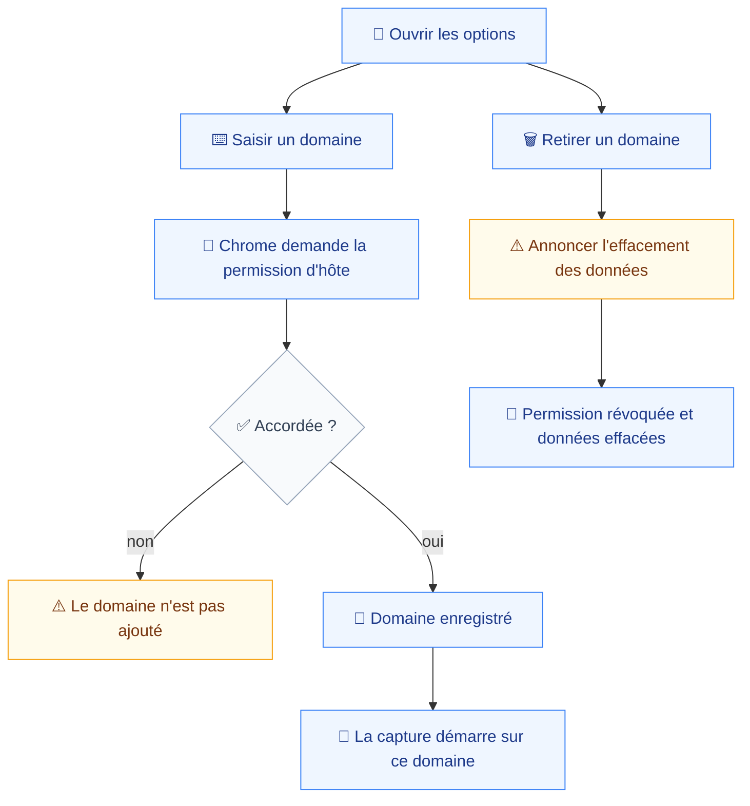
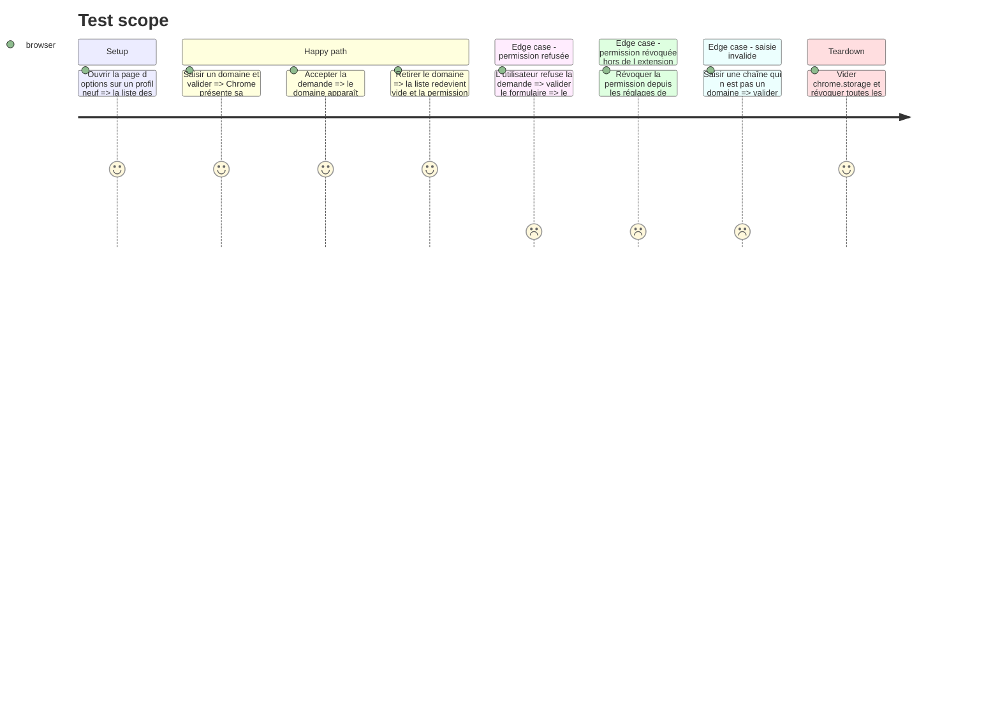

# Instruction: Domaines surveillés et portée

La liste des domaines surveillés est la seule configuration que le produit exige avant d'être utile (`navigation.md:33`). Elle décide de ce qui est capté, de ce que le consentement doit annoncer, et de ce qu'un export fuité pourrait contenir.

Cette phase livre l'écran d'options qui la gère, et la fonction de portée que toutes les écritures des phases suivantes traverseront.

## Architecture projection

> Tree of the final files. ✅ create · ✏️ modify · ❌ delete

```txt
.
├── apps/
│   └── extension/
│       └── src/
│           ├── entrypoints/
│           │   ├── ✏️ background.ts                  # réagit à l'ajout et au retrait
│           │   └── options/
│           │       ├── ✅ index.html
│           │       ├── ✅ main.tsx
│           │       ├── ✅ App.tsx
│           │       ├── ✅ WatchedDomainList.tsx      # une ligne par domaine
│           │       └── ✅ AddDomainForm.tsx          # saisie et demande de permission
│           ├── storage/
│           │   ├── ✅ watched-domains.ts             # lecture et écriture dans chrome.storage
│           │   ├── ✅ watched-domains.test.ts
│           │   ├── ✅ scope.ts                       # une URL tombe-t-elle dans la portée
│           │   └── ✅ scope.test.ts                  # couverture obligatoire, testing.md:22
│           └── ui/
│               └── ✅ components/                    # primitives shadcn/ui utilisées ici
└── e2e/
    └── specs/
        └── ✅ watched-domains.spec.ts
```

## User Journey



## Test Scope



## Wireframe

```txt
┌────────────────────────────────────────────┐
│ (1) Domaines surveillés                     │
│  ┌───────────────────────────────────────┐  │
│  │ (2) domaine · état permission · [x]   │  │
│  └───────────────────────────────────────┘  │
│  ┌──────────────────────────┬────────────┐  │
│  │ (3) champ nouveau domaine │ [Ajouter] │  │
│  └──────────────────────────┴────────────┘  │
├────────────────────────────────────────────┤
│ (4) Stockage — rempli en phase 9            │
├────────────────────────────────────────────┤
│ (5) Rappel de ce qui est capté — phase 9    │
└────────────────────────────────────────────┘
```

1. La liste, seule configuration obligatoire du produit.
2. Une ligne par domaine, portant l'état réel de la permission — accordée, révoquée hors de l'extension — et non sa seule présence en base.
3. L'ajout déclenche `chrome.permissions.request()`, d'où le bouton : l'API exige un geste utilisateur.
4. Réservé à la phase 9.
5. Réservé à la phase 9.

## Tasks to do

### `1)` Écrire la fonction de portée

> Le point le plus sensible du produit : une erreur ici écrit sur disque du trafic non surveillé.

1. `scope.ts` expose une fonction pure : une URL et la liste des domaines surveillés entrent, un booléen sort.
2. Correspondance sur l'hôte enregistrable, sous-domaines inclus. Décider explicitement du traitement des sous-domaines et l'écrire dans le code.
3. `scope.test.ts` couvre : correspondance exacte, sous-domaine, domaine voisin qui contient le nom surveillé sans en être un, port différent, schéma différent, liste vide.
4. Aucune dépendance à `chrome.*` dans ce module, pour qu'il reste testable unitairement.

### `2)` Persister la liste

> `chrome.storage`, pas Dexie : c'est de la configuration, pas de la donnée captée (`navigation.md:10`).

1. `watched-domains.ts` : lire, ajouter, retirer, s'abonner aux changements.
2. Croiser chaque entrée avec `chrome.permissions.getAll()` pour exposer l'état réel de la permission, jamais la seule présence en base.
3. Tests unitaires sur la lecture, l'écriture, et la détection d'une permission révoquée en dehors de l'extension.

### `3)` Construire l'écran d'options

> Trois régions, dont deux réservées à la phase 9.

1. Entrypoint WXT `options`, racine React, primitives shadcn/ui.
2. `AddDomainForm` : saisie validée avant toute demande, puis `chrome.permissions.request()` dans le gestionnaire de clic — le geste utilisateur est une exigence de l'API.
3. `WatchedDomainList` : une ligne par domaine, l'état de sa permission, un retrait qui annonce l'effacement des données avant de l'exécuter (`spec.md:17`).
4. Sur retrait : révoquer la permission, retirer de `chrome.storage`, et déclencher l'effacement des données captées — implémenté en phase 4, appelé ici derrière une fonction déjà nommée.

### `4)` Brancher le cycle de vie

> Un domaine ajouté doit capturer sans redémarrage.

1. `background.ts` s'abonne aux changements de la liste et aux événements `permissions.onAdded` / `onRemoved`.
2. Rappeler l'enregistrement idempotent des listeners écrit en phase 2.
3. Spécification Playwright de bout en bout : ajouter, accorder, vérifier que la capture démarre ; retirer, vérifier qu'elle s'arrête.

## Test acceptance criteria

| Task | Acceptance criteria                                                                                                                         |
| ---- | ----------------------------------------------------------------------------------------------------------------------------------------------- |
| 1    | Un domaine voisin contenant le nom d'un domaine surveillé n'est pas dans la portée ; la liste vide ne met rien dans la portée                  |
| 2    | Une permission révoquée depuis les réglages de Chrome se lit comme manquante dans la liste, sans redémarrage de l'extension                    |
| 3    | Un refus de permission n'ajoute pas le domaine ; un retrait annonce l'effacement des données avant de l'exécuter                               |
| 4    | Un domaine ajouté capture sans redémarrer le navigateur ; un domaine retiré cesse de capturer immédiatement                                    |
