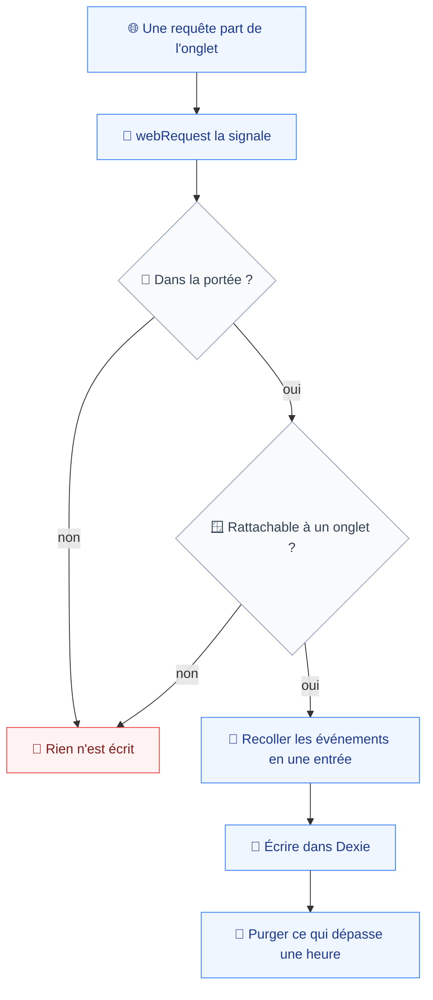
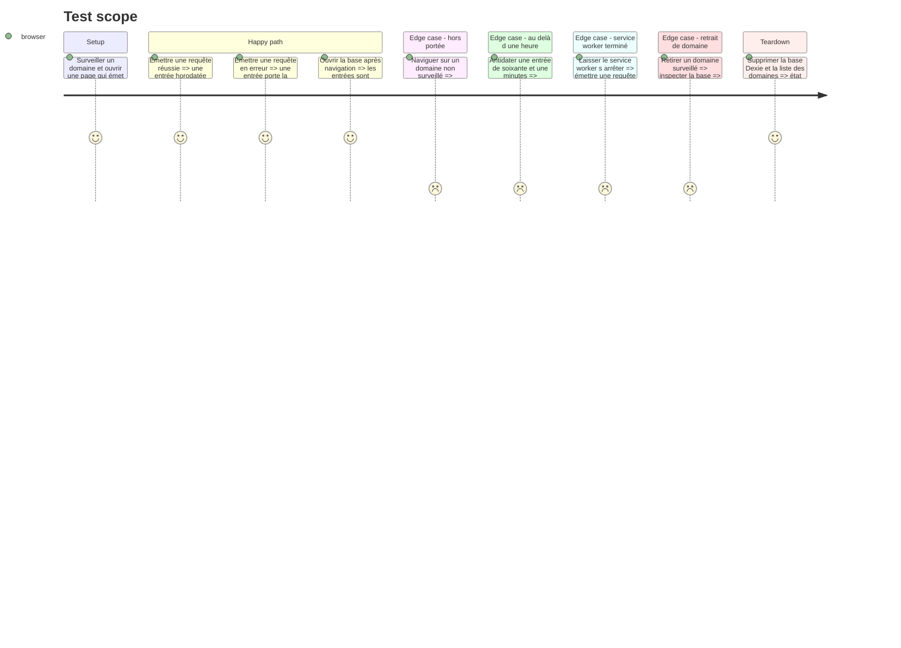

# Instruction: Capture réseau et stockage roulant

Le cœur de la promesse : quand le bug apparaît, la dernière heure de trafic est déjà là. Cette phase branche `chrome.webRequest` sur les domaines surveillés et écrit dans un magasin borné à une heure.

Deux règles gouvernent tout le reste : le filtre de portée et la purge horaire vivent sur le **chemin d'écriture**, jamais à la lecture (`database.md:38-39`). Un filtre à l'export laisserait le trafic non surveillé atteindre le disque, ce qui démentirait la revendication centrale du produit.

## Architecture projection

> Tree of the final files. ✅ create · ✏️ modify · ❌ delete

```txt
.
├── apps/
│   └── extension/
│       └── src/
│           ├── entrypoints/
│           │   └── ✏️ background.ts                  # enregistre les listeners réseau
│           ├── capture/
│           │   └── network/
│           │       ├── ✅ listeners.ts               # onBeforeRequest → onCompleted / onErrorOccurred
│           │       ├── ✅ assemble.ts                # recolle les événements en une entrée
│           │       ├── ✅ assemble.test.ts
│           │       └── ✏️ listener-lifecycle.ts      # étendu aux vrais listeners
│           └── storage/
│               ├── ✅ db.ts                          # schéma Dexie, version 1
│               ├── ✅ write.ts                       # chemin d'écriture unique, portée puis purge
│               ├── ✅ write.test.ts                  # couverture obligatoire, testing.md:22
│               ├── ✅ prune.ts                       # fenêtre roulante d'une heure
│               ├── ✅ prune.test.ts                  # couverture obligatoire, testing.md:22
│               └── ✏️ watched-domains.ts             # le retrait déclenche l'effacement
└── e2e/
    └── specs/
        └── ✅ network-capture.spec.ts
```

## User Journey



## Test Scope



## Tasks to do

### `1)` Écrire le schéma Dexie

> Version 1, indexée pour les deux seules requêtes que le produit pose.

1. `db.ts` : une table d'entrées portant horodatage, identifiant d'onglet, domaine, nature, charge utile.
2. Index composés sur `(tabId, timestamp)` — la découpe d'export — et sur `(domain)` — l'effacement au retrait d'un domaine. Rien d'autre : chaque index coûte à l'écriture, et c'est l'écriture qui est sous pression ici.
3. Ne jamais modifier un bloc de version existant ; une évolution s'ajoute (`database.md:41`).

### `2)` Écrire le chemin d'écriture unique

> Un seul point d'entrée, traversé par tout, testé comme tel.

1. `write.ts` expose une fonction unique. Elle applique, dans cet ordre : le filtre de portée de la phase 3, le rattachement à un onglet, l'écriture, puis la purge.
2. Rejeter les événements dont `tabId` vaut `-1` — prefetch, service worker de page. Ils n'appartiennent à aucun fil et ne seraient jamais exportables ; les stocker produirait de la donnée morte.
3. Écrire par lots avec vidage synchrone : un lot en attente ne doit jamais survivre au-delà de ce que la terminaison du service worker peut effacer. Le seuil sera ajusté par la mesure de la phase 6.
4. `write.test.ts` couvre : hors portée, sans onglet, dans la portée, écriture concurrente.

### `3)` Écrire la purge

> À l'écriture, jamais sur minuterie — une minuterie ne survit pas à la terminaison MV3 (`database.md:38`).

1. `prune.ts` supprime tout ce qui précède l'heure glissante, à chaque vidage de lot.
2. Exposer le volume occupé et l'horodatage de l'entrée la plus ancienne — la phase 9 les affiche, la phase 7 s'en sert pour annoncer la profondeur réellement couverte.
3. Détecter la saturation du quota via `navigator.storage.estimate()` et marquer l'état : la fenêtre a rétréci. Décision de plan, `spec.md:23` — rétrécir doit se voir.
4. `prune.test.ts` couvre : entrée à cinquante-neuf minutes conservée, à soixante et une minutes supprimée, base vide, purge idempotente.

### `4)` Brancher les listeners réseau

> `onBeforeRequest` ouvre, `onCompleted` ou `onErrorOccurred` ferme.

1. Enregistrer au niveau supérieur de `background.ts`, condition de réveil du service worker.
2. `onBeforeRequest` avec `extraInfoSpec: ['requestBody']`, `onSendHeaders` et `onCompleted` avec `['extraHeaders']` — seule voie vers `Cookie` et `Set-Cookie`, au prix d'une performance annoncée par la documentation.
3. `assemble.ts` recolle les événements d'un même `requestId` en une entrée. Prévoir la requête jamais close : au vidage du lot, écrire ce qui existe plutôt que de la perdre.
4. Marquer chaque entrée `responseBody: unavailable`. `webRequest` n'y donne jamais accès, et `prd.md:79` exige que ce soit signalé, pas omis.

### `5)` Effacer au retrait d'un domaine

> Compléter la fonction que la phase 3 appelait déjà.

1. Supprimer par l'index de domaine toutes les entrées le concernant.
2. Vérifier par une spécification Playwright qu'aucune entrée ne survit au retrait.

## Test acceptance criteria

| Task | Acceptance criteria                                                                                                                          |
| ---- | ------------------------------------------------------------------------------------------------------------------------------------------------ |
| 1    | La base s'ouvre en version 1 ; une découpe par onglet et fenêtre temporelle répond sans parcours complet de table                               |
| 2    | Une navigation soutenue sur un domaine non surveillé laisse la base vide ; aucune entrée sans onglet rattachable n'est écrite                   |
| 3    | Une entrée à cinquante-neuf minutes survit, une à soixante et une disparaît ; la saturation du quota est signalée, jamais silencieuse           |
| 4    | Une requête réussie et une requête en erreur produisent chacune une entrée horodatée ; chaque entrée porte l'indisponibilité du corps de réponse |
| 5    | Après retrait d'un domaine, aucune entrée le concernant ne subsiste en base                                                                    |
