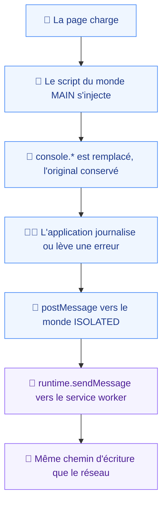
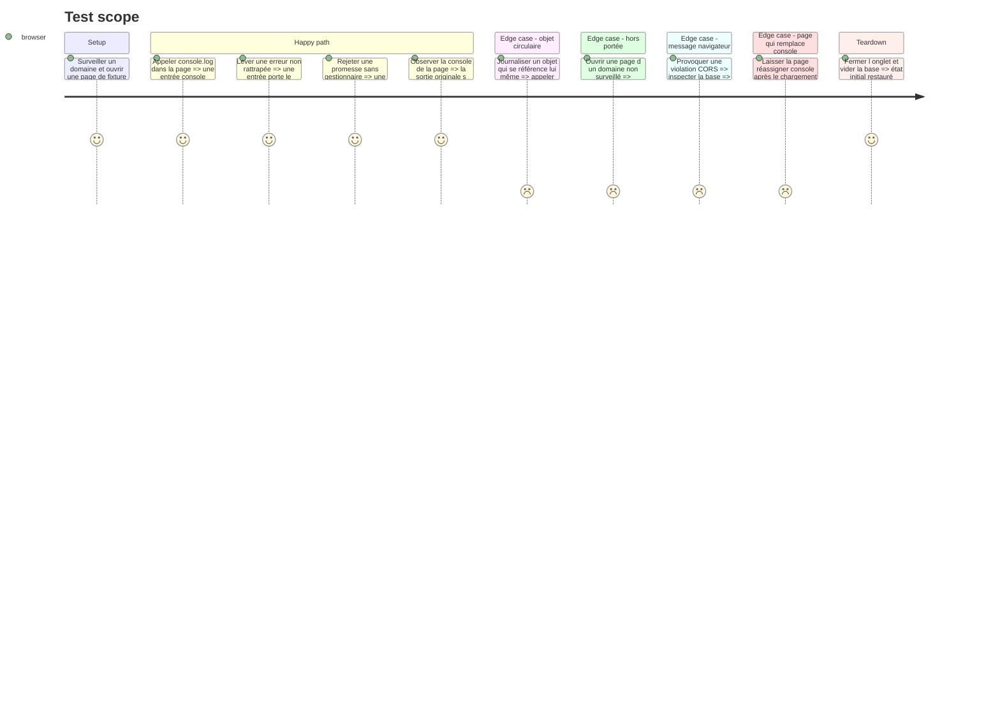

# Instruction: Capture console et erreurs JS

Sans SDK et sans `chrome.debugger`, une seule voie reste ouverte : un script exécuté dans le monde `MAIN` de la page, qui remplace `console.*` et écoute les erreurs non rattrapées, puis relaie vers le service worker par le pont du monde `ISOLATED`.

Cette voie a un trou connu et non contournable : les messages que le navigateur génère lui-même — CORS, CSP, contenu mixte, ressource échouée — ne passent pas par `console.*` et resteront invisibles (`INSTALL.md:212`). Le rapport doit le dire, exactement comme il dit qu'un corps de réponse est indisponible.

## Architecture projection

> Tree of the final files. ✅ create · ✏️ modify · ❌ delete

```txt
.
├── apps/
│   └── extension/
│       ├── ✏️ wxt.config.ts                          # déclare la ressource accessible au web
│       └── src/
│           ├── entrypoints/
│           │   ├── ✏️ background.ts                  # reçoit les événements relayés
│           │   ├── ✅ content.ts                     # monde ISOLATED, pont
│           │   └── ✅ injected.ts                    # monde MAIN, script non listé
│           ├── capture/
│           │   └── console/
│           │       ├── ✅ patch.ts                   # remplacement de console, réversible
│           │       ├── ✅ patch.test.ts
│           │       ├── ✅ serialize.ts               # arguments arbitraires vers texte
│           │       ├── ✅ serialize.test.ts
│           │       └── ✅ bridge.ts                  # protocole MAIN ↔ ISOLATED
│           └── storage/
│               └── ✏️ write.ts                       # accepte les entrées console et erreur
└── e2e/
    └── specs/
        └── ✅ console-capture.spec.ts
```

## User Journey



## Test Scope



## Tasks to do

### `1)` Écrire le script du monde MAIN

> WXT déconseille `world: 'MAIN'` et recommande l'injection explicite — suivre sa recommandation.

1. `injected.ts` en `defineUnlistedScript()`, déclaré dans `web_accessible_resources` de `wxt.config.ts`.
2. `content.ts` en monde `ISOLATED`, `run_at: document_start`, appelant `injectScript()`. Le démarrage au plus tôt est la seule façon de couvrir les journaux du chargement initial.
3. Restreindre les `matches` du content script aux domaines surveillés, par enregistrement dynamique via `chrome.scripting.registerContentScripts()` — c'est le second verrou de portée, après le filtre d'écriture.

### `2)` Remplacer `console` sans casser la page

> La page continue de fonctionner exactement comme avant.

1. `patch.ts` conserve les références originales et les appelle systématiquement après capture. Une exception dans le code de capture ne doit jamais empêcher l'affichage.
2. Couvrir `log`, `info`, `warn`, `error`, `debug`.
3. Écouter `window.onerror` et `unhandledrejection`.
4. Exposer une fonction de restauration, utilisée par les tests unitaires.
5. `patch.test.ts` : l'original est toujours appelé, une exception de capture n'est pas propagée, la restauration rend la console intacte.

### `3)` Sérialiser des arguments arbitraires

> Le point de rupture le plus probable de la phase.

1. `serialize.ts` transforme des arguments quelconques en texte : primitives, objets, tableaux, `Error` avec sa pile, `DOM` nodes.
2. Traiter les références circulaires, les objets profonds, les très grandes valeurs. Une valeur tronquée est marquée comme telle, jamais coupée en silence.
3. Fonctionner en synchrone et sans allocation excessive : ce code s'exécute dans le fil principal de la page de l'utilisateur, c'est là que se joue « aucune dégradation perceptible » (`spec.md:18`).
4. `serialize.test.ts` couvre chacun de ces cas.

### `4)` Relayer jusqu'au service worker

> Deux sauts, chacun avec sa contrainte.

1. `bridge.ts` définit un protocole nommé sur `window.postMessage`, filtrant sur l'origine et sur un marqueur propre à Vigie — le monde `MAIN` est partagé avec la page.
2. Le content script relaie par `chrome.runtime.sendMessage`, en gérant l'échec quand le service worker est en cours de réveil.
3. Le service worker écrit par la même fonction que le réseau : le filtre de portée et la purge s'appliquent sans exception.
4. Les formes `ConsoleEntry` et `ErrorEntry` viennent de `@vigie/contract`, jamais redéclarées.

### `5)` Déclarer le trou

> Ce qui ne sera jamais capté doit être écrit quelque part.

1. Marquer dans la forme du rapport que les messages générés par le navigateur sont hors de portée de cette version.
2. Marquer qu'une page chargée avant l'ajout du domaine ou avant l'installation n'a pas de contexte antérieur — résout le TBD de `spec.md:24`.
3. La phase 7 rend ces marques dans le rapport.

## Test acceptance criteria

| Task | Acceptance criteria                                                                                                                           |
| ---- | ------------------------------------------------------------------------------------------------------------------------------------------------- |
| 1    | Un journal émis pendant le chargement initial est capté ; aucune injection n'a lieu sur un domaine non surveillé                                 |
| 2    | La sortie console de la page reste identique avec l'extension active ; une exception dans la capture n'atteint jamais la page                   |
| 3    | Un objet circulaire, un objet profond et une très grande chaîne produisent chacun une entrée lisible, les troncatures étant marquées            |
| 4    | Une entrée console et une entrée réseau du même onglet partagent la même base et le même ordre chronologique                                    |
| 5    | Les deux trous connus sont représentés dans la forme du rapport, prêts à être rendus                                                            |
