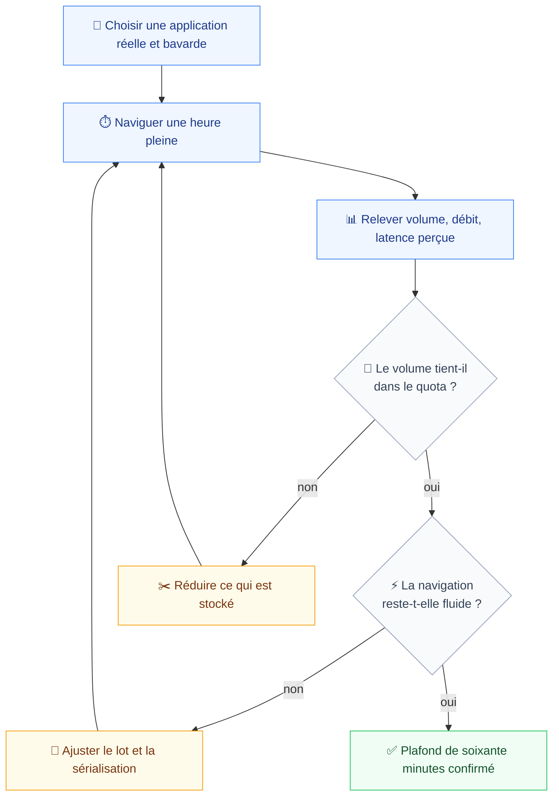
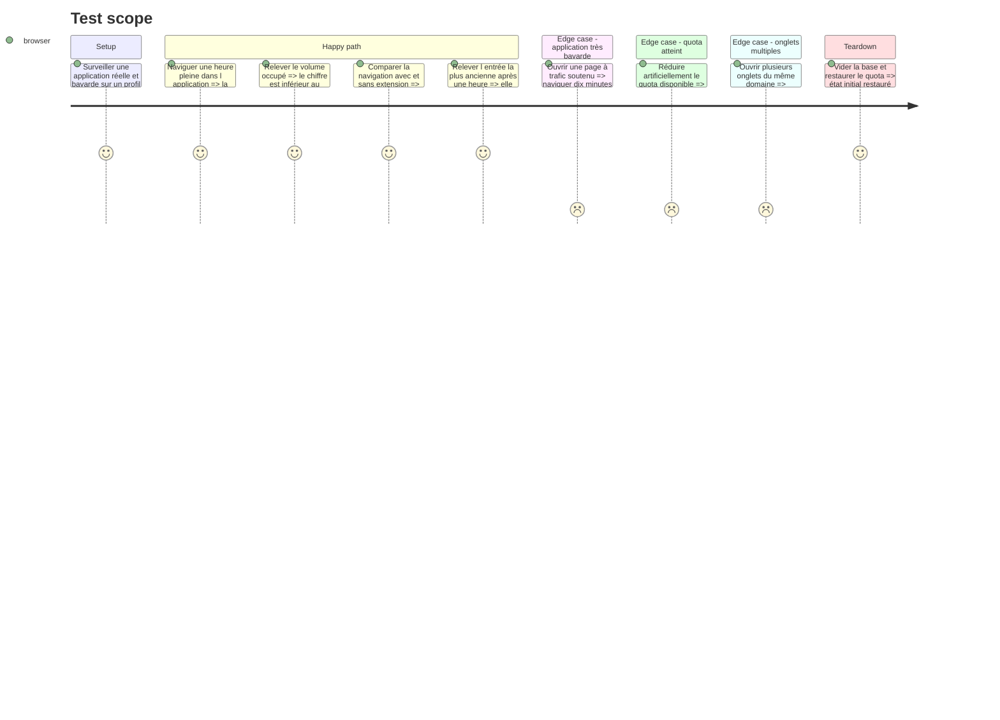

# Instruction: Mesure — volume d'une heure et sobriété

`prd.md:95` désigne cette mesure comme celle qui décide si le produit est vivable : le magasin de contexte tourne en permanence, donc c'est lui qui dit si le plafond de soixante minutes tient.

Elle arrive maintenant, et pas plus tôt, parce qu'elle porte sur le vrai chemin d'écriture — celui des phases 4 et 5 — et pas sur un prototype dont les chiffres ne vaudraient rien. Elle arrive maintenant, et pas plus tard, parce que ses résultats peuvent remettre en cause le plafond avant que sept phases ne s'appuient dessus.

Cette phase ne livre pas de fonctionnalité. Elle produit des chiffres, et les ajustements qu'ils imposent.

## Architecture projection

> Tree of the final files. ✅ create · ✏️ modify · ❌ delete

```txt
.
├── apps/
│   └── extension/
│       └── src/
│           ├── entrypoints/
│           │   └── ✏️ background.ts                  # expose les compteurs de mesure
│           └── storage/
│               ├── ✅ metrics.ts                     # volume, débit d'écriture, âge le plus ancien
│               ├── ✏️ write.ts                       # seuil de lot ajusté par la mesure
│               └── ✏️ prune.ts                       # plafond ajusté si les chiffres l'imposent
└── aidd_docs/
    └── tasks/2026_08/2026_08_06_extension-scope/
        └── ✅ measure-storage.md                     # les chiffres et les décisions, en français
```

## User Journey



## Test Scope



## Tasks to do

### `1)` Instrumenter

> Mesurer, pas estimer.

1. `metrics.ts` expose le volume via `navigator.storage.estimate()`, le nombre d'entrées, le débit d'écriture, et l'horodatage de l'entrée la plus ancienne.
2. Compter séparément le réseau et la console : ils ne se réduisent pas de la même façon.
3. Rendre ces compteurs lisibles sans DevTools, pour relever pendant la navigation.

### `2)` Mesurer sur une application réelle

> `spec.md:60` le pose en dépendance : sans cible réelle, la sobriété n'est pas vérifiable.

1. Choisir l'application cible et la nommer dans le rapport de mesure. Une application interne bavarde vaut mieux qu'un site vitrine.
2. Une heure pleine de navigation représentative, pas un script synthétique.
3. Relever à intervalles réguliers : volume, entrées, débit.
4. Relever la latence perçue avec et sans extension, sur les mêmes parcours.

### `3)` Décider

> Trois seuils, chacun avec sa réponse.

1. **Le volume tient et la navigation est fluide** : le plafond de soixante minutes est confirmé, rien ne bouge.
2. **Le volume déborde** : réduire ce qui est stocké avant de réduire la fenêtre. Les corps de requête et les en-têtes complets sont les premiers candidats — les tronquer coûte moins cher au produit que de raccourcir le rewind, qui est sa promesse.
3. **La navigation se dégrade** : ajuster le seuil de lot dans `write.ts` et la sérialisation console de la phase 5, puis remesurer.
4. **Si le plafond de soixante minutes doit tomber** : arrêter et remonter. `spec.md:11` en fait une contrainte ferme ; la changer change le produit, pas le code.

### `4)` Consigner

> `measure-storage.md`, en français, avec les chiffres bruts.

1. L'application mesurée, la durée, la version de Chrome, le matériel.
2. Volume et débit par nature d'entrée.
3. Les ajustements appliqués et leur effet mesuré.
4. Ce qui reste incertain — une seule application ne prouve pas un plafond universel.

## Test acceptance criteria

| Task | Acceptance criteria                                                                                                                        |
| ---- | ---------------------------------------------------------------------------------------------------------------------------------------------- |
| 1    | Volume, nombre d'entrées et âge de la plus ancienne sont lisibles pendant la navigation, sans outil externe                                   |
| 2    | Une heure pleine de navigation sur une application nommée a produit des relevés horodatés, pas une extrapolation                              |
| 3    | Chaque seuil dépassé a reçu son ajustement, et l'ajustement a été remesuré ; une remise en cause du plafond a été remontée, jamais appliquée seule |
| 4    | `measure-storage.md` permet de rejouer la mesure sur une autre application sans rien redemander                                               |
