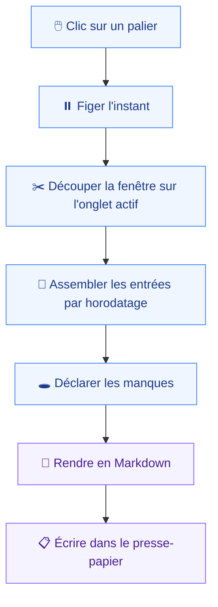
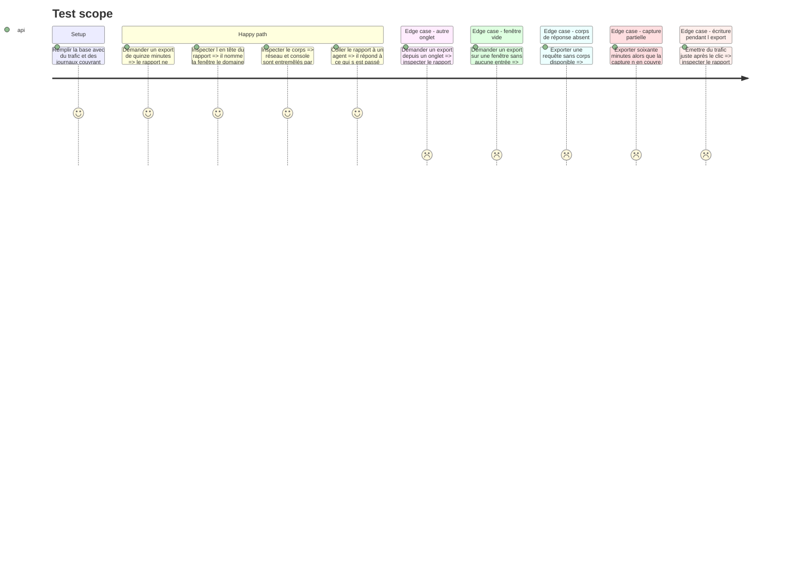

# Instruction: Assemblage et rendu du rapport

Le rapport est le produit. Tout le reste ne sert qu'à le remplir.

`spec.md:20` laisse sa structure entièrement ouverte, et `brainstorm.md:24` note qu'elle n'a jamais été abordée alors qu'elle décide de l'exploitabilité par un agent. Cette phase la tranche : un agent doit répondre à « que s'est-il passé ? » à partir du seul texte collé, sans reformatage.

## Architecture projection

> Tree of the final files. ✅ create · ✏️ modify · ❌ delete

```txt
.
├── apps/
│   └── extension/
│       └── src/
│           ├── export/
│           │   ├── ✅ slice.ts                       # découpe de la fenêtre, onglet actif
│           │   ├── ✅ slice.test.ts                  # couverture obligatoire, testing.md:9
│           │   ├── ✅ bundle.ts                      # assemblage figé
│           │   ├── ✅ bundle.test.ts
│           │   ├── ✅ markdown.ts                    # rendu unique, consommable par un agent
│           │   ├── ✅ markdown.test.ts
│           │   ├── ✅ gaps.ts                        # déclaration des manques
│           │   ├── ✅ gaps.test.ts
│           │   └── ✅ clipboard.ts
│           └── entrypoints/
│               └── ✏️ background.ts                  # sert la demande d'export
├── packages/
│   └── contract/
│       └── src/
│           └── ✏️ report.ts                          # forme figée du bundle
└── e2e/
    └── specs/
        └── ✅ export-report.spec.ts
```

## User Journey



## Test Scope



## Tasks to do

### `1)` Découper la fenêtre

> Pure, testable sans navigateur — c'est là que doit vivre l'essentiel de la couverture (`testing.md:9`).

1. `slice.ts` prend un instant de figement, une profondeur, un identifiant d'onglet, et rend les entrées concernées.
2. Borner à soixante minutes quelle que soit la demande (`spec.md:12`).
3. Aucun tri, aucun filtrage à l'intérieur de la fenêtre (`spec.md:14`).
4. `slice.test.ts` couvre : bornes exactes, fenêtre vide, entrées d'un autre onglet, demande au-delà du plafond, capture plus courte que la fenêtre demandée.

### `2)` Figer le bundle

> Ce qui arrive après le clic n'y entre pas (`spec.md:14`).

1. `bundle.ts` capte l'instant de figement en premier, avant toute lecture de base.
2. Rassembler les métadonnées : fenêtre couverte, profondeur réellement disponible, domaine, onglet, URL, version de l'extension, `schemaVersion`.
3. Ordonner par horodatage croissant, réseau et console dans un seul fil — c'est l'ordre des causes, celui dont un agent a besoin.

### `3)` Déclarer les manques

> `prd.md:79` l'exige pour les corps de réponse ; la même règle vaut pour les trois autres trous.

1. `gaps.ts` recense : corps de réponse indisponibles, messages générés par le navigateur hors de portée, capture démarrée après le chargement de la page, fenêtre rétrécie par le quota.
2. Chaque manque est une phrase explicite dans le rapport, jamais une absence.
3. Les manques figurent en tête, pas en note de bas de page : un agent doit savoir ce qu'il ne voit pas avant de conclure.

### `4)` Rendre en Markdown

> Un seul format, pour tous les destinataires (`spec.md:15`). Décision de structure, à figer ici.

1. En-tête : ce qui est couvert et ce qui manque, en premier.
2. Corps : un fil chronologique unique. Une requête tient sur un bloc — horodatage, méthode, URL, statut, durée, en-têtes, corps de requête si présent, mention du corps de réponse indisponible.
3. Une entrée console tient sur un bloc — horodatage, niveau, texte sérialisé, pile pour une erreur.
4. Ni tableau, ni imbrication profonde : le format doit rester lisible tronqué, puisqu'un rapport d'une heure peut dépasser la fenêtre de contexte de son destinataire.
5. `markdown.test.ts` verrouille la forme sur des instantanés — une dérive silencieuse casserait l'exploitabilité sans casser aucun test de logique.

### `5)` Copier

> Le seul effet de bord de l'export.

1. `clipboard.ts` écrit dans le presse-papier depuis la popup, contexte porteur du geste utilisateur.
2. Rendre l'échec visible : un presse-papier refusé doit se voir, pas se deviner.

## Test acceptance criteria

| Task | Acceptance criteria                                                                                                                       |
| ---- | --------------------------------------------------------------------------------------------------------------------------------------------- |
| 1    | Une demande de quatre-vingt-dix minutes rend au plus soixante minutes ; aucune entrée d'un autre onglet n'apparaît jamais                    |
| 2    | Du trafic émis juste après le clic est absent du rapport ; l'en-tête nomme la fenêtre, le domaine et l'onglet                                |
| 3    | Les quatre manques possibles produisent chacun une phrase explicite en tête de rapport                                                       |
| 4    | Un agent répond à « que s'est-il passé ? » depuis le seul rapport collé, sans reformatage ; les instantanés verrouillent la forme            |
| 5    | Le rapport atteint le presse-papier ; un échec de copie est affiché, jamais silencieux                                                       |
