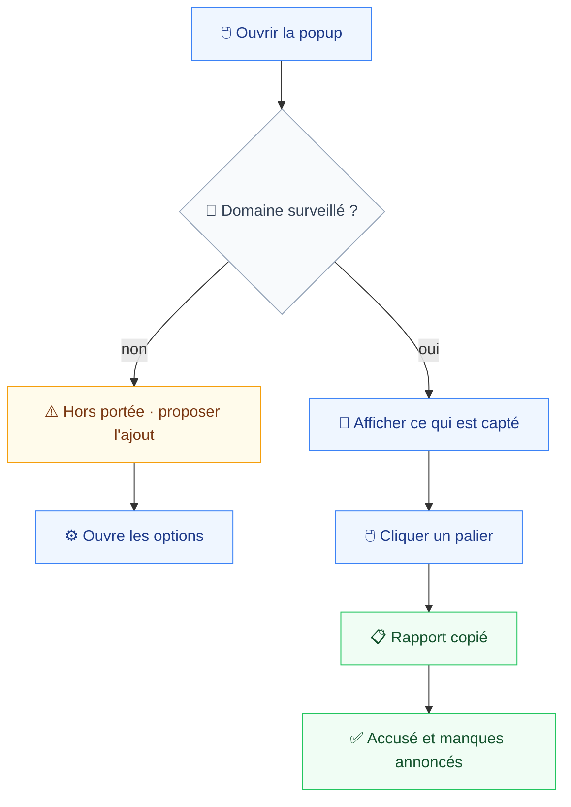
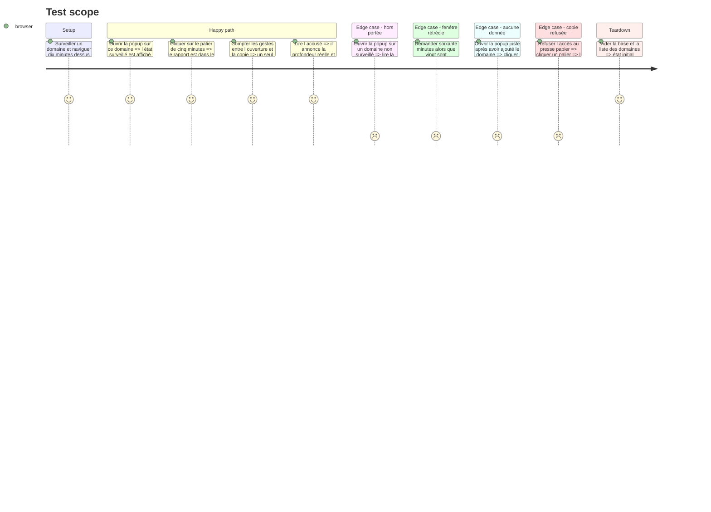

# Instruction: Popup d'export

Le geste complet du produit tient ici : voir que le domaine est surveillé, cliquer sur une profondeur, avoir le rapport. Rien entre les deux (`spec.md:13`).

Deux états portent tout le risque d'usage. **Hors portée** : rien ne se passe visiblement quand la capture n'a pas lieu, et l'utilisateur ne le découvre qu'à l'export — `design.md:21` en fait le point le plus susceptible d'être mal lu. **Fenêtre rétrécie** : la profondeur demandée n'est pas celle qui sera livrée.

## Architecture projection

> Tree of the final files. ✅ create · ✏️ modify · ❌ delete

```txt
.
└── apps/
    └── extension/
        └── src/
            ├── entrypoints/
            │   └── popup/
            │       ├── ✏️ App.tsx                    # la coquille de la phase 1 est remplie
            │       ├── ✅ ScopeStatus.tsx            # les quatre états de capture
            │       ├── ✅ DepthButtons.tsx           # quatre boutons, aucun présélectionné
            │       ├── ✅ TabContextLine.tsx         # ce que couvrira l'export
            │       └── ✅ CopyFeedback.tsx           # accusé de copie et manques
            ├── ui/
            │   └── ✅ components/                    # primitives shadcn/ui ajoutées ici
            └── ✏️ export/clipboard.ts                # branché sur le geste du clic
```

## User Journey



## Test Scope



## Wireframe

```txt
┌──────────────────────────────────┐
│ (1) Statut de portée du domaine   │
├──────────────────────────────────┤
│ (2) Exporter les dernières        │
│  ┌──────┬──────┬──────┬───────┐   │
│  │ 5min │15min │30min │ 60min │   │
│  └──────┴──────┴──────┴───────┘   │
├──────────────────────────────────┤
│ (3) Ligne de contexte de l'onglet │
├──────────────────────────────────┤
│ (4) Accusé de copie               │
├──────────────────────────────────┤
│ (5) [Inspecter]      [Réglages]   │
└──────────────────────────────────┘
```

1. L'état le plus lisible de la surface. Hors portée, il porte l'action d'ajout du domaine.
2. Les quatre paliers sont quatre boutons d'export, aucun présélectionné : un clic déclenche, il n'y a rien à valider ensuite.
3. Ce que couvrira l'export : domaine, onglet, profondeur réellement disponible.
4. Après copie : la profondeur livrée et les manques déclarés par la phase 7.
5. Sorties vers le side panel de la phase 10 et les options de la phase 3.

## Tasks to do

### `1)` Rendre les quatre états de capture

> `design.md:20` les impose sur toute surface affichant un statut. La vidéo étant hors périmètre, il en reste trois ici.

1. **Hors portée** : le domaine n'est pas surveillé. État visuellement dominant, portant l'action d'ajout — c'est le seul chemin de sortie utile.
2. **En capture** : le domaine est surveillé, avec le volume capté pour cet onglet.
3. **Dégradée** : la permission d'hôte a été révoquée hors de l'extension, ou le quota a rétréci la fenêtre. Dire laquelle.
4. Jamais la couleur seule : chaque état porte un libellé (`design.md:29`).

### `2)` Construire les boutons de profondeur

> Un clic est l'export, pas une sélection.

1. Quatre boutons sur une rangée, dans un popup de quelques centaines de pixels (`design.md:16`).
2. Chacun déclenche directement l'assemblage de la phase 7 et la copie.
3. Aucun état sélectionné par défaut, aucune validation ensuite — décision du plan résolvant `spec.md:21`.
4. Désactiver les paliers plus profonds que ce qui est réellement disponible, en disant pourquoi plutôt qu'en les grisant en silence.

### `3)` Rendre le retour

> Ce que l'utilisateur emporte sans le savoir doit lui être dit.

1. Confirmation de copie, avec la profondeur réellement livrée.
2. Les manques déclarés par `gaps.ts` de la phase 7, résumés en une ligne.
3. Un échec de copie s'affiche et propose un second essai.
4. Une fenêtre sans aucune entrée est annoncée avant la copie, pas après.

### `4)` Câbler les sorties

> Deux boutons, deux surfaces.

1. Ouvrir le side panel de la phase 10 — s'il n'est pas encore livré, masquer le bouton plutôt que de le laisser inerte.
2. Ouvrir la page d'options.

## Test acceptance criteria

| Task | Acceptance criteria                                                                                                                         |
| ---- | ----------------------------------------------------------------------------------------------------------------------------------------------- |
| 1    | Les trois états sont distinguables sans couleur ; l'état hors portée propose l'ajout du domaine et rien d'autre                                |
| 2    | Un seul clic sépare l'ouverture de la popup du rapport dans le presse-papier ; un palier indisponible dit pourquoi il l'est                    |
| 3    | L'accusé annonce la profondeur livrée quand elle diffère de celle demandée ; une fenêtre vide est signalée avant la copie                      |
| 4    | Les deux sorties ouvrent leur surface ; aucun bouton ne mène à une surface non livrée                                                          |
