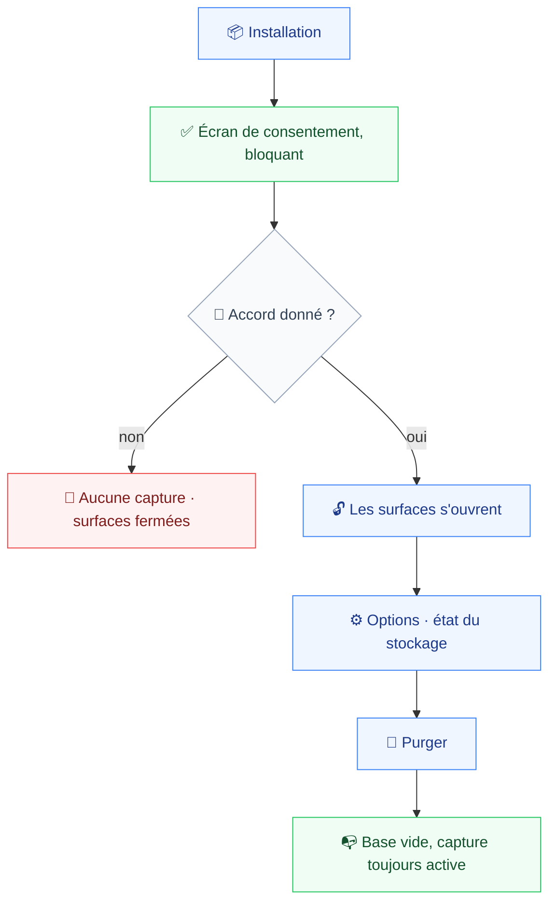
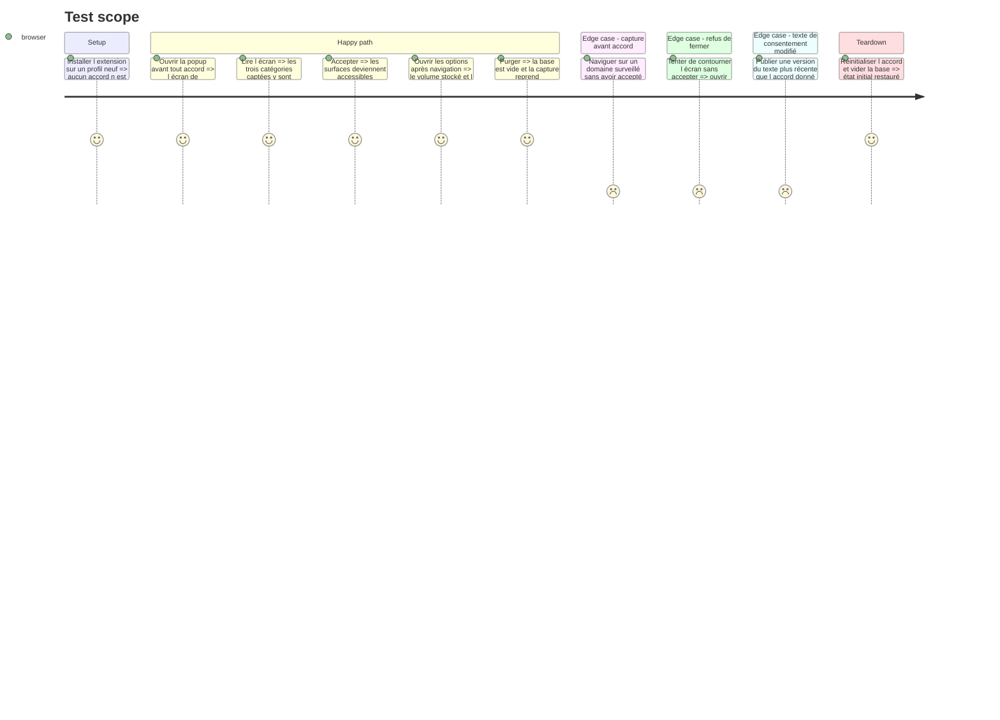

# Instruction: Consentement, transparence et purge

L'écran de consentement n'est pas une préférence d'ergonomie : la politique du Chrome Web Store exige que la divulgation et l'accord se produisent **dans l'interface du produit**, et précise qu'ils ne peuvent pas résider seulement dans une politique de confidentialité. Une soumission sans cet écran est rejetée, quel que soit le lien fourni.

Cette phase livre aussi les deux contreparties promises à l'utilisateur : voir ce qui est stocké, et l'effacer (`spec.md:17`).

## Architecture projection

> Tree of the final files. ✅ create · ✏️ modify · ❌ delete

```txt
.
├── apps/
│   └── extension/
│       └── src/
│           ├── entrypoints/
│           │   ├── ✏️ background.ts                  # bloque la capture avant l'accord
│           │   ├── ✅ consent/
│           │   │   ├── ✅ index.html
│           │   │   ├── ✅ main.tsx
│           │   │   └── ✅ App.tsx                    # écran bloquant premier lancement
│           │   ├── ✏️ options/App.tsx                # régions 4 et 5 remplies
│           │   └── ✏️ popup/App.tsx                  # redirige tant que l'accord manque
│           ├── consent/
│           │   ├── ✅ state.ts                       # accord donné, version acceptée
│           │   └── ✅ state.test.ts                  # couverture obligatoire, testing.md:22
│           └── storage/
│               ├── ✅ purge.ts                       # effacement total
│               └── ✅ purge.test.ts
├── ✅ docs/privacy-policy.md                         # publiée sur GitHub Pages avant soumission
└── e2e/
    └── specs/
        └── ✅ consent-flow.spec.ts
```

## User Journey



## Test Scope



## Wireframe

```txt
┌────────────────────────────────────────────┐
│ (1) Titre + une phrase de promesse          │
├────────────────────────────────────────────┤
│ (2) Ce qui est capté                        │
│   • trafic réseau, en-têtes bruts inclus    │
│   • sorties console et erreurs JS           │
│   • uniquement sur les domaines désignés    │
├────────────────────────────────────────────┤
│ (3) Ce qui ne l'est pas                     │
│   • rien ne quitte la machine               │
│   • aucun domaine non désigné               │
│   • rien au-delà d'une heure                │
├────────────────────────────────────────────┤
│ (4) [lien politique de confidentialité]     │
├────────────────────────────────────────────┤
│ (5)              [ J'accepte ]              │
└────────────────────────────────────────────┘
```

1. Titre : pose l'objet avant la liste.
2. Les catégories captées, énumérées sans dépliage — c'est la clause opposable au CWS.
3. Les limites, symétriques : ce qui rassure n'a de valeur qu'à côté de ce qui inquiète.
4. Lien vers la page publiée, obligatoire mais insuffisant seul.
5. Action unique et explicite. Aucune capture avant ce clic.

## Tasks to do

### `1)` Bloquer la capture avant l'accord

> « Avant toute capture » est littéral (`spec.md:16`).

1. `state.ts` persiste l'accord et **la version du texte accepté** dans `chrome.storage`. Un texte modifié redemande l'accord — sinon la divulgation ne couvre plus ce qui est capté.
2. `background.ts` refuse toute écriture tant que l'accord manque. Le verrou est sur le chemin d'écriture, comme le filtre de portée : c'est le seul endroit qui ne peut pas être contourné.
3. `state.test.ts` couvre : sans accord, avec accord, avec un accord périmé par une nouvelle version.

### `2)` Construire l'écran de consentement

> Bloquant, pas une bannière (`design.md:23`).

1. Entrypoint WXT dédié, ouvert au premier lancement par `runtime.onInstalled`.
2. Les trois catégories captées, énumérées. Ne pas énumérer la vidéo : elle est hors périmètre de cette version, et annoncer ce qui n'est pas capté fabrique un faux.
3. Les limites en regard : rien ne sort de la machine, rien hors domaines désignés, rien au-delà d'une heure.
4. Popup et options renvoient ici tant que l'accord manque.
5. Le texte reste consultable après acceptation, depuis les options.

### `3)` Afficher et purger le stockage

> La contrepartie promise à l'utilisateur.

1. Région 4 des options : volume total, entrée la plus ancienne, répartition par domaine. Les compteurs viennent de `metrics.ts` de la phase 6.
2. `purge.ts` vide la base. La capture reprend immédiatement après — purger n'est pas désactiver.
3. La répartition par domaine sert la vérification directe : un domaine jamais désigné n'y apparaît jamais.
4. Région 5 : le texte du consentement, relu à froid.

### `4)` Écrire la politique de confidentialité

> Elle doit être publiquement joignable **avant** la soumission (`deployment.md:33`).

1. `docs/privacy-policy.md` : ce qui est capté, où c'est stocké, ce qui n'est jamais transmis, comment effacer.
2. Cohérente au mot près avec l'écran de consentement — une divergence entre les deux est un motif de rejet.
3. Publication sur GitHub Pages : phase 11.

## Test acceptance criteria

| Task | Acceptance criteria                                                                                                                        |
| ---- | ---------------------------------------------------------------------------------------------------------------------------------------------- |
| 1    | Naviguer sur un domaine surveillé avant tout accord laisse la base vide ; un texte de consentement plus récent redemande l'accord             |
| 2    | Toute surface ouverte avant l'accord renvoie à l'écran de consentement ; les trois catégories captées y sont énumérées                        |
| 3    | Les options affichent volume, âge de la plus ancienne entrée et répartition par domaine ; après purge la base est vide et la capture continue |
| 4    | La politique de confidentialité et l'écran de consentement énoncent les mêmes catégories, sans divergence                                    |
