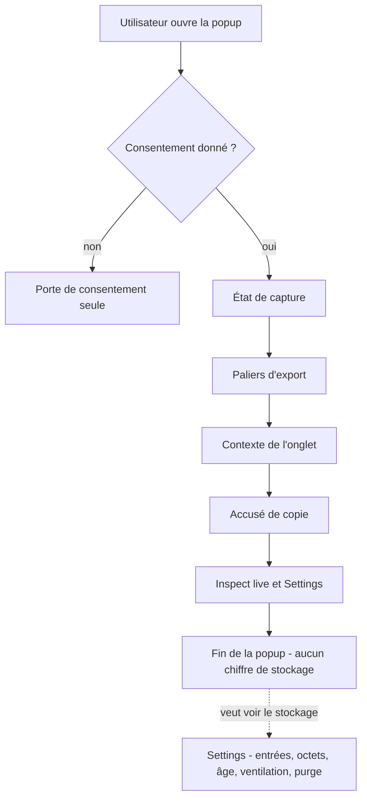
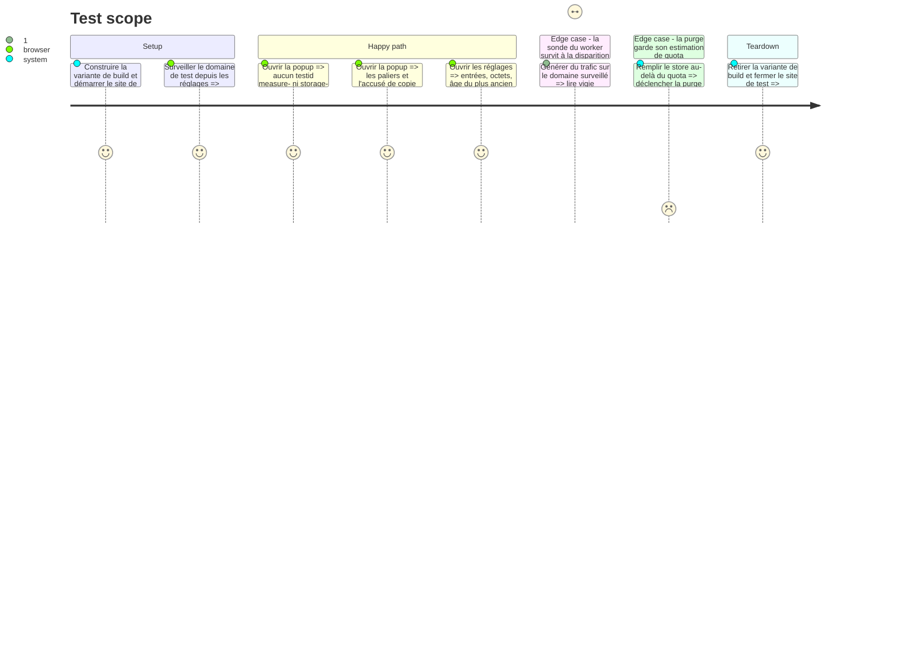

# Instruction: Retrait de l'instrumentation de la popup

## Architecture projection

> Tree of the final files. ✅ create · ✏️ modify · ❌ delete

```txt
.
├── apps/extension/src/
│   ├── entrypoints/
│   │   ├── options/
│   │   │   └── StoredData.tsx                    (inchangé — seul lecteur restant de captureMetrics)
│   │   └── popup/
│   │       └── App.tsx                           ✏️ sonde et bloc de stockage retirés
│   ├── capture/network/
│   │   └── listener-lifecycle.ts                 (inchangé — la sonde du worker survit, seul son affichage part)
│   └── storage/
│       ├── metrics.ts                            ✏️ série de relevés et champs de projection retirés
│       ├── metrics.test.ts                       ✏️
│       └── prune.ts                              (inchangé — consomme estimateQuota)
└── e2e/specs/
    ├── storage-metrics.spec.ts                   ❌ le fichier entier testait l'instrumentation
    ├── watched-domains.spec.ts                   ✏️ compteurs lus en storage.session, plus dans le DOM
    └── optional-host-permission.spec.ts          ✏️ idem, un seul test concerné
```

## User Journey



## Test Scope



## Wireframe

```txt
┌──────────────────────────────────────────────┐
│ Vigie                                        │
├──────────────────────────────────────────────┤
│ ● Capturing                                  │
│   example.com is watched. 284 entries…       │
├──────────────────────────────────────────────┤
│ [ 5 min ][ 15 min ][ 30 min ][ 60 min ]      │
│ 30 min and 60 min unavailable: …             │
├──────────────────────────────────────────────┤
│ example.com · tab 4 · 28.4 min available     │
├──────────────────────────────────────────────┤
│ Pick a depth. The report goes straight…      │
├──────────────────────────────────────────────┤
│ [ Inspect live ]        [ Settings ]         │
└──────────────────────────────────────────────┘
   ↑ la popup s'arrête ici. Tout ce qui suivait
     — sonde phase 2, chiffres de stockage,
     relevés — disparaît sans remplacement.
```

## Tasks to do

### `1)` Vider `popup/App.tsx` de sa sonde

> La popup ne garde que ce qui sert l'export. Rien n'est déplacé.

1. Supprimer le `<section>` d'instrumentation, `App.tsx:371-478`, en entier.
2. Supprimer les aides qui n'ont plus de lecteur : `bytes()` (`:75`), `span()` (`:83`), `percent()` (`:87`).
3. Supprimer le `useEffect` de relevé, `App.tsx:171-199`, ainsi que `reading()` (`:208`), `take()` (`:216`), `copyReadings()` (`:222`), `forgetReadings()` (`:226`).
4. Supprimer les états `state`, `metrics`, `readings` (`:101-103`) et la dérivation `lastChange` / `covered` (`:283-284`).
5. Purger les imports devenus morts : `EMPTY_MEASUREMENT_STATE`, `MEASUREMENT_STATE_KEY`, `MeasurementState`, tout le bloc `@/storage/metrics`. `RETENTION_MS` et `MS_PER_MINUTE` restent, `readFacts` les lit encore (`:137`).
6. Retirer du bloc de documentation la partie « The instrumentation below the fold » (`:62-71`), qui décrit ce qui n'existe plus.

### `2)` Réduire `storage/metrics.ts` à ses deux consommateurs restants

> Ce module ne devient pas mort. Il maigrit.

1. Confirmer les lecteurs restants avant de couper : `prune.ts:2,85` prend `estimateQuota` et `QuotaEstimate`, `StoredData.tsx:2,55` prend `captureMetrics` et `CaptureMetrics`.
2. Supprimer la série de relevés : `STORAGE_READINGS_KEY`, `MAX_READINGS`, `recordReading`, `readReadings`, `clearReadings`, `formatReadings`.
3. Retirer de `CaptureMetrics` les champs que seule la popup lisait : `byKind`, `entriesPerMinute`, `bytesPerEntry`, `projectedHourBytes`, `projectedQuotaRatio`, `quotaBytes`, `usageBytes`, `baselineBytes`. Garder ce que `StoredData.tsx:73-148` affiche : `entryCount`, `storeBytes`, `oldestEntryAt`, `byDomain`, `takenAt`.
4. Supprimer du calcul de `captureMetrics` tout ce qui n'alimentait que ces champs, y compris l'appel à `estimateQuota` s'il n'y sert plus qu'à eux — `estimateQuota` reste exporté pour `prune.ts`.
5. Ajuster `metrics.test.ts` : retirer les cas de la série de relevés et ceux des champs supprimés, garder ceux qui portent sur `entryCount`, `storeBytes`, `byDomain` et `estimateQuota`.

### `3)` Rebrancher les deux specs qui se servaient de la sonde comme instrument de mesure

> Elles ne testent pas l'instrumentation, elles s'en servaient pour observer le worker. Le compteur existe toujours, il n'est plus affiché.

1. Reprendre le patron déjà écrit à `optional-host-permission.spec.ts:56-65` : ouvrir `popup.html`, lire `MEASUREMENT_STATE_KEY` par `chrome.storage.session.get` en `page.evaluate`, fermer la page.
2. Dans `watched-domains.spec.ts`, réécrire le helper `counters()` (`:58`) sur ce patron, et remplacer l'assertion `measure-permission-changes` (`:99`) par la lecture de `permissionChanges.length` sur l'état lu.
3. Dans `optional-host-permission.spec.ts`, remplacer le `expect.poll` sur `measure-network-events` (`:213`) par un `expect.poll` sur `networkEvents` de l'état lu. Garder le commentaire de `:202` qui explique pourquoi le compteur est nécessaire.
4. Ne pas factoriser le helper entre les deux fichiers dans cette phase : deux copies de six lignes coûtent moins qu'un module partagé introduit au milieu d'un retrait.

### `4)` Supprimer `e2e/specs/storage-metrics.spec.ts`

> 440 lignes qui n'ont plus de sujet.

1. Vérifier qu'aucun autre fichier ne l'importe, ni sa variante de build.
2. Supprimer le fichier avec `trash`, pas `rm`.
3. Vérifier que `measure-storage.md` n'est référencé nulle part comme procédure exécutable de la recette — c'est un protocole documenté, pas un test.

## Test acceptance criteria

| Task | Acceptance criteria                                                                                                                         |
| ---- | --------------------------------------------------------------------------------------------------------------------------------------------- |
| 1    | La popup ouverte sur un domaine surveillé n'affiche aucun chiffre de stockage ni de mesure ; les paliers, le contexte d'onglet, l'accusé de copie, `Inspect live` et `Settings` restent tous présents et fonctionnels |
| 2    | La page de réglages continue d'afficher entrées, octets, âge du plus ancien, ventilation par domaine et bouton de purge ; la purge continue de rétrécir la fenêtre et de le signaler quand le quota force la main |
| 3    | Après du trafic sur un domaine surveillé, `watched-domains.spec.ts` et `optional-host-permission.spec.ts` observent la progression des compteurs du worker sans passer par le DOM de la popup |
| 4    | La suite e2e complète passe sans `storage-metrics.spec.ts`, et aucun test ne référence un `data-testid` commençant par `measure-` ou `storage-` |
