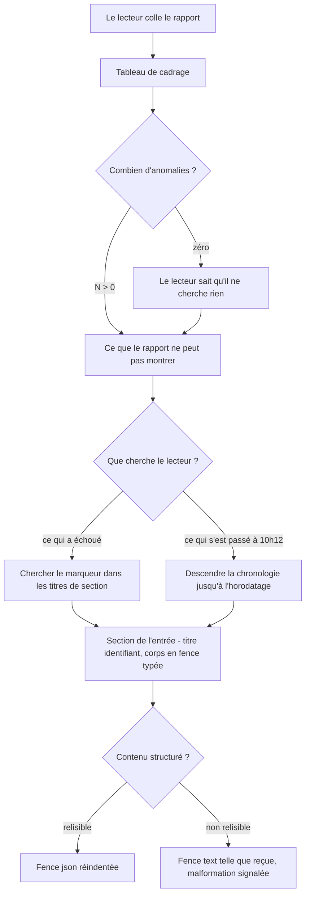
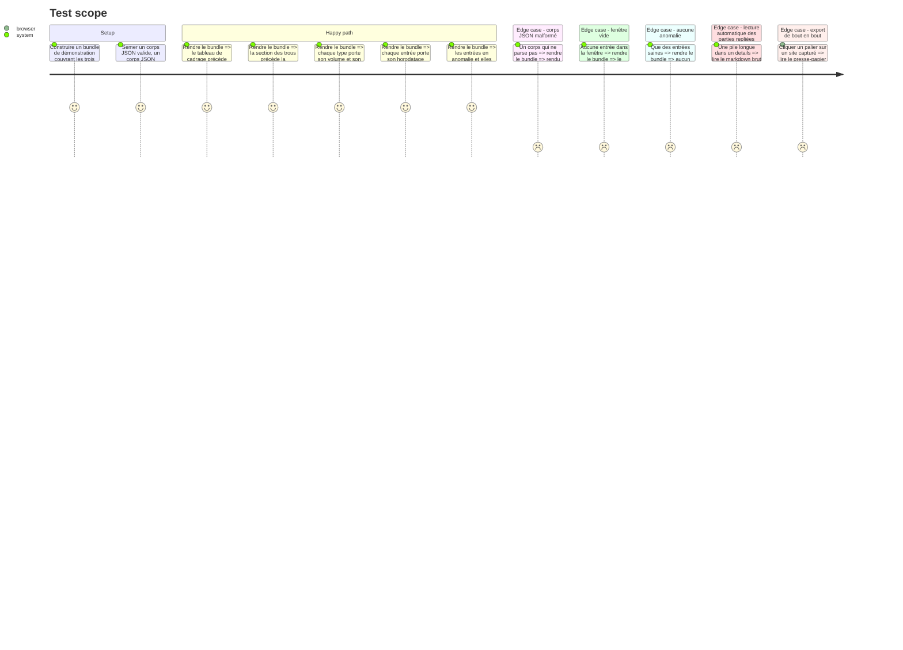

# Instruction: Le rapport structuré

## Architecture projection

> Tree of the final files. ✅ create · ✏️ modify · ❌ delete

```txt
.
├── packages/contract/src/
│   ├── events.ts                        (inchangé — source des champs sur lesquels l'anomalie se lit)
│   └── report.ts                        (inchangé — aucun changement de contrat)
├── apps/extension/src/export/
│   ├── anomalies.ts                     ✅ définition unique de l'anomalie et comptes par type
│   ├── anomalies.test.ts                ✅
│   ├── bundle.ts                        (inchangé — le bundle ne change pas de forme)
│   ├── gaps.ts                          (inchangé — les trous sont déjà calculés)
│   ├── markdown.ts                      ✏️ réécriture complète du rendu
│   └── markdown.test.ts                 ✏️ snapshots refaits
└── e2e/specs/
    └── export-report.spec.ts            ✏️ assertions et helper timelineStamps refaits
```

## User Journey



## Test Scope



## Tasks to do

### `1)` Nommer l'anomalie une seule fois, dans `export/anomalies.ts`

> Le renderer ne doit pas redécider ce qu'est une anomalie à chaque endroit où il l'affiche.

1. Écrire `isAnomalous(entry: CaptureEntry): boolean` : réseau si `outcome === 'failed'` ou `statusCode >= 400` ; console si `level === 'error'` ; toute entrée `kind === 'error'`.
2. Écrire `countEntries(bundle: ReportBundle)` retournant, par type, le total et le détail des anomalies : réseau `{ total, failed, badStatus }`, console `{ total, errors }`, erreurs `{ total }`, plus le total d'anomalies toutes catégories.
3. Ne pas toucher `packages/contract`. L'anomalie est une lecture du rapport, pas une propriété stockée — la placer dans le contrat imposerait une migration Dexie (`database.md:44`) pour une dérivation.
4. Couvrir en test les bornes qui se trompent facilement : `statusCode` à 399 et 400, `outcome: 'pending'` sans statut, `level: 'warn'`.

### `2)` Réécrire l'en-tête en tableau de cadrage

> Le lecteur doit connaître le périmètre, la période, le volume et le nombre d'anomalies avant toute chronologie.

1. Remplacer `reportHeader()` (`markdown.ts:66-80`) par un tableau à deux colonnes. Lignes : `Subject`, `URL`, `Title` si présent, `Window`, `Period`, `Network`, `Console`, `JS errors`, `Anomalies`, `Produced by`.
2. Les volumes viennent de `countEntries` et portent leur détail d'anomalies entre parenthèses. Aucun index ligne à ligne.
3. Conserver `known()` pour les valeurs manquantes : une valeur absente se dit, elle ne se rend pas en blanc.
4. Échapper les `|` dans les valeurs — une URL de requête peut en porter un, et un tuyau non échappé casse la ligne du tableau.

### `3)` Réécrire la chronologie en sections par entrée

> Un titre qui identifie l'entrée sans lire son contenu, et un marqueur sur celles qui sont en anomalie.

1. Garder l'ordre unique par horodatage, tous kinds mêlés. C'est l'ordre des causes, et le séparer par type éloignerait la ligne de log de la requête qu'elle explique (`markdown.ts:18-20`).
2. Titre de niveau 3 : `### {marqueur}{horodatage ISO complet} · {kind} · {intitulé}`.
   - Marqueur `[!] ` sur les seules entrées en anomalie, préfixe fixe et greppable.
   - Intitulé réseau : `{method} {chemin de l'URL} → {statut ou `failed` ou `pending`}`.
   - Intitulé console : `{level} · {première ligne du texte, coupée à 80 caractères}`.
   - Intitulé erreur : `{source} · {première ligne du message, coupée à 80 caractères}`.
3. Conserver l'horodatage complet sur chaque entrée, y compris dans le titre : un fragment collé hors contexte doit encore dire quand il s'est produit (`markdown.ts:24-26`).
4. Garder le cas vide explicite : une chronologie vide se dit, sinon elle se lit comme un échec de rendu (`markdown.ts:138-140`).

### `4)` Fences typées, parties repliées, contenu malformé

> Un contenu qui se relit est remis en forme ; un contenu qui ne se relit pas est remis tel quel et signalé.

1. En-têtes de requête et de réponse : `<details><summary>Request headers (N)</summary>` avec une fence `http` à l'intérieur. Ligne vide obligatoire après le `<summary>` et avant le `</details>`, sinon la fence n'est pas rendue.
2. Corps de requête : tenter `JSON.parse`. Si ça parse, fence `json` réindentée à deux espaces. Sinon, fence `text` telle que reçue, précédée de la mention de malformation quand le contenu commence par `{` ou `[` — la malformation est peut-être le défaut recherché, jamais corrigée ni omise.
3. Corps de réponse : garder la mention d'indisponibilité sur chaque requête, jamais omise (`markdown.ts:113-115`). Elle passe en phrase de section au lieu d'une ligne indentée.
4. Texte de console : fence `text`. Pile d'appel d'erreur : `<details><summary>Stack</summary>` avec une fence `js`. Les mentions de troncature de la capture restent, elles disent une autre absence.
5. Ne rien tronquer de nouveau. Le renderer porte tous les en-têtes sans les rogner ; le repli est une affaire de lecture humaine, pas de taille (`markdown.ts:28-31`).
6. Réécrire le bloc de documentation en tête de `markdown.ts` : les quatre décisions de `:14-31` deviennent fausses sur un point et il faut y inscrire la révocation ainsi que le risque accepté — un rapport coupé au milieu d'un tableau ou d'un `<details>` devient partiellement inexploitable.

Squelette visé :

````markdown
# Vigie report — app.example.com

| Field | Value |
| --- | --- |
| Subject | app.example.com, tab 4 |
| URL | https://app.example.com/checkout |
| Title | Checkout |
| Window | 30 min requested, 28.4 min covered |
| Period | 2026-08-07T10:12:03.114Z → 2026-08-07T10:40:27.881Z |
| Network | 284 (3 failed, 5 with status ≥ 400) |
| Console | 31 (2 errors) |
| JS errors | 3 |
| Anomalies | 13 |
| Produced by | Vigie 0.1.0, report schema 1 |

## What this report does not contain

- No response bodies: Chrome does not expose them without the SDK.

## Timeline

### [!] 2026-08-07T10:12:03.114Z · network · POST /api/orders → 500

Completed in 42 ms · xmlhttprequest

<details><summary>Request headers (7)</summary>

```http
content-type: application/json
```

</details>

Request body:

```json
{
  "items": 2
}
```

Response body: not available.

### 2026-08-07T10:12:04.902Z · console · warn · Retrying order submission

```text
Retrying order submission (attempt 2)
```

### [!] 2026-08-07T10:12:09.552Z · error · uncaught · TypeError: total is not a function

```text
TypeError: total is not a function
```

<details><summary>Stack</summary>

```js
at submit (checkout.js:118:9)
```

</details>
````

### `5)` Refaire les tests unitaires et la spec de bout en bout

> Les deux verrouillent l'ancien format ligne à ligne. Ce sont des réécritures, pas des ajustements.

1. `markdown.test.ts` : refaire les snapshots inline sur la nouvelle forme, en gardant les cas déjà couverts — fenêtre vide, entrée sans statut, requête échouée, troncature de capture.
2. Ajouter les cas neufs : corps JSON valide réindenté, corps JSON malformé signalé, marqueur présent sur les seules entrées en anomalie, comptes du cadrage cohérents avec la chronologie.
3. `export-report.spec.ts` : réécrire les assertions de titre, de sujet, d'URL et de fenêtre sur la forme tabulaire ; remplacer `markdown.split('response body: not available')` par le comptage de la nouvelle phrase ; réécrire `timelineStamps()` dont l'expression `/^\d{4}-\d{2}-\d{2}T[\d:.]+Z {2}/` ne matche plus rien.
4. Garder l'assertion d'ordre — le cadrage puis les trous puis la chronologie — c'est la contrainte que la spec formule le plus directement (`spec-export-redesign.md:21`).
5. Ajouter une assertion de lecture automatique : le contenu d'un `<details>` est présent dans le markdown brut, sans dépliage.

## Test acceptance criteria

| Task | Acceptance criteria                                                                                                                                    |
| ---- | -------------------------------------------------------------------------------------------------------------------------------------------------------- |
| 1    | Une requête à 400 compte comme anomalie, une à 399 non ; un `console.warn` non, un `console.error` oui ; toute entrée `error` oui                          |
| 2    | Le rapport s'ouvre sur un tableau donnant domaine, onglet, URL, fenêtre demandée et couverte, période, volume par type dont le compte d'anomalies          |
| 3    | Un lecteur trouve les trois entrées en anomalie d'un rapport de 318 entrées en cherchant le marqueur, sans parcourir la chronologie et sans index         |
| 4    | Un corps JSON valide apparaît réindenté en fence `json` ; un corps malformé apparaît tel qu'il a été reçu en fence `text`, accompagné de la mention de sa malformation ; l'indisponibilité du corps de réponse est dite sur chaque requête |
| 5    | La suite unitaire et `export-report.spec.ts` passent sur le nouveau format, l'ordre cadrage → trous → chronologie est asserté, et un lecteur automatique atteint le contenu des `<details>` sans dépliage |
