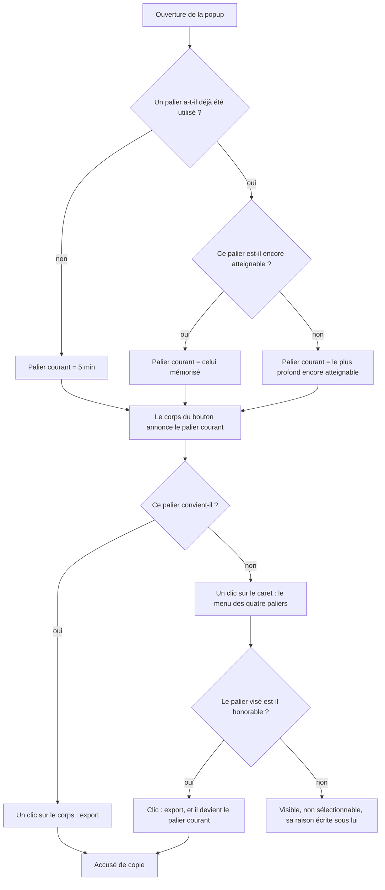
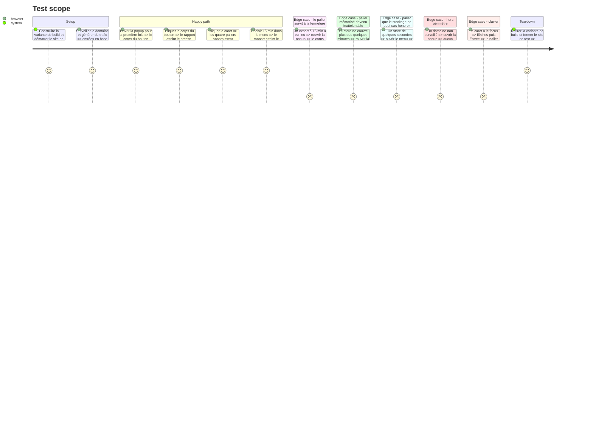

# Instruction: Le geste d'export

## Architecture projection

> Tree of the final files. ✅ create · ✏️ modify · ❌ delete

```txt
.
├── apps/extension/
│   ├── package.json                              ✏️ lucide-react et @radix-ui/react-dropdown-menu
│   └── src/
│       ├── ui/components/
│       │   ├── button.tsx                        (inchangé — Radix.Trigger rend son propre bouton, asChild reste inutile)
│       │   └── dropdown-menu.tsx                 ✅ primitive shadcn/ui copiée et possédée ici
│       └── entrypoints/popup/
│           ├── App.tsx                           ✏️ palier courant lu au montage, ExportButton câblé
│           ├── DepthButtons.tsx                  ❌ remplacé par ExportButton
│           ├── ExportButton.tsx                  ✅ split button — corps, caret, menu des quatre paliers
│           ├── last-depth.ts                     ✅ mémoire locale du dernier palier
│           ├── last-depth.test.ts                ✅
│           ├── state.ts                          ✏️ resolveCurrentDepth ajouté, depthNotice retiré
│           └── state.test.ts                     ✏️
└── e2e/specs/
    ├── popup-export.spec.ts                      ✏️ le geste change, les assertions aussi
    ├── acceptance.spec.ts                        ✏️ la boucle sur les quatre paliers passe par le menu
    └── consent-flow.spec.ts                      ✏️ un seul testid à corriger
```

## User Journey



## Test Scope



## Wireframe

```txt
Fermé                              Ouvert
┌────────────────────────────┐     ┌────────────────────────────┐
│ Export the last            │     │ Export the last            │
│ ┌──────────────────┬─────┐ │     │ ┌──────────────────┬─────┐ │
│ │ Export 5 min     │  v  │ │     │ │ Export 5 min     │  ^  │ │
│ └──────────────────┴─────┘ │     │ └──────────────────┴─────┘ │
└────────────────────────────┘     │        ┌─────────────────┐ │
                                   │        │  5 min          │ │
  corps  = data-testid=export-run  │        │ 15 min          │ │
  caret  = data-testid=export-menu │        │ 30 min          │ │
                                   │        │ 60 min          │ │
                                   │        │ needs 30 min of │ │
                                   │        │ capture, 4.2    │ │
                                   │        │ min held        │ │
                                   │        └─────────────────┘ │
                                   └────────────────────────────┘

  Un palier non honorable garde sa place dans la liste, ne répond
  pas au clic, et porte sa raison en clair sous son libellé —
  jamais en infobulle : un élément désactivé ne reçoit ni le
  survol ni le clic.
```

## Tasks to do

### `1)` Faire entrer les deux dépendances et copier la primitive de menu

> Une seule fois, avant tout code de surface.

1. Ajouter à `apps/extension/package.json` : `lucide-react` en `1.30.0`, `@radix-ui/react-dropdown-menu` en `2.1.24`. Versions figées, comme tout le reste du fichier.
2. Copier la primitive `dropdown-menu` de shadcn/ui dans `src/ui/components/dropdown-menu.tsx`, la réduire aux parties utilisées — `Root`, `Trigger`, `Portal`, `Content`, `Item` — et lui donner un bloc de documentation qui dit pourquoi Radix entre ici alors que `button.tsx:9-11` l'avait écarté.
3. Ne pas réintroduire `asChild` dans `button.tsx` : `DropdownMenu.Trigger` rend déjà un `<button>` et se style directement avec `buttonVariants`.
4. Construire l'extension et ouvrir la popup du build pour confirmer que la CSP par défaut des `extension_pages` n'empêche pas Radix d'injecter ses styles. En cas de refus, la primitive maison redevient la solution et cette phase change de moyen sans changer de but.

### `2)` Se souvenir du dernier palier, dans `popup/last-depth.ts`

> Sur la machine seule, jamais synchronisé.

1. `readLastDepth(): Promise<ExportDepthMinutes | null>` et `writeLastDepth(depth: ExportDepthMinutes): Promise<void>`, sur `chrome.storage.local`, clé `vigie:export-depth`.
2. `storage.local`, pas `storage.sync` : la spec borne la mémoire à la machine, et `sync` la ferait traverser les appareils de l'utilisateur.
3. Valider à la lecture. Une valeur absente, corrompue ou hors des quatre paliers rend `null`, jamais une exception : cette clé est écrite par une version dont le jeu de paliers peut changer.

### `3)` Décider du palier courant, dans `popup/state.ts`

> La règle est une fonction pure, testée sans navigateur, comme tout le reste des décisions de la popup.

1. Exporter `DEFAULT_EXPORT_DEPTH_MINUTES = 5`, le palier d'avant tout premier export.
2. Écrire `resolveCurrentDepth(remembered, availability)` : le palier mémorisé s'il est encore honorable, sinon le plus profond encore honorable, sinon le défaut. Le palier le plus court n'est jamais désactivé (`state.ts:157`), donc un repli existe toujours.
3. Supprimer `depthNotice()` (`state.ts:175-181`) : la raison passe sous chaque palier du menu, la ligne collective sous la rangée n'a plus de rangée.
4. Laisser `depthAvailability()` intacte. Sa règle — un palier n'est désactivé que si la capture n'atteint même pas le palier précédent — reste juste et son commentaire explique pourquoi (`state.ts:146-159`).
5. Couvrir en test : premier lancement, palier mémorisé encore honorable, palier mémorisé devenu inatteignable, capture vide.

### `4)` Écrire `popup/ExportButton.tsx` et retirer `DepthButtons.tsx`

> Un corps qui rejoue, un caret qui ouvre, quatre paliers qui exportent.

1. Corps : `data-testid="export-run"`, libellé `Export the last {palier} min`, désactivé pendant un export en vol.
2. Caret : `data-testid="export-menu"`, `aria-label` explicite, icône `ChevronDown` de lucide. Les deux moitiés se collent visuellement — arrondis extérieurs seulement, bordure partagée.
3. Éléments du menu : `data-testid={`export-${palier}`}`, plus `data-enabled` et `data-reason`. Ce sont ces attributs que la recette lit ; l'état désactivé d'un élément de menu Radix n'est pas un attribut `disabled` de bouton.
4. Un palier non honorable reste dans la liste, ne répond pas au clic, et porte sa raison en texte sous son libellé — sans survol ni clic.
5. Un clic sur un palier exporte et l'écrit en mémoire. C'est le seul moment où `writeLastDepth` est appelée : un menu ouvert puis refermé ne change rien.
6. Supprimer `DepthButtons.tsx` avec `trash`, et son import dans `App.tsx:37`.

### `5)` Câbler `App.tsx`

> Le palier courant se lit une fois, au montage, avec le reste des faits.

1. Ajouter un état `rememberedDepth` et le lire dans l'effet de montage existant, à côté de `readFacts` — pas dans un effet à part, un second passage ferait clignoter le libellé du bouton.
2. Dériver le palier courant par `resolveCurrentDepth(rememberedDepth, availability)` et le passer à `ExportButton`.
3. Après un export réussi, écrire le palier et mettre à jour l'état local, pour que le libellé du corps suive sans attendre une réouverture.
4. Ne pas toucher `exportReport()` : l'écriture du presse-papier doit rester la dernière instruction du gestionnaire, sur l'activation transitoire que le clic a accordée (`App.tsx:247-254`).
5. Garder `CopyFeedback` et sa reprise inchangés — la reprise rejoue la profondeur du rapport produit, pas le palier courant.

### `6)` Réécrire les trois specs de bout en bout que le geste casse

> Le geste change ; ce que la recette prouve ne change pas.

1. `popup-export.spec.ts` : `:110-111` deviennent l'absence de `export-run` hors périmètre ; `:145` et `:234` cliquent `export-run` ; `:151-162` ouvre le menu et lit `data-enabled` et `data-reason` sur `export-60`, `depth-notice` disparaît ; `:195-196` ouvre le menu avant de cliquer `export-60`.
2. `acceptance.spec.ts` : `:165-166` deviennent l'absence de `export-run` ; la boucle `:225-227` ouvre le menu puis vérifie que les quatre paliers y sont ; `:230` clique `export-run`.
3. `consent-flow.spec.ts:149` : `export-15` devient `export-run`, toujours à un compte de zéro sous la porte de consentement.
4. Ajouter à `popup-export.spec.ts` le test de la mémoire : exporter à 15 min, rouvrir la popup, le corps annonce 15 min.
5. Ajouter le test du repli : un store dont la couverture ne peut plus honorer le palier mémorisé, rouvrir la popup, le corps annonce le palier le plus profond encore atteignable.
6. Ajouter le test du clavier : le caret reçoit le focus, les flèches parcourent les paliers, Entrée exporte.

## Test acceptance criteria

| Task | Acceptance criteria                                                                                                                                    |
| ---- | -------------------------------------------------------------------------------------------------------------------------------------------------------- |
| 1    | L'extension se construit et la popup du build ouvre le menu sans erreur de CSP dans la console de la page                                                 |
| 2    | Le palier écrit survit à la fermeture de la popup et ne quitte pas la machine ; une valeur corrompue en base est traitée comme une absence de mémoire      |
| 3    | Avant tout premier export le palier courant est 5 min ; un palier mémorisé encore honorable est repris tel quel ; un palier devenu inatteignable est remplacé par le plus profond encore atteignable, sans intervention |
| 4    | Un clic sur le corps exporte le palier courant ; un clic sur le caret puis sur un palier exporte celui-là ; un palier que le stockage ne peut pas honorer est visible, ne répond pas au clic, et donne sa raison sans survol ni clic |
| 5    | Le libellé du corps annonce le palier courant dès l'ouverture, sans clignoter, et suit immédiatement un export fait depuis le menu                        |
| 6    | La suite de bout en bout passe, couvre le premier export, la mémoire, le repli, le palier indisponible, le hors-périmètre et le parcours au clavier        |
