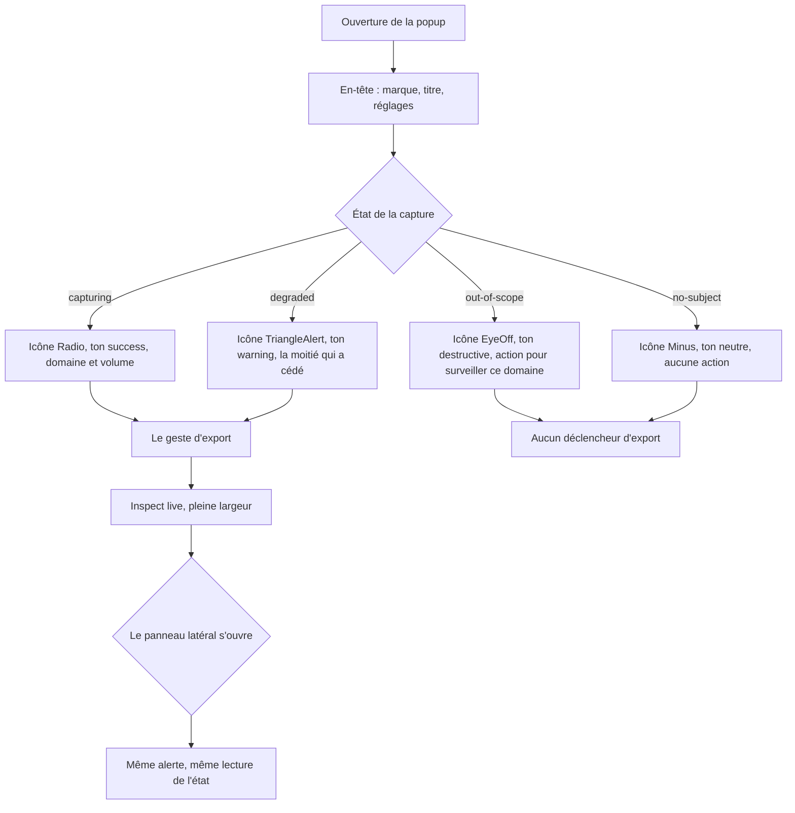
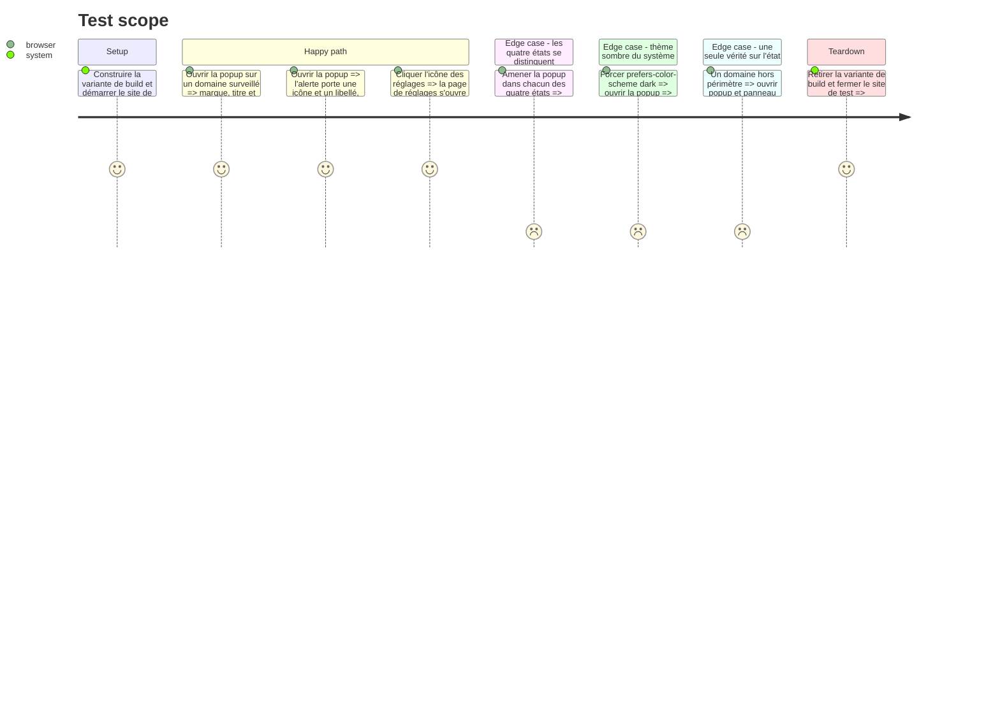

# Instruction: La surface — états, thème, en-tête

## Architecture projection

> Tree of the final files. ✅ create · ✏️ modify · ❌ delete

```txt
.
├── apps/extension/
│   ├── public/icon/32.png                        (inchangé — seule source de la marque, aucun vectoriel n'existe)
│   └── src/
│       ├── ui/globals.css                        ✏️ paires --success et --warning dans les trois blocs de tokens
│       └── entrypoints/
│           ├── popup/
│           │   ├── App.tsx                       ✏️ en-tête, Settings monté en haut, Inspect live pleine largeur
│           │   ├── PopupHeader.tsx               ✅ marque, titre, accès aux réglages
│           │   └── ScopeStatus.tsx               ✏️ alerte encadrée, quatre tons distincts, icônes Lucide
│           └── sidepanel/App.tsx                 (inchangé — hérite de l'alerte par l'import de :8)
└── e2e/specs/
    ├── acceptance.spec.ts                        ✏️ les quatre états distinguables
    └── sidepanel-read.spec.ts                    ✏️ vérifie que le panneau dit la même chose que la popup
```

## User Journey



## Test Scope



## Wireframe

```txt
┌──────────────────────────────────────────────┐
│ [■] Vigie                              [⚙]   │  ← PopupHeader
├──────────────────────────────────────────────┤
│ ┌──────────────────────────────────────────┐ │
│ │ (◉) Capturing                            │ │  ← alerte encadrée
│ │     example.com is watched. 284 entries  │ │    rounded-lg, bg-*/10,
│ │     captured on this tab.                │ │    border-*/30
│ └──────────────────────────────────────────┘ │
├──────────────────────────────────────────────┤
│ Export the last                              │
│ ┌────────────────────────────────┬─────────┐ │
│ │ Export 5 min                   │    v    │ │
│ └────────────────────────────────┴─────────┘ │
├──────────────────────────────────────────────┤
│ example.com · tab 4 · 28.4 min available,    │
│ 284 entries on this tab.                     │
├──────────────────────────────────────────────┤
│ Copied 284 entries. It covers 28.4 min…      │
├──────────────────────────────────────────────┤
│ ┌──────────────────────────────────────────┐ │
│ │ [▤]  Inspect live                        │ │  ← seul sur sa ligne
│ └──────────────────────────────────────────┘ │
└──────────────────────────────────────────────┘

Les quatre alertes, en niveaux de gris :

  (◉) Capturing              Radio         · ton success
  (⚠) Degraded — …           TriangleAlert · ton warning
  (◌) Out of scope           EyeOff        · ton destructive
  (–) No page to report on   Minus         · ton neutre
```

## Tasks to do

### `1)` Semer les deux paires de tokens dans `ui/globals.css`

> Trois blocs, pas un. Un token défini une seule fois laisse un thème sans valeur.

1. Ajouter `--success` et `--warning` à `:root` (`globals.css:13-35`), à `.dark` (`:37-57`), et à la media query `prefers-color-scheme: dark` (`:85-107`). Oublier le troisième bloc est le défaut le plus probable : c'est le seul qui s'applique réellement (`globals.css:11` cible `.dark *`, aucune ligne du code ne pose cette classe).
2. Valeurs relevées dans `node_modules/.pnpm/tailwindcss@4.3.3/node_modules/tailwindcss/theme.css:38-39,75-76`, réécrites dans la notation décimale du fichier :
   - clair — `--success: oklch(0.627 0.194 149.214)` (green-600), `--warning: oklch(0.769 0.188 70.08)` (amber-500)
   - sombre — `--success: oklch(0.723 0.219 149.579)` (green-500), `--warning: oklch(0.828 0.189 84.429)` (amber-400)
3. Mapper `--color-success` et `--color-warning` dans le bloc `@theme inline` (`:59-83`), sans quoi les utilitaires `text-success` et `border-success` n'existent pas.
4. Ne pas créer de paire `-foreground`. Ces deux tokens ne servent qu'en teinte d'icône, de bordure et de fond translucide — rien ne les utilise en fond plein, donc rien n'a besoin d'un texte contrasté par-dessus.

### `2)` Faire de `ScopeStatus` une alerte encadrée à quatre tons distincts

> C'est le composant que la popup et le panneau latéral partagent. Une seule vérité sur l'état de capture.

1. Remplacer la carte des tons (`ScopeStatus.tsx:31-36`) : `capturing` → success, `degraded` → warning, `out-of-scope` → destructive, `no-subject` → neutre. La collision actuelle entre `degraded` et `out-of-scope`, tous deux sur `border-destructive`, disparaît.
2. Remplacer la carte des glyphes (`:24-29`) par des icônes Lucide, figées ici : `Radio` pour capturing, `TriangleAlert` pour degraded, `EyeOff` pour out-of-scope, `Minus` pour no-subject. Quatre silhouettes différentes — la distinction survit à une capture d'écran en niveaux de gris.
3. Passer du filet à gauche à un cadre : `rounded-lg`, `border`, `bg-*/10`, `border-*/30`, icône à gauche du titre.
4. Marquer les icônes `aria-hidden` : le libellé porte déjà l'état pour un lecteur d'écran, et une icône annoncée le dirait deux fois.
5. Ne jamais laisser la couleur porter l'état seule (`design.md:28`) : le libellé et l'icône restent tous les deux présents dans les quatre cas.
6. Conserver `data-testid="scope-status"`, `data-state` et `data-testid="scope-detail"` — la recette existante et le panneau latéral s'y accrochent.

### `3)` Écrire `popup/PopupHeader.tsx`

> Marque, titre, réglages. La même barre au-dessus de la porte de consentement et au-dessus de la popup ouverte.

1. Marque : `public/icon/32.png` rendu à 20 px, `rounded-md`, `alt` vide — le titre à côté dit déjà de quoi il s'agit.
2. Titre `Vigie`, puis un séparateur souple qui pousse les réglages à droite.
3. Réglages : `<Button variant="ghost" size="icon">` avec l'icône `Settings`, `aria-label` explicite et `title` natif. Aucune primitive Tooltip n'existe dans le projet et cette phase n'en introduit pas.
4. Garder `data-testid="open-options"` sur ce bouton : il descend du bas de la popup vers l'en-tête, et `popup-export.spec.ts:261` continue de le cliquer.
5. Utiliser cet en-tête dans les deux branches de rendu de `App.tsx` — la porte de consentement (`:298-308`) et la popup ouverte (`:310-315`) — au lieu des deux `<h1>Vigie</h1>` d'aujourd'hui.

### `4)` Rendre sa ligne à `Inspect live`

> Il reste seul depuis que les réglages sont montés en en-tête.

1. Supprimer le `<div className="flex gap-2">` de `App.tsx:341-369` et son second bouton.
2. `Inspect live` passe en pleine largeur, avec l'icône `PanelRight` à gauche du libellé.
3. Ne pas toucher au gestionnaire de clic : `sidePanel.open` n'est honoré que dans le geste qui l'a déclenché, et une seule promesse attendue avant l'appel dépense ce geste (`App.tsx:348-351`).
4. Conserver `data-testid="open-sidepanel"`.

### `5)` Couvrir les quatre états et les deux thèmes en recette

> C'est le seul endroit où « distinguables » se vérifie, pas en test unitaire.

1. Dans `acceptance.spec.ts`, amener la popup dans chacun des quatre états et relever pour chacun `data-state` et le libellé : les quatre couples doivent être deux à deux différents.
2. Ajouter un cas sous `prefers-color-scheme: dark`, imposé par `page.emulateMedia({ colorScheme: 'dark' })`, et vérifier que la popup rend son fond et son texte par les tokens plutôt que par des couleurs figées.
3. Dans `sidepanel-read.spec.ts`, ajouter l'assertion de vérité unique : sur un même onglet hors périmètre, la popup et le panneau annoncent le même `data-state` et le même libellé.
4. Ne pas asserter de couleur. La recette lit `data-state`, l'icône et le libellé — ce qui survit à une capture en niveaux de gris est exactement ce qui est testable ici.

## Test acceptance criteria

| Task | Acceptance criteria                                                                                                                                    |
| ---- | -------------------------------------------------------------------------------------------------------------------------------------------------------- |
| 1    | Les utilitaires `text-success`, `border-success`, `text-warning` et `border-warning` produisent une couleur sous les deux thèmes du système, sans réglage de la part de l'utilisateur |
| 2    | Chacun des quatre états de capture porte une icône et un libellé qui lui sont propres ; sur une capture d'écran en niveaux de gris chacun reste distinguable des trois autres |
| 3    | La marque et le titre apparaissent en en-tête au-dessus de la porte de consentement comme au-dessus de la popup ouverte, et l'icône des réglages ouvre la page de réglages |
| 4    | `Inspect live` occupe toute la largeur, porte son icône, et ouvre toujours le panneau latéral sur l'onglet courant                                        |
| 5    | La recette relève quatre couples état-libellé distincts, la popup reste lisible sous `prefers-color-scheme: dark`, et le panneau latéral annonce le même état que la popup pour un même onglet |
