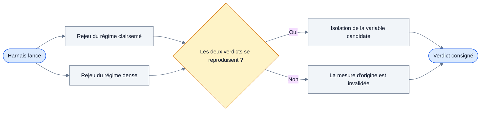
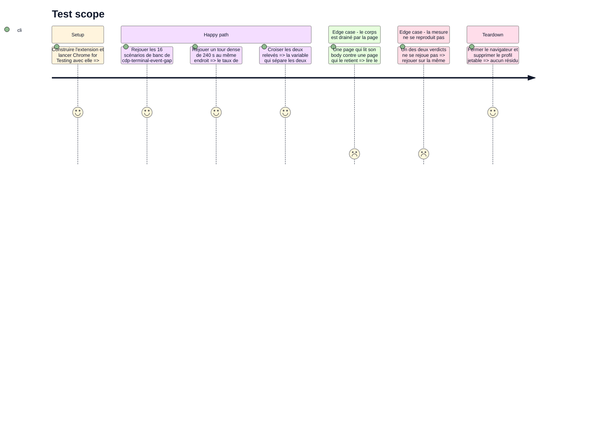

<!-- Fill or omit these sections; never add, rename, or reorder one. -->

# Instruction: trancher la joignabilité du corps de réponse

## Architecture projection

> Tree of the final files. ✅ create · ✏️ modify · ❌ delete

```txt
.
└── aidd_docs/
    ├── backlog/
    │   ├── spikes/
    │   │   └── cdp-body-read-timing.md          ✏️ verdict chiffré, status resolved
    │   └── tasks/
    │       └── contract-response-body-state.md  ✏️ le sixième état est figé ou retiré
    └── memory/
        └── architecture.md                      ✏️ :72 et :88, la contestation est levée
```

Aucun fichier de production n'est touché.
Le harnais de mesure est jetable et vit hors du dépôt, comme celui de `store-entry-overhead.md:40` : il importe les fixtures de `e2e/` par chemin absolu et n'écrit rien dedans.

## User Journey

La mesure oppose les deux régimes de trafic qui ont produit des verdicts contraires, puis isole la variable qui les sépare.



## Test Scope

<!-- Required for every phase. Keep Setup, Happy path, any qualifying Edge cases, and any required Teardown in this one journey. -->



## Tasks to do

### `1)` Rejouer les deux mesures dans un seul harnais

> Obtenir les deux verdicts contraires côte à côte, sur la même version de Chrome et le même build, avant d'expliquer quoi que ce soit.

1. Poser le harnais hors du dépôt, sur le modèle de `store-entry-overhead.md:40` : import des fixtures `e2e/` par chemin absolu, aucune écriture dans le dépôt.
2. Rejouer les 16 scénarios de banc de `cdp-terminal-event-gap` — appel de `getResponseBody` au signal terminal de `webRequest` — et relever la réussite par scénario.
3. Rejouer un tour dense de 240 s dans le même harnais, celui qui a produit les 2 122 échecs `No data found for resource with given identifier`.
4. Consigner les deux taux dans le tableau `Investigation` de `cdp-body-read-timing.md`, même si l'un des deux ne se reproduit pas.

### `2)` Isoler la variable

> Nommer ce qui sépare 6 réussites sur 6 de 0 réussite sur 2 122, sachant qu'un délai de garde est déjà exclu.

1. Ne pas réessayer le délai : `cdp-body-read-timing.md` a mesuré 0 réussite aux rungs 0, 100, 500, 2000, 5000 et 10000 ms, et l'échelle dense monte à 17,6 s.
2. Tester l'hypothèse de tête : le corps ne serait lisible que tant que personne n'a drainé la `Response`. Opposer une page qui lit son `body` à une page qui le retient, à volume de requêtes égal.
3. Faire varier la concurrence seule, à drainage constant, pour savoir si le nombre de requêtes en vol explique l'écart.
4. Faire varier les tailles passées à `Network.enable` seules — `architecture.md:92` impose de toujours les passer explicitement — pour écarter l'éviction comme cause.

### `3)` Trancher et consigner

> Rendre au reste du plan une règle utilisable, ou l'absence de règle dite clairement.

1. Écrire le verdict dans la section `Outcome` de `cdp-body-read-timing.md` et passer son `status` à `resolved`.
2. Corriger `architecture.md:72` : retirer « but that last claim is contested and must not be built on yet », ou remplacer la règle si la mesure la renverse.
3. Corriger `architecture.md:88` : la lecture de `No data found for resource with given identifier` est confirmée, remplacée, ou déclarée non déterminable — dans ce dernier cas la mention « under review » reste et le sixième état ne sera pas figé.
4. Trancher dans `contract-response-body-state.md` : le sixième état entre dans le contrat, ou la tâche descend explicitement à cinq états. La phase 2 lit cette décision et rien d'autre.
5. Consigner si le chemin d'écriture doit porter un délai de garde. À défaut de preuve du contraire, il n'en porte pas : c'est ce que la phase 4 construira.

## Test acceptance criteria

<!-- Each criterion is an observable behavior, not a command. -->

| Task | Acceptance criteria              |
| ---- | -------------------------------- |
| 1 | Le tableau `Investigation` de `cdp-body-read-timing.md` porte les deux taux de réussite relevés sur une même version de Chrome, ou dit lequel ne s'est pas reproduit. |
| 2 | Une variable est nommée avec le relevé qui la désigne, ou la section `Outcome` déclare qu'aucune des variables testées ne sépare les deux régimes. |
| 3 | `cdp-body-read-timing.md` porte `status: resolved`, `architecture.md:72` et `:88` ne portent plus de marque de contestation non résolue, et `contract-response-body-state.md` énonce un nombre d'états arrêté. |
