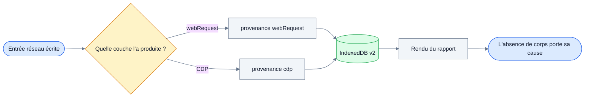
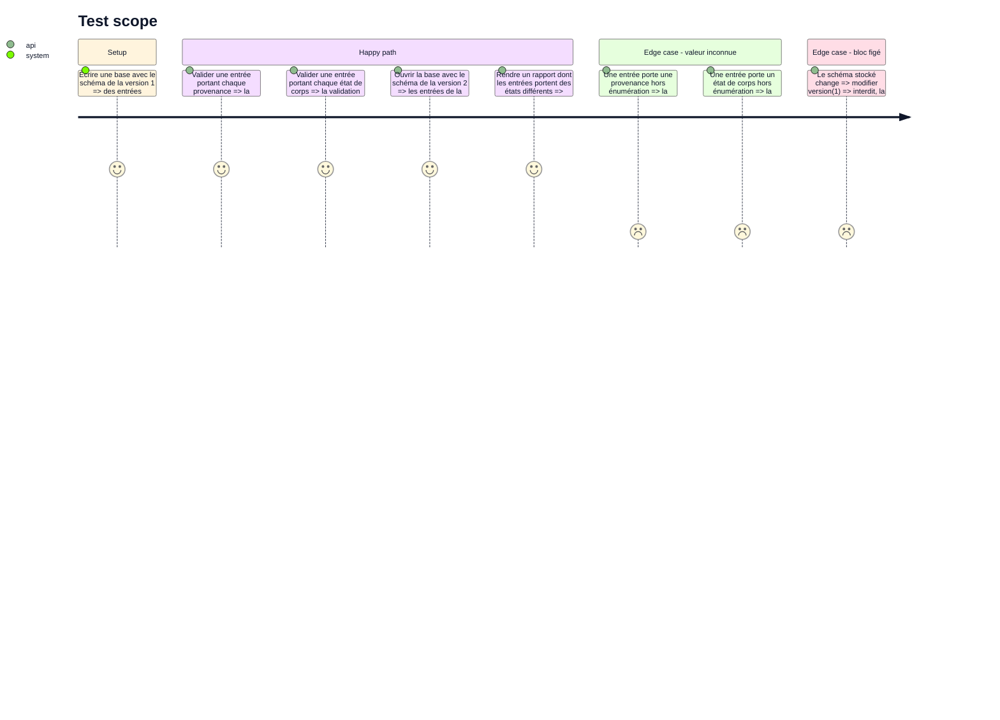

<!-- Fill or omit these sections; never add, rename, or reorder one. -->

# Instruction: le contrat et sa migration

## Architecture projection

> Tree of the final files. ✅ create · ✏️ modify · ❌ delete

```txt
.
├── packages/contract/src/
│   ├── events.ts                                ✏️ provenance, ResponseBodyState élargi, doc de requestId
│   └── events.test.ts                           ✏️ chaque provenance, chaque état, le rejet d'une valeur inconnue
└── apps/extension/src/
    ├── storage/
    │   ├── db.ts                                ✏️ version(2) ajoutée, version(1) intouchée
    │   └── db.test.ts                           ✏️ migration appliquée sur une base écrite par la version précédente
    ├── capture/network/
    │   ├── assemble.ts                          ✏️ estampille provenance webRequest et l'état de corps par défaut
    │   └── assemble.test.ts                     ✏️ les deux champs sont posés sur chaque entrée assemblée
    └── export/
        ├── markdown.ts                          ✏️ :319, « no response body » codé en dur devient l'état lu
        └── markdown.test.ts                     ✏️ un rendu par état de corps
```

Les deux tâches de contrat sont fusionnées ici, comme `contract-entry-provenance.md:38` le demande : elles touchent `NetworkEntry`, sa validation et la même version Dexie, et les séparer coûterait deux migrations là où une suffit.

## User Journey

Un lecteur de rapport doit pouvoir expliquer, entrée par entrée, pourquoi celle-ci porte un corps et sa voisine non.



## Test Scope

<!-- Required for every phase. Keep Setup, Happy path, any qualifying Edge cases, and any required Teardown in this one journey. -->



## Tasks to do

### `1)` Poser la provenance au contrat

> Une entrée dit quelle couche l'a produite, et `requestId` cesse de mentir.

1. Dans `packages/contract/src/events.ts`, déclarer `EntryProvenance` avec ses deux valeurs et la liste `ENTRY_PROVENANCES` à côté de `CONSOLE_LEVELS`, `ERROR_SOURCES` et `NETWORK_OUTCOMES` (lignes 84 à 86).
2. Ajouter `provenance: EntryProvenance` à `NetworkEntry`, obligatoire et non optionnel : une entrée vient d'une couche et d'une seule, y compris aux bornes de session où une requête à cheval revient entièrement à `webRequest`.
3. Documenter le champ pour qu'il ne se lise pas à l'envers : le signal qui déclenche l'écriture ne détermine pas la provenance. Une entrée déclenchée par `webRequest` mais renseignée par CDP reste une entrée CDP — `webRequest` n'y apporte aucun champ, seulement le moment (`contract-entry-provenance.md:24`).
4. Réécrire le commentaire de `requestId` (ligne 39) : identifiant de la couche qui a produit l'entrée, sans stabilité d'une couche à l'autre, la forme CDP `<identifiant de processus>.<compteur>` n'étant unique que dans un processus de rendu et pour la durée de la session.
5. Étendre `isNetworkEntry` (lignes 128 à 144) pour rejeter une provenance hors énumération.

### `2)` Élargir l'état du corps de réponse

> Six causes d'absence distinctes au lieu d'un `unavailable` qui les confond toutes, plus le cas où le corps est là.

1. Remplacer `ResponseBodyState = 'unavailable'` (ligne 30) par l'énumération arrêtée en phase 1 : corps présent, corps tronqué à l'écriture, corps évincé du buffer CDP, corps hors d'atteinte de toute couche, corps jamais demandé parce que le type de ressource est hors filtre, corps hors d'atteinte parce que la requête traversait une borne de session, et — seulement si la phase 1 l'a figé — corps que la requête n'avait pas fini de livrer.
2. Retirer la constante `RESPONSE_BODY_UNAVAILABLE` (ligne 32) ou la conserver comme alias de l'état « hors d'atteinte de toute couche », selon ce qui laisse le moins de sites d'appel à corriger.
3. Ajouter `responseBodyText?: string` à `NetworkEntry` : l'état dit pourquoi, le texte porte le corps quand il y en a un. Deux champs plats plutôt qu'une union discriminée, pour rester dans la forme du reste du contrat — `requestBody?: string` à la ligne 51.
4. Étendre `isNetworkEntry` pour rejeter un état hors énumération et pour refuser un texte de corps sur un état qui en interdit un.
5. Adapter `packages/contract/src/events.test.ts` : un cas par provenance, un cas par état, un cas de rejet pour chacune des deux énumérations.

### `3)` Ajouter la version Dexie

> Une extension installée se met à jour sur des données vivantes, donc un bloc publié ne bouge plus.

1. Dans `apps/extension/src/storage/db.ts`, ajouter `this.version(2)` sous le bloc `version(1)` existant, sans toucher à celui-ci.
2. Poser la valeur des deux nouveaux champs sur les entrées déjà écrites : provenance `webRequest`, état de corps « hors d'atteinte de toute couche » — c'est ce que la version 1 produisait, littéralement.
3. Ne pas ajouter d'index : ni la provenance ni l'état de corps ne sont des critères de découpe d'export, et un index se paie à chaque écriture.
4. Couvrir la migration dans `db.test.ts` en ouvrant une base écrite au schéma de la version 1.

### `4)` Estampiller le chemin `webRequest`

> Ce que la couche existante écrit doit être vrai avant que la couche CDP existe.

1. Dans `apps/extension/src/capture/network/assemble.ts`, poser `provenance: 'webRequest'` dans `finish()`, à côté de l'état de corps déjà écrit à la ligne 177.
2. Remplacer cet état par « hors d'atteinte de toute couche » : `webRequest` n'expose aucun corps, ce qui n'est ni une éviction ni un filtre.
3. Vérifier que `RequestAssembler` n'a pas d'autre changement à subir — `architecture.md:70` le laisse intouché par la branche CDP.

### `5)` Rendre les deux champs dans le rapport

> Le rapport cesse de répéter une phrase fausse trois cents fois.

1. Dans `apps/extension/src/export/markdown.ts`, remplacer la chaîne `'no response body'` codée en dur à la ligne 319 par la formulation de l'état porté par l'entrée.
2. Garder la règle de forme déjà posée dans le fichier : l'absence est dite sur la ligne de méta qui existe déjà, jamais dans un paragraphe à elle (lignes 304 à 311).
3. Ne pas rendre le texte du corps à cette phase : la couche qui le produit n'existe pas encore, et le rendu du corps appartient à la phase 5.
4. Ne pas rendre la provenance au lecteur pour l'instant. Le champ existe et est stocké ; ce qu'un rapport en montre se décide en phase 5, quand deux provenances coexistent réellement dans une même fenêtre.

## Test acceptance criteria

<!-- Each criterion is an observable behavior, not a command. -->

| Task | Acceptance criteria              |
| ---- | -------------------------------- |
| 1 | Une entrée réseau sans provenance est rejetée par la validation, une entrée portant une provenance inconnue aussi, et la documentation de `requestId` ne nomme plus `chrome.webRequest`. |
| 2 | Chaque état de corps est accepté par la validation, un état inconnu est rejeté, et un texte de corps posé sur un état qui l'interdit est rejeté. |
| 3 | Une base écrite par le schéma de la version 1 s'ouvre au schéma de la version 2, ses entrées portent la provenance `webRequest` et l'état « hors d'atteinte de toute couche », et le bloc `version(1)` est identique au commit précédent. |
| 4 | Toute entrée produite par `RequestAssembler` porte la provenance `webRequest` et l'état d'absence structurelle. |
| 5 | Un rapport rendu à partir d'entrées portant des états différents affiche une cause différente par entrée, et aucune section ne porte plus la chaîne codée en dur. |
