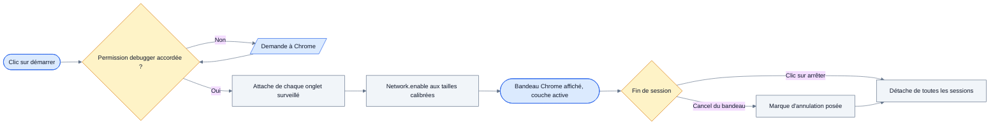
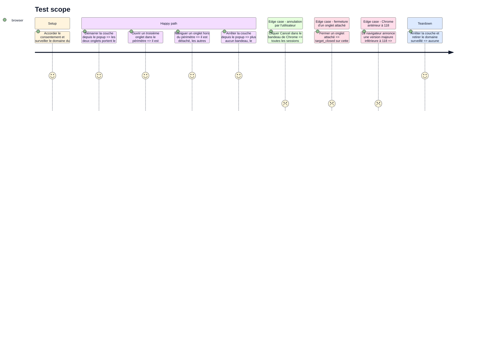

<!-- Fill or omit these sections; never add, rename, or reorder one. -->

# Instruction: la session, de son démarrage à son arrêt

## Architecture projection

> Tree of the final files. ✅ create · ✏️ modify · ❌ delete

```txt
.
├── apps/extension/
│   ├── wxt.config.ts                            ✏️ optional_permissions: ['debugger']
│   └── src/
│       ├── shared/chrome-apis.d.ts              ✏️ les surfaces `debugger` que les typings de Chrome n'ont pas
│       ├── capture/cdp/
│       │   ├── permission.ts                    ✅ demande, lecture et révocation de la permission optionnelle
│       │   ├── support.ts                       ✅ version majeure de Chrome, verdict de disponibilité
│       │   ├── support.test.ts                  ✅ pur, testable en unitaire
│       │   ├── session-state.ts                 ✅ état persisté dans chrome.storage.session, marque d'annulation
│       │   ├── session-state.test.ts            ✅ sérialisation et lecture, pures
│       │   ├── attach.ts                        ✅ attache et détache un onglet, Network.enable calibré
│       │   └── session.ts                       ✅ démarrage, arrêt, suivi des domaines surveillés
│       └── entrypoints/
│           ├── background.ts                    ✏️ câblage du démarrage, de l'arrêt et de onDetach
│           └── popup/
│               ├── App.tsx                      ✏️ le bloc de la couche approfondie
│               ├── DeepLayerControl.tsx         ✅ un état, un bouton, une explication
│               ├── state.ts                     ✏️ DeepLayerView, ses états et leurs textes
│               └── state.test.ts                ✏️ un cas par état
└── e2e/specs/cdp-session.spec.ts                ✅ attache, détache, refus après annulation
```

`chrome.debugger` n'a aucun mock fidèle : tout ce qui touche l'API se vérifie en e2e sur un navigateur réel (`coding-assertions.md`).
Seuls `support.ts` et `session-state.ts` sont purs et couverts en unitaire.

## User Journey

L'utilisateur arme la couche depuis le popup ; tout le reste suit les domaines déjà surveillés.



## Test Scope

<!-- Required for every phase. Keep Setup, Happy path, any qualifying Edge cases, and any required Teardown in this one journey. -->



## Wireframe

<!-- UI phase only. No UI => omit the section, don't invent one. -->

```txt
┌─────────────────────────────────────────────┐
│ (1) En-tête                                 │
├─────────────────────────────────────────────┤
│ (2) État de portée                          │
├─────────────────────────────────────────────┤
│ (3) Couche réseau approfondie               │
│   ┌───────────────────────────┬───────────┐ │
│   │ (4) Ligne d'état          │ (5) Action│ │
│   └───────────────────────────┴───────────┘ │
│   (6) Ligne de conséquence                  │
├─────────────────────────────────────────────┤
│ (7) Profondeur · Exporter                   │
├─────────────────────────────────────────────┤
│ (8) Ligne de contexte d'onglet              │
├─────────────────────────────────────────────┤
│ (9) Retour d'export                         │
└─────────────────────────────────────────────┘
```

1. En-tête : nom du produit et accès aux options. Existant, inchangé.
2. État de portée : les quatre états de capture déjà rendus par `ScopeStatus`. Inchangé ici.
3. Bloc de la couche approfondie, entre la portée et l'export : la couche est une propriété de la capture, pas de l'export.
4. Ligne d'état de la couche : indisponible, arrêtée, active, arrêtée par l'utilisateur. Un libellé et une icône, jamais la couleur seule.
5. Action unique : démarrer ou arrêter. Absente quand la couche est indisponible.
6. Ligne de conséquence : ce que l'état en cours change pour le rapport, et la mention du bandeau que Chrome affichera.
7. Profondeur et bouton d'export. Existant, inchangé.
8. Ligne de contexte d'onglet. Existante, inchangée.
9. Retour d'export. Existant, inchangé.

## Tasks to do

### `1)` Déclarer la permission sans toucher au socle

> `debugger` arrive à l'usage, pas à l'installation.

1. Ajouter `optional_permissions: ['debugger']` à `apps/extension/wxt.config.ts`. La clé n'existe pas encore dans le manifeste.
2. Ne pas toucher au tableau `permissions` : le commentaire déjà posé au-dessus dit pourquoi, et une extension publiée qui fait grandir ce tableau est désactivée jusqu'à acceptation.
3. Laisser `minimum_chrome_version: '114'` en place. Le maintien en vie du worker n'existe qu'à partir de 118, mais le refus se fera à l'exécution — voir la tâche 2.
4. Déclarer dans `apps/extension/src/shared/chrome-apis.d.ts` les surfaces `debugger` que les typings de Chrome n'ont pas, comme le fichier le fait déjà pour `offscreen`.

### `2)` Décider si la couche est disponible

> Deux conditions, lisibles séparément, testables sans navigateur.

1. Écrire `support.ts` : lire la version majeure de Chrome depuis le service worker, vérifier d'abord la disponibilité de `navigator.userAgentData` puis retomber sur `navigator.userAgent`, et exposer un verdict `supported` / `unsupported` avec sa raison.
2. Poser 118 comme seuil, avec le commentaire qui dit pourquoi : en deçà, une session attachée ne maintient pas le worker en vie et la capture se coupe seule.
3. Écrire `permission.ts` sur le modèle de `storage/watched-domains.ts` : `hasDebuggerAccess`, `requestDebuggerAccess`, `revokeDebuggerAccess`. La demande n'est **pas** `async` — le geste utilisateur ne survit pas à un `await` avant l'appel, exactement comme `watchDomain`.
4. Couvrir `support.ts` en unitaire ; `permission.ts` touche `chrome.permissions` et se vérifie en e2e.

### `3)` Persister l'état de la session

> `onDetach` ne se déclenche jamais pour une mort du worker : l'état persisté est la seule source de vérité.

1. Écrire `session-state.ts` sur `chrome.storage.session` : la couche est-elle armée, quels onglets sont attachés, et la carte `requestId → url` des requêtes en vol — 449 octets pour un onglet et six requêtes en vol, medium suffisant.
2. Ajouter la marque d'annulation, distincte de l'arrêt volontaire : elle a bloqué deux tentatives de ré-attache consécutives dans la génération revenue d'un crash.
3. Ne pas viser la survie à un redémarrage du navigateur : un redémarrage ferme tous les onglets et ne laisse aucune requête en vol à ré-attribuer.
4. Garder les fonctions pures autour d'un accesseur injectable, pour les couvrir en unitaire sans navigateur.

### `4)` Attacher et détacher un onglet

> Un onglet, une session, des tailles de buffer toujours explicites.

1. Écrire `attach.ts` : `chrome.debugger.attach` sur un `tabId`, puis `Network.enable`.
2. Passer les cinq paramètres de `Network.enable`, jamais deux. `maxTotalBufferSize` à 10 Mo et `maxResourceBufferSize` à 2 Mo : à ces tailles rien de mesurable ne grandit côté renderer, pour zéro échec de lecture.
3. Ne pas activer `enableDurableMessages` sans `maxTotalBufferSize` : l'appel est rejeté avec `-32602`, et un `Network.enable` rejeté laisse la session attachée — la ré-attache ne rapportera alors que d'être déjà attaché à soi-même.
4. Traiter le détachement : `target_closed` ne concerne que la session de l'onglet fermé, `canceled_by_user` détache toutes les sessions de l'extension d'un coup.
5. Ne jamais ré-attacher après `canceled_by_user` : Chrome ne garde aucune mémoire du refus et le bandeau reviendrait dans la seconde. C'est l'utilisateur qui arrête la capture.

### `5)` Suivre les domaines surveillés

> La session suit le périmètre, pas un onglet.

1. Écrire `session.ts` : au démarrage, attacher tous les onglets déjà dans le périmètre ; ensuite, suivre les entrées et les sorties.
2. Brancher le suivi sur les mêmes signaux que le reste de la capture — `onWatchedDomainsChanged` et les événements d'onglet déjà écoutés par `background.ts`.
3. Ne pas chercher à fermer la fenêtre aveugle de 82 ms d'un onglet ouvert en cours de session : l'onglet naît après le démarrage, aucune politique ne la referme. Elle coûte des corps, jamais des entrées.
4. Accepter le maintien d'environ 60 ms après la sortie du périmètre : ce n'est pas l'attachement qui borne ce qui est stocké, c'est le filtre d'URL déjà en place.
5. Ne pas armer de limitation de débit : une session coûte 1,97 % d'un cœur, six en coûtent 9,3 %, et l'onglet regardé ne perd ni image ni requête.

### `6)` Donner à la couche sa surface

> Elle est optionnelle et met un bandeau sur tous les onglets : elle doit se voir et se dire.

1. Ajouter `DeepLayerView` à `apps/extension/src/entrypoints/popup/state.ts` avec ses quatre états — indisponible, arrêtée, active, arrêtée par l'utilisateur — et leurs textes, comme le fichier le fait déjà pour la portée et l'export.
2. Écrire `DeepLayerControl.tsx` sur le modèle de `ScopeStatus.tsx` : un enregistrement d'icônes et un de tons, indexés par l'état, un `data-testid` et un `data-state` pour l'e2e.
3. Ne jamais porter l'état par la couleur seule : un libellé accompagne l'icône.
4. Insérer le bloc dans `App.tsx` entre `ScopeStatus` et le bloc d'export, sous la porte de consentement existante.
5. Enchaîner la demande de permission sur le clic sans `await` préalable, puis démarrer la session une fois la permission accordée.
6. Ne rien afficher de la coexistence avec DevTools : les deux cohabitent dans les deux ordres d'arrivée, ce n'est pas le conflit à remonter.

### `7)` Câbler le service worker

> Le worker orchestre, il ne décide pas.

1. Dans `background.ts`, écouter `chrome.debugger.onDetach` et router `canceled_by_user` vers la marque d'annulation, `target_closed` vers le retrait d'un seul onglet.
2. Ajouter le message de démarrage et celui d'arrêt à `runtime.onMessage`, à côté des quatre déjà servis.
3. Ne pas appeler la reprise au démarrage : c'est la phase 6.

## Test acceptance criteria

<!-- Each criterion is an observable behavior, not a command. -->

| Task | Acceptance criteria              |
| ---- | -------------------------------- |
| 1 | Le manifeste construit porte `debugger` dans `optional_permissions` et un tableau `permissions` identique au commit précédent. |
| 2 | Sur un Chrome antérieur à 118 le popup affiche la couche indisponible avec sa raison et n'offre aucun bouton ; au-delà il en offre un. |
| 3 | Après un arrêt volontaire l'état persisté est vide ; après une annulation il porte la marque, et une tentative de démarrage automatique ne fait rien. |
| 4 | Un onglet attaché porte le bandeau de Chrome ; fermer cet onglet laisse les autres attachés ; un `Network.enable` rejeté est signalé plutôt que silencieux. |
| 5 | Un onglet entrant dans le périmètre est attaché sans action de l'utilisateur, un onglet sortant est détaché, et le démarrage attache les onglets déjà ouverts. |
| 6 | Les quatre états de la couche sont rendus avec une icône et un libellé, et le bloc n'apparaît pas tant que le consentement n'est pas donné. |
| 7 | Cliquer Cancel dans le bandeau de Chrome fait basculer le popup sur l'état « arrêtée par l'utilisateur » sans qu'aucune session ne se rouvre. |
