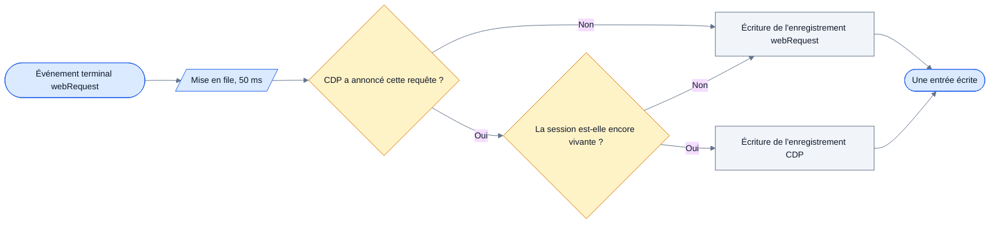
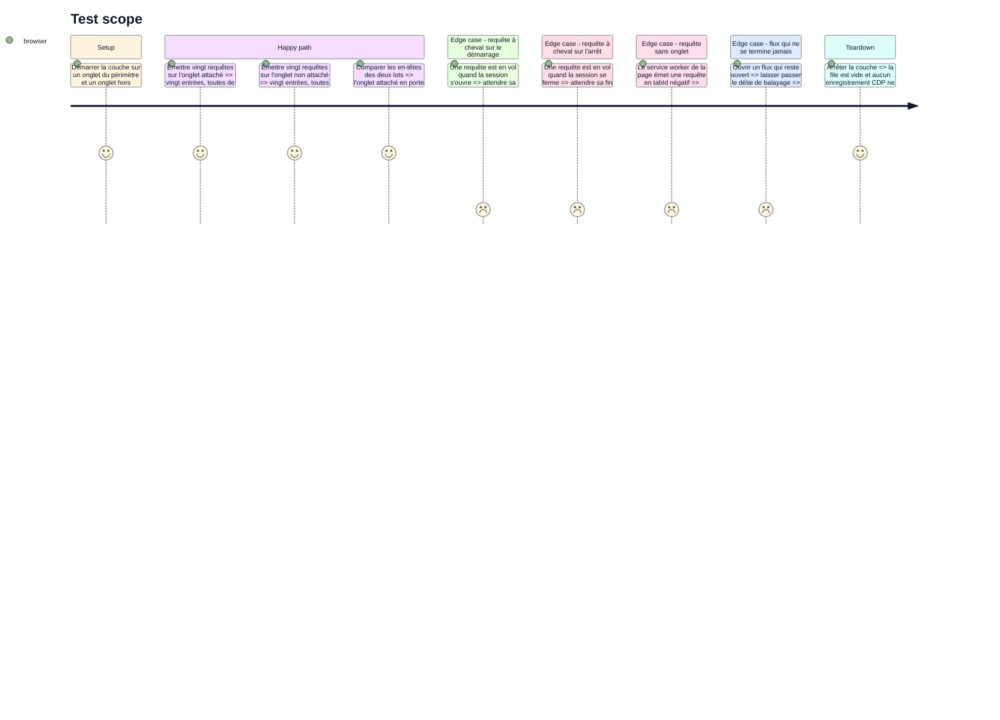

<!-- Fill or omit these sections; never add, rename, or reorder one. -->

# Instruction: la propriété d'une requête

## Architecture projection

> Tree of the final files. ✅ create · ✏️ modify · ❌ delete

```txt
.
├── apps/extension/src/
│   ├── capture/cdp/
│   │   ├── events.ts                            ✅ écoute du domaine Network, ensemble des ids annoncés
│   │   ├── records.ts                           ✅ enregistrement CDP en vol, balayage borné
│   │   ├── records.test.ts                      ✅ pur, testable en unitaire
│   │   ├── ownership.ts                         ✅ qui possède la requête à son événement terminal
│   │   ├── ownership.test.ts                    ✅ pur, testable en unitaire
│   │   └── session.ts                           ✏️ branche et débranche les écoutes du domaine Network
│   ├── capture/network/
│   │   ├── listeners.ts                         ✏️ l'événement terminal alimente la file au lieu d'écrire
│   │   ├── queue.ts                             ✅ file de 50 ms, bornée, purgée au flush
│   │   └── queue.test.ts                        ✅ pur, testable en unitaire
│   └── entrypoints/background.ts                ✏️ le flush vide la file avant de servir un export
└── e2e/specs/cdp-substitution.spec.ts           ✅ une requête, une entrée, aux deux bornes
```

`assemble.ts` n'est pas touché : la branche CDP le laisse intact, et son délai de 30 s reste ce qu'il est.

## User Journey

Chaque requête produit exactement une entrée, et c'est son événement terminal qui décide de laquelle.



## Test Scope

<!-- Required for every phase. Keep Setup, Happy path, any qualifying Edge cases, and any required Teardown in this one journey. -->



## Tasks to do

### `1)` Recueillir les événements du domaine Network

> CDP ne possède que ce qu'il a annoncé lui-même.

1. Écrire `events.ts` : brancher `requestWillBeSent`, `requestWillBeSentExtraInfo`, `responseReceived`, `dataReceived`, `loadingFinished` et `loadingFailed` sur la session d'un onglet.
2. Tenir l'ensemble des `requestId` annoncés par `requestWillBeSent` pendant la session. Tout `requestId` jamais annoncé est jeté entier, sans exception.
3. Ne pas se servir du `RequestId` CDP comme clé de store : c'est `<identifiant de processus>.<compteur>` pour une sous-ressource et le `loaderId` en 32 caractères hexadécimaux pour le document, et le compteur repart de zéro à chaque changement de processus de rendu.
4. Traiter les événements orphelins — pas de `requestWillBeSent`, parfois pas d'URL du tout — comme des événements à ignorer, pas comme une erreur.
5. Débrancher les écoutes dans `session.ts` au détachement, quelle qu'en soit la cause.

### `2)` Tenir l'enregistrement CDP en vol

> Un enregistrement par requête annoncée, borné pour ne jamais fuir.

1. Écrire `records.ts` : accumuler méthode, URL, en-têtes de requête et de réponse, statut, type de ressource et durée par `requestId` annoncé.
2. Persister la carte `requestId → url` dans l'état de session écrit en phase 3 : c'est elle que la reprise relit.
3. Borner la rétention par un balayage aligné sur les 30 s de `RequestAssembler`, pour la même raison : un flux ouvert indéfiniment ne doit pas accumuler d'enregistrements dans un worker qui ne meurt plus tant qu'une session est attachée.
4. Appeler ce balayage depuis `flushNetworkCapture`, où `assembler.sweep` est déjà appelé.
5. Poser en commentaire que la question de faire entrer `EventSource` et `WebSocket` dans le filtre de corps reste ouverte, et que ce balayage est ce qui rend leur présence sans danger pour la mémoire.

### `3)` Décider la propriété

> Une fonction pure, sans `chrome.*`, qui répond à une seule question.

1. Écrire `ownership.ts` : à partir du `tabId`, du `requestId` `webRequest`, de l'ensemble des ids annoncés et de l'état de la session, dire quel enregistrement est écrit.
2. Poser les deux marques que la décision demande, et rien de plus : un ensemble d'ids annoncés côté CDP, une marque de session par onglet côté `webRequest`. Aucune clé partagée, aucun tampon commun.
3. Faire de la substitution la règle : sur un onglet attaché, `webRequest` observe toujours tout mais n'écrit rien de ce que CDP possède.
4. Faire du détachement un retour intégral : quelle qu'en soit la cause, toute requête que CDP avait commencée revient à `webRequest`, entière.
5. Ne pas construire de corrélation `method + URL`, malgré ses 147 succès sur 147 : elle coûte 1000 ms de retenue avant chaque écriture et n'apporte que des artefacts de pile réseau.
6. Couvrir la fonction en unitaire : c'est le cœur de la phase et le seul morceau qu'un test peut atteindre sans navigateur.

### `4)` Poser la file de 50 ms

> Le déclencheur arrive avant l'enregistrement qu'il doit lire.

1. Écrire `queue.ts` : différer l'écriture de 50 ms après l'événement terminal de `webRequest`, sur les seules requêtes d'un onglet attaché.
2. Justifier le chiffre en commentaire : l'événement terminal de `webRequest` précède l'annonce CDP de 42,6 ms en moyenne pour 98 % des requêtes, une consultation immédiate échoue 294 fois sur 299.
3. Ne pas porter de délai de garde avant l'appel de lecture du corps, sauf si la phase 1 a conclu le contraire.
4. Borner la file : une entrée non résolue au bout du délai est écrite avec ce qu'on a plutôt que gardée.
5. Vider la file dans `flushNetworkCapture`, avant `flush(now)`, pour qu'un export ne parte jamais avec des écritures en attente.
6. Laisser les requêtes des onglets non attachés écrire directement, sans passer par la file : elles n'attendent rien.

### `5)` Brancher le tout sur les écoutes existantes

> Le chemin `webRequest` change de geste terminal, pas de forme.

1. Dans `listeners.ts`, remplacer l'appel direct à `store(entry)` de l'événement terminal par le passage dans la file quand l'onglet est attaché.
2. Ne rien changer aux quatre écoutes `webRequest` elles-mêmes : elles continuent d'observer tout, onglet attaché compris.
3. Laisser les 21 requêtes sans onglet du service worker de la page à `webRequest` : aucune couche ne les réclame.
4. Vérifier dans `background.ts` que le flush de `tabs.onRemoved` et celui de l'export passent tous deux par le nouveau chemin.

## Test acceptance criteria

<!-- Each criterion is an observable behavior, not a command. -->

| Task | Acceptance criteria              |
| ---- | -------------------------------- |
| 1 | Les événements dont le `requestId` n'a jamais été annoncé ne laissent aucune trace, et le détachement arrête l'arrivée d'événements. |
| 2 | Un flux resté ouvert au-delà du délai de balayage libère son enregistrement, et le nombre d'enregistrements en vol redescend à zéro après un flush. |
| 3 | Sur un onglet attaché toutes les entrées portent la provenance `cdp`, sur les autres onglets la provenance `webRequest`, et un détachement en cours de requête ramène celle-ci à `webRequest`. |
| 4 | Une requête d'onglet attaché n'est écrite qu'après le délai, et un export déclenché immédiatement après un trafic ne perd aucune entrée. |
| 5 | Un tour de navigation produit exactement une entrée par requête, sans doublon aux bornes de la session, et les entrées d'un onglet attaché portent davantage d'en-têtes que celles d'un onglet non attaché. |
