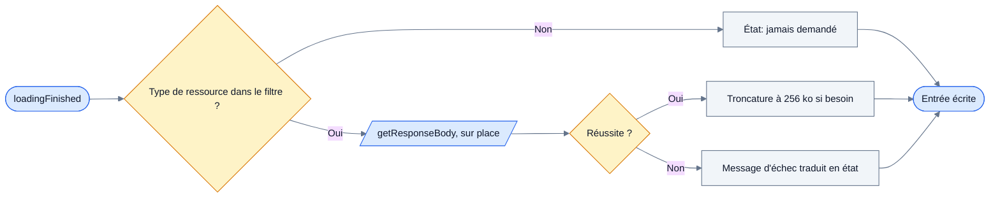
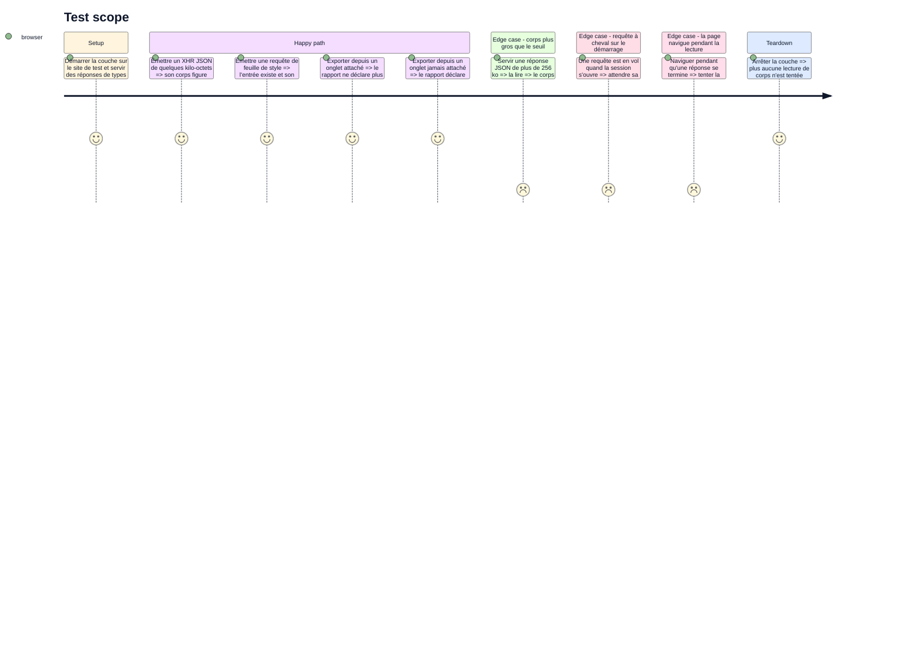

<!-- Fill or omit these sections; never add, rename, or reorder one. -->

# Instruction: les corps de réponse

## Architecture projection

> Tree of the final files. ✅ create · ✏️ modify · ❌ delete

```txt
.
├── packages/contract/src/
│   ├── report.ts                                ✏️ l'absence de corps quitte STRUCTURAL_GAPS et sa phrase change
│   └── report.test.ts                           ✏️ le trou n'est plus inconditionnel
├── apps/extension/src/
│   ├── capture/cdp/
│   │   ├── body.ts                              ✅ filtre, lecture, troncature, lecture des deux messages d'échec
│   │   ├── body.test.ts                         ✅ filtre et troncature, purs
│   │   └── events.ts                            ✏️ la lecture est appelée dans loadingFinished
│   └── export/
│       ├── gaps.ts                              ✏️ le trou est déclaré selon ce que la fenêtre contient
│       ├── gaps.test.ts                         ✏️ un cas avec entrées cdp, un cas sans
│       ├── markdown.ts                          ✏️ le corps est rendu, son absence porte sa cause
│       └── markdown.test.ts                     ✏️ un rendu par état de corps
└── e2e/specs/cdp-response-body.spec.ts          ✅ corps présent, corps filtré, corps tronqué
```

`Log.enable` n'entre pas ici : aucun Spike ne l'a mesuré, et le trou `browser-messages-out-of-reach` reste structurel dans cette version.

## User Journey

Le corps est lu dans la seconde où son événement arrive, ou il est perdu.



## Test Scope

<!-- Required for every phase. Keep Setup, Happy path, any qualifying Edge cases, and any required Teardown in this one journey. -->



## Tasks to do

### `1)` Filtrer avant de lire

> Le filtre est ce qui rend la fenêtre d'une heure payable, pas un jugement de pertinence.

1. Écrire `body.ts` avec les six types de ressource retenus : `XHR`, `Fetch`, `Document`, `Manifest`, `EventSource` et `WebSocket`. Les treize autres gardent leurs métadonnées seules.
2. Commenter le chiffre qui justifie le filtre : 6,9 Go/h de corps décodés sans filtre contre 224 Mo/h une fois filtré et tronqué, face à un quota de 10,7 Go déjà accordé sans `unlimitedStorage`.
3. Écarter explicitement `Script` et `Stylesheet` : à eux deux 95 % du volume de corps, et rien à dire sur un incident.
4. Ne jamais tenter la lecture sur `Preflight` ni `Ping` : ils n'ont aucun corps et chaque lecture y échoue.
5. Poser l'état « jamais demandé » sur tout ce que le filtre écarte, sans appeler `getResponseBody`.

### `2)` Lire sur place

> Différer, grouper ou reprendre après un redémarrage du worker perd tous les corps.

1. Appeler `getResponseBody` à l'intérieur du gestionnaire de `Network.loadingFinished`, dans `events.ts`, dès que cet événement arrive.
2. Ne pas mettre la lecture en file : c'est la seule opération de la couche qui ne supporte pas d'attendre. Ce qu'elle court, c'est la navigation de la page, qui n'est jamais annoncée à l'avance.
3. Écrire le résultat dans l'enregistrement CDP en vol tenu par `records.ts`, que la file de 50 ms lira à l'écriture.
4. Ne pas s'inquiéter de l'éviction : lire dans `loadingFinished` la précède, mesuré à zéro échec sur 7 395 réponses XHR et Fetch, aux tailles de buffer par défaut comme réduites.

### `3)` Tronquer à 256 ko

> Le seuil laisse 98,4 % des corps JSON entiers.

1. Couper à 256 ko et poser l'état « tronqué », distinct d'un corps entier comme d'un corps absent.
2. Fermer la coupe sur au moins un élément de premier niveau complet, ce que le seuil garantit déjà en pratique.
3. Ne pas retenir la taille d'origine : aucune source du corpus ne la demande, et l'état suffit à dire qu'il manque quelque chose.
4. Couvrir le filtre et la troncature en unitaire : ce sont les deux seuls morceaux purs de la phase.

### `4)` Traduire les échecs en états

> Les deux messages de `getResponseBody` ne disent pas la même chose.

1. Traiter `No resource with given identifier found` comme l'orphelin : la session n'a jamais annoncé cette requête, rien à faire, état « hors d'atteinte pour cause de borne de session ». C'est le seul échec définitif.
2. Traiter `No data found for resource with given identifier` selon ce que la phase 1 a tranché, et selon rien d'autre. Si elle n'a pas tranché, le sixième état n'existe pas et ce message tombe sur un état d'échec générique.
3. Poser l'état « évincé » sur ce qui dépasse `maxResourceBufferSize`, même si aucun corps applicatif n'a été perdu ainsi en mesure.
4. Ne jamais laisser un échec de lecture supprimer une entrée : le corps manque, l'entrée reste.

### `5)` Corriger le trou déclaré dans le rapport

> `STRUCTURAL_GAPS` devient faux le jour où un corps arrive.

1. Dans `packages/contract/src/report.ts`, retirer `'response-bodies-unavailable'` de `STRUCTURAL_GAPS` (ligne 83) et corriger le commentaire au-dessus, qui affirme qu'aucun corps ne sera jamais disponible.
2. Réécrire son `GAP_STATEMENTS` (ligne 46) : la phrase actuelle dit « in any version », ce qui cesse d'être vrai. Elle doit dire que la couche approfondie n'était pas active sur cette fenêtre.
3. Ajuster `GAP_SUMMARIES` si le nouveau libellé le demande, en gardant la même formulation entre les deux surfaces.
4. Dans `apps/extension/src/export/gaps.ts`, déclarer ce trou depuis `declareGaps` seulement quand aucune entrée de la fenêtre ne porte la provenance `cdp` — au même endroit que `capture-started-after-page-load`, qui se décide déjà sur le contenu de la tranche.
5. Corriger le commentaire d'en-tête de `gaps.ts`, qui compte deux trous structurels sur quatre.

### `6)` Rendre le corps

> Le rapport montre ce que la couche a rapporté, et dit pourquoi quand elle n'a rien rapporté.

1. Dans `markdown.ts`, rendre `responseBodyText` dans un bloc replié, sur le modèle de `requestBodyBlock` : réindentation du JSON valide, passage tel quel du reste, malformation annoncée plutôt que réparée.
2. Placer ce bloc après les en-têtes de réponse, à la fin de la section, là où `networkSection` assemble déjà ses blocs.
3. Garder l'absence sur la ligne de méta, jamais dans un paragraphe : c'est la règle que le fichier s'est déjà donnée, et une phrase répétée trois cents fois cesse d'être lue.
4. Rendre la provenance seulement si elle explique quelque chose au lecteur : deux entrées voisines dont l'une porte un corps et l'autre non appellent une raison, et cette raison est l'état de corps, pas la couche.

## Test acceptance criteria

<!-- Each criterion is an observable behavior, not a command. -->

| Task | Acceptance criteria              |
| ---- | -------------------------------- |
| 1 | Une réponse de type hors filtre produit une entrée dont l'état dit que le corps n'a jamais été demandé, et aucune lecture n'est tentée sur elle. |
| 2 | Un XHR JSON émis sur un onglet attaché arrive dans le rapport avec son corps entier. |
| 3 | Une réponse de plus de 256 ko produit un corps coupé, un état qui le dit, et une coupe qui ferme au moins un élément de premier niveau. |
| 4 | Une requête déjà en vol au démarrage de la session produit une entrée complète dont seul le corps manque, avec la cause nommée. |
| 5 | Un rapport exporté d'un onglet attaché ne porte plus le trou d'absence de corps ; un rapport exporté d'un onglet jamais attaché le porte toujours. |
| 6 | Une section de requête portant un corps affiche ce corps replié, et une section n'en portant pas affiche sa cause sur la ligne de méta. |
