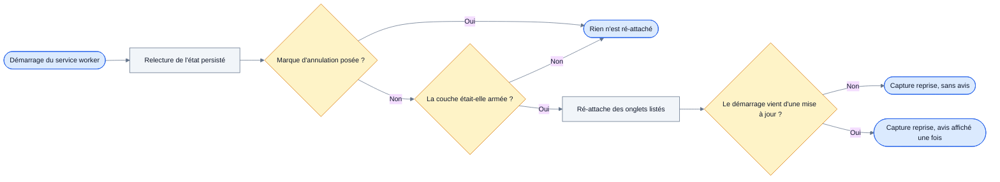
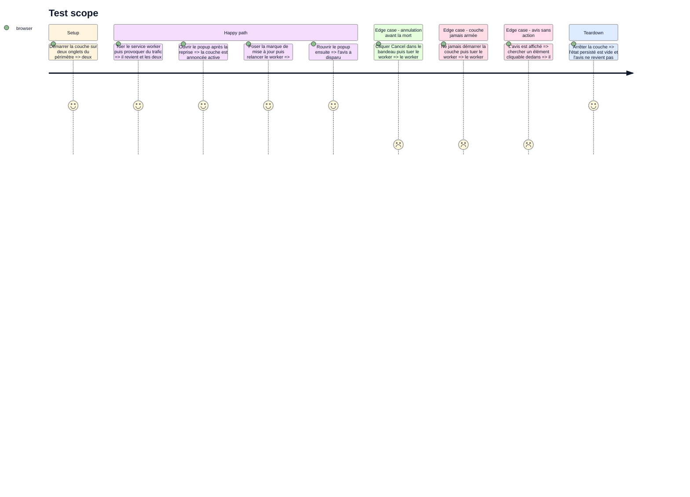

<!-- Fill or omit these sections; never add, rename, or reorder one. -->

# Instruction: la reprise et son avis

## Architecture projection

> Tree of the final files. ✅ create · ✏️ modify · ❌ delete

```txt
.
├── apps/extension/src/
│   ├── capture/cdp/
│   │   ├── resume.ts                            ✅ les trois gestes du démarrage
│   │   ├── resume.test.ts                       ✅ la décision de reprise, pure
│   │   └── session-state.ts                     ✏️ la marque d'interruption écrite au démarrage
│   └── entrypoints/
│       ├── background.ts                        ✏️ reprise appelée au démarrage, onInstalled écouté
│       ├── popup/
│       │   ├── App.tsx                          ✏️ l'avis, au-dessus de l'état de portée
│       │   ├── InterruptionNotice.tsx           ✅ un avis, rien à cliquer
│       │   ├── state.ts                         ✏️ InterruptionNoticeView et son texte
│       │   └── state.test.ts                    ✏️ affiché une fois, puis plus
│       └── sidepanel/                           ✏️ le même avis, même composant
└── e2e/specs/cdp-resume.spec.ts                 ✅ mort du worker, marque d'annulation, avis
```

Le composant est partagé entre popup et panneau latéral, comme `ScopeStatus.tsx` l'est déjà.

## User Journey

La capture se relève seule et le dit ; l'utilisateur n'a jamais rien à relancer.



## Test Scope

<!-- Required for every phase. Keep Setup, Happy path, any qualifying Edge cases, and any required Teardown in this one journey. -->



## Wireframe

<!-- UI phase only. No UI => omit the section, don't invent one. -->

```txt
┌─────────────────────────────────────────────┐
│ (1) En-tête                                 │
├─────────────────────────────────────────────┤
│ (2) Avis d'interruption                     │
├─────────────────────────────────────────────┤
│ (3) État de portée                          │
├─────────────────────────────────────────────┤
│ (4) Couche réseau approfondie               │
├─────────────────────────────────────────────┤
│ (5) Profondeur · Exporter                   │
├─────────────────────────────────────────────┤
│ (6) Ligne de contexte d'onglet              │
└─────────────────────────────────────────────┘
```

1. En-tête. Existant, inchangé.
2. Avis d'interruption : une icône, deux lignes, aucun élément interactif. Il occupe la première position parce qu'il porte sur toute la fenêtre de capture, pas sur l'onglet courant. Il disparaît après avoir été vu une fois.
3. État de portée. Existant, inchangé.
4. Bloc de la couche approfondie, posé en phase 3. Il dit la couche active : c'est ce qui rend l'avis lisible comme un constat et non comme une alerte.
5. Profondeur et export. Existant, inchangé.
6. Ligne de contexte d'onglet. Existante, inchangée.

## Tasks to do

### `1)` Écrire les trois gestes du démarrage

> La reprise est un chemin de démarrage, pas un mécanisme.

1. Écrire `resume.ts` : relire l'état persisté, ré-attacher les onglets qu'il liste, refuser de le faire si la marque d'annulation est posée. Trois gestes, dans cet ordre.
2. Ne rien provoquer pour réveiller le worker : Chrome le redémarre au premier événement qu'il écoute, et le trafic `webRequest` suffit.
3. Ne ré-attacher que les onglets encore ouverts et encore dans le périmètre : la liste persistée peut avoir vieilli.
4. Isoler la décision — reprendre ou non — dans une fonction pure, couverte en unitaire ; le reste touche `chrome.debugger` et se vérifie en e2e.
5. Ne pas chercher à récupérer les corps perdus pendant la coupure : une requête commencée pendant l'absence et finie après voit son entrée récupérée par `webRequest` et jamais son corps par CDP.

### `2)` Poser la marque d'interruption

> Une seule cause mérite un avis : celle qui a perdu la capture entière.

1. Écouter `chrome.runtime.onInstalled` avec `reason: 'update'` dans `background.ts` et poser la marque d'interruption dans `chrome.storage.session`.
2. Ne poser aucune marque pour un arrêt de worker ni pour un crash : ils coûtent 0 et 6 entrées, la reprise est immédiate et n'a rien à annoncer.
3. Effacer la marque dès que l'avis a été affiché une fois, pour qu'il ne revienne pas à chaque ouverture du popup.
4. Consigner en commentaire ce qui n'a pas été mesuré : une mise à jour publiée sur le Web Store n'a jamais été observée, et `chrome.runtime.reload()` ne redémarre jamais le worker sur une extension chargée par `--load-extension`. La reprise après mise à jour n'est garantie qu'au prochain démarrage du navigateur.

### `3)` Afficher l'avis

> Un constat, jamais une invitation.

1. Écrire `InterruptionNotice.tsx` : une icône, le texte, et aucun élément interactif. Tout bouton demanderait à l'utilisateur de refaire ce que le démarrage a déjà fait.
2. Ajouter `InterruptionNoticeView` à `popup/state.ts` avec son texte, comme le fichier porte déjà tous les autres textes visibles.
3. Dire deux choses et pas une de plus : l'extension a été mise à jour, la capture a été interrompue. La reprise, elle, se lit dans le bloc de la couche juste en dessous.
4. Poser l'avis au-dessus de l'état de portée dans `App.tsx`, et le rendre aussi dans le panneau latéral avec le même composant.
5. Le maintenir hors de la porte de consentement : sans consentement il n'y avait pas de capture à interrompre.

### `4)` Vérifier sur un navigateur réel

> Aucune de ces trois morts n'a de mock fidèle.

1. Écrire `e2e/specs/cdp-resume.spec.ts` avec les deux morts provoquées que le corpus a mesurées : l'arrêt du worker et la marque d'annulation.
2. Simuler la mise à jour par la pose directe de la marque plutôt que par une vraie mise à jour, et le dire dans le fichier de test.
3. Vérifier que la ré-attache se fait sans geste utilisateur : `chrome.debugger.attach` rouvre son bandeau sans redemander le consentement.
4. Vérifier que l'avis ne survit pas à un second affichage.

## Test acceptance criteria

<!-- Each criterion is an observable behavior, not a command. -->

| Task | Acceptance criteria              |
| ---- | -------------------------------- |
| 1 | Après une mort du service worker suivie de trafic, les onglets qui étaient attachés le sont à nouveau, sans action de l'utilisateur. |
| 2 | Une marque d'annulation posée avant la mort empêche toute ré-attache au démarrage suivant, et une couche jamais armée n'en déclenche aucune. |
| 3 | L'avis d'interruption apparaît une fois après une mise à jour, ne contient aucun élément cliquable, et a disparu à l'ouverture suivante du popup. |
| 4 | Le popup et le panneau latéral rendent le même avis avec le même composant, et aucun des deux ne le rend avant que le consentement soit donné. |
