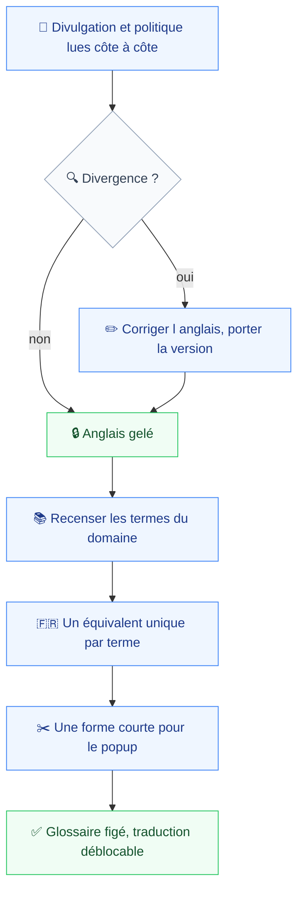
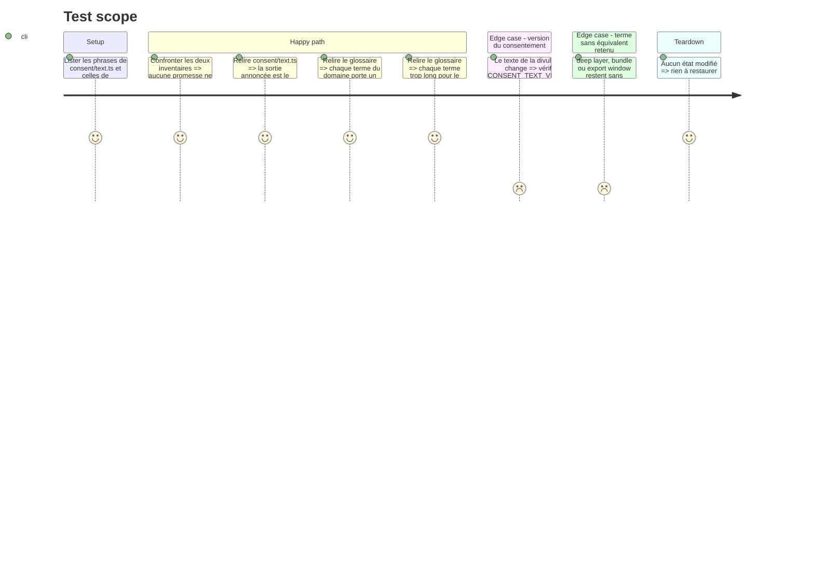

# Instruction: Geler l'anglais et figer le glossaire

Rien ne se traduit tant que la source bouge. Le PRD en fait deux dépendances bloquantes distinctes : le gel du texte anglais (`prd.md:135`) et le glossaire des termes du domaine (`prd.md:133`), ce dernier « figé avant la première chaîne traduite, pas pendant » (`prd.md:142`).

Cette phase les livre, et corrige au passage une divergence déjà présente. `consent/text.ts:79` promet que les données restent locales « until you copy a report yourself », alors que `docs/privacy-policy.md:40` dit « until you export a report yourself ». Le presse-papier a disparu du produit, la sortie est un fichier téléchargé : c'est la divulgation qui est périmée, pas la politique. Une divulgation produit et une politique publiée qui divergent sont un motif de rejet à elles seules (`prd.md:138`), et traduire maintenant reviendrait à produire la divergence en deux langues.

Le moment est le bon pour la correction. Rien n'est publié : `cws-submission.md` note la politique « à publier sur GitHub Pages ⏳ » et le compte développeur « non réglé ⏳ ». Il n'y a aucun utilisateur installé à redemander, donc `CONSENT_TEXT_VERSION` peut passer à `2` sans coût, ce qui ne sera plus vrai après la publication.

## Architecture projection

> Tree of the final files. ✅ create · ✏️ modify · ❌ delete

```txt
.
├── aidd_docs/
│   └── tasks/2026_08/2026_08_13_ui-language/
│       └── ✅ glossaire.md                    # un équivalent français unique par terme, plus sa forme courte
├── apps/
│   └── extension/
│       └── src/
│           └── consent/
│               └── ✏️ text.ts                 # « copy » devient « export », version portée à 2
└── docs/
    └── ✏️ privacy-policy.md                   # relue phrase à phrase contre la divulgation
```

## User Journey



## Test Scope



## Tasks to do

### `1)` Réconcilier la divulgation et la politique publiée

> Une divergence traduite est une divergence en deux exemplaires.

1. Lire `consent/text.ts` et `docs/privacy-policy.md` en regard, promesse par promesse : catégories captées, limites, durée de rétention, sortie, effacement.
2. Corriger `text.ts:79` : « until you copy a report yourself » devient « until you export a report yourself ». Le presse-papier n'existe plus, la sortie est `export/download.ts`.
3. Consigner dans le glossaire toute autre divergence relevée, et la corriger dans le même passage.
4. Porter `CONSENT_TEXT_VERSION` de `1` à `2`. Le commentaire du fichier l'exige dès qu'une phrase change, et l'extension n'étant pas publiée, personne n'est redemandé.
5. Vérifier que `docs/privacy-policy.md` reste l'exact reflet du fichier corrigé, dans les deux sens.

### `2)` Figer le glossaire des termes du domaine

> Le vocabulaire s'arrête ici, une fois, et ne se rediscute plus pendant la traduction.

1. Créer `glossaire.md` avec une table à quatre colonnes : terme anglais, équivalent français, forme courte, surfaces où il apparaît.
2. Recenser les termes depuis les surfaces elles-mêmes, pas de mémoire : `popup/state.ts`, `sidepanel/EntryRow.tsx`, `consent/text.ts`, `options/StoredData.tsx`.
3. Trancher les trois que le PRD laisse ouverts : `deep layer`, `bundle`, `export window` (`prd.md:142`).
4. Un terme, un équivalent, sur toutes les surfaces. Deux traductions d'un même terme se lisent comme deux notions (`prd.md:94`).
5. Marquer explicitement ce qui ne se traduit pas : URL, en-têtes HTTP, noms de domaine, codes de statut, et le nom du produit (`prd.md:95`, `prd.md:61`).

### `3)` Écrire la règle d'abrègement

> Elle arbitre chaque libellé trop long, et doit exister avant le premier.

1. Consigner la règle en tête du glossaire : la traduction s'abrège, la surface ne s'élargit pas.
2. Nommer les deux plafonds concernés : le popup à 320 px (`popup/App.tsx`, `w-80`) et la description courte du store.
3. Pour chaque terme dont l'équivalent français dépasse l'anglais de plus d'un tiers, écrire la forme courte dans la colonne prévue.
4. Interdire l'abréviation improvisée : une forme courte absente du glossaire est un défaut, pas une liberté du traducteur.

## Test acceptance criteria

| Task | Acceptance criteria                                                                                                                                    |
| ---- | ---------------------------------------------------------------------------------------------------------------------------------------------------- |
| 1    | La divulgation et la politique publiée énoncent les mêmes catégories, les mêmes limites et la même sortie ; `CONSENT_TEXT_VERSION` vaut `2`             |
| 2    | Chaque terme du domaine relevé sur une surface figure au glossaire avec un équivalent français et un seul ; `deep layer`, `bundle` et `export window` y sont tranchés |
| 3    | Le glossaire ouvre sur la règle d'abrègement, nomme les deux plafonds, et chaque terme long y porte une forme courte                                    |
