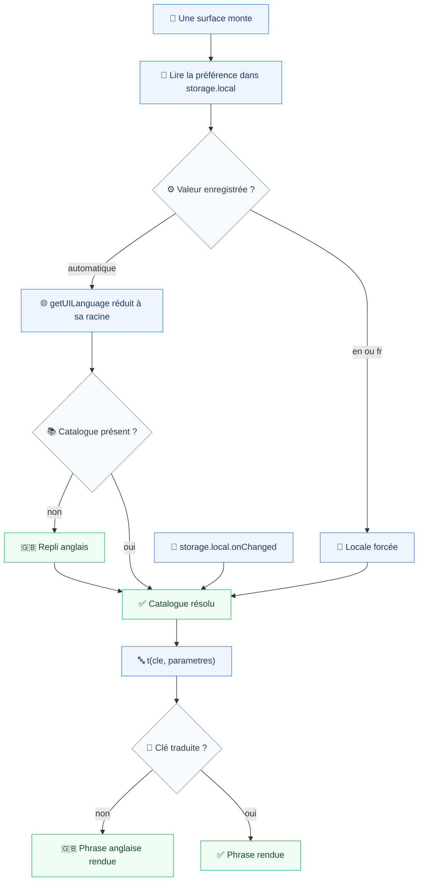
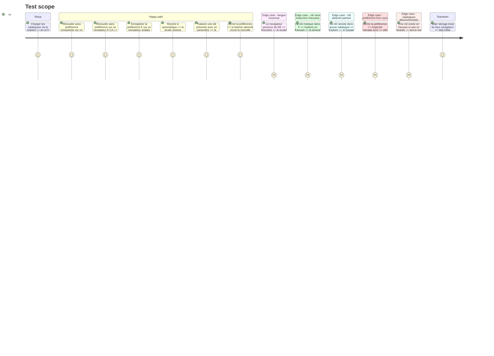

# Instruction: La couche de traduction, sans surface

Cette phase livre le mécanisme et rien d'autre : aucune surface n'est traduite, aucun texte ne bouge à l'écran. Elle se vérifie entièrement par des tests unitaires sans navigateur, ce que le projet attend d'un module pur (`testing.md`).

Quatre décisions y sont matérialisées. La préférence vit dans `chrome.storage.local`, parce que le réglage doit rester propre à l'installation (`prd.md:88`) et que `storage.sync` le ferait voyager. Les catalogues sont découverts par `import.meta.glob` plutôt qu'énumérés, ce qui est exactement le critère « une langue de plus, aucune surface touchée » (`prd.md:125`). Le repli est anglais et jamais vide ni brut (`prd.md:97`). Et la résolution réduit la locale à sa racine, `fr-CA` et `fr-BE` donnant français (`prd.md:78`).

Le patron existe déjà dans le dépôt : `storage/watched-domains.ts` porte la même forme, clé dans `storage.local`, écritures sérialisées, `onChanged` renvoyant un désabonnement. Et `popup/last-depth.test.ts:35` fournit le précédent d'une préférence assertée absente de `storage.sync`.

## Architecture projection

> Tree of the final files. ✅ create · ✏️ modify · ❌ delete

```txt
.
└── apps/
    └── extension/
        └── src/
            └── ✅ i18n/
                ├── ✅ catalogs/
                │   ├── ✅ en.ts                  # référence des clés, repli obligatoire
                │   └── ✅ fr.ts                  # Partial du précédent, une clé absente retombe en anglais
                ├── ✅ registry.ts                # import.meta.glob, une langue de plus est un fichier déposé
                ├── ✅ registry.test.ts           # le registre expose bien en et fr, dans cet ordre
                ├── ✅ resolve.ts                 # préférence puis getUILanguage réduit à sa racine puis en
                ├── ✅ resolve.test.ts
                ├── ✅ preference.ts              # lecture, écriture, abonnement dans storage.local
                ├── ✅ preference.test.ts
                ├── ✅ translate.ts               # interpolation, pluriel, repli anglais
                ├── ✅ translate.test.ts
                ├── ✅ catalog-parity.test.ts     # aucune clé orpheline dans un sens ni dans l autre
                └── ✅ I18nProvider.tsx           # contexte React, réabonné à onChanged
```

## User Journey



## Test Scope



## Tasks to do

### `1)` Le registre des langues

> Une langue de plus est un fichier déposé, pas une ligne à ajouter.

1. `catalogs/en.ts` exporte `{ code: 'en', label: 'English', messages }`, où `messages` est un objet plat de clés vers des phrases anglaises.
2. `catalogs/fr.ts` exporte la même forme, `messages` typé `Partial<Record<MessageKey, string>>` de sorte qu'une clé manquante soit un trou, pas une erreur.
3. `registry.ts` collecte les catalogues par `import.meta.glob('./catalogs/*.ts', { eager: true })` et en dérive `LOCALES`, `MessageKey` et `DEFAULT_LOCALE = 'en'`.
4. Le chargement est immédiat et non différé : le changement à chaud interdit d'aller chercher un catalogue au moment du clic.
5. `catalog-parity.test.ts` échoue sur toute clé présente dans un catalogue et absente de l'autre, dans les deux sens.

### `2)` La résolution de la locale

> Une fonction pure, sans navigateur, qui porte tout le comportement par défaut.

1. `resolveLocale(preference, uiLanguage)` prend la préférence (`'auto' | code`) et le retour de `getUILanguage()`.
2. Une préférence explicite l'emporte, sans condition (`prd.md:87`).
3. En automatique, `uiLanguage` est réduit à sa racine avant comparaison : `fr-CA` et `fr-BE` donnent `fr` (`prd.md:78`).
4. Une racine sans catalogue retombe sur `en`, connue ou non (`prd.md:79`).
5. La fonction renvoie aussi la locale détectée, distincte de la locale appliquée : les paramètres doivent nommer ce que le navigateur annonce (`prd.md:85`).

### `3)` La préférence, propre à l'installation

> Le patron est `storage/watched-domains.ts`, pas une invention.

1. Clé `vigie:language` dans `chrome.storage.local`. Jamais `sync` : le réglage ne suit pas l'utilisateur d'une machine à l'autre (`prd.md:88`).
2. `readLanguagePreference()` renvoie `'auto'` en l'absence de valeur, ce qui fait d'Automatique la valeur initiale sans rien écrire au premier lancement (`prd.md:80`, `prd.md:84`).
3. `writeLanguagePreference(value)` sérialise ses écritures, comme `watched-domains.ts`.
4. `onLanguagePreferenceChanged(listener)` s'abonne à `storage.local.onChanged` et renvoie un désabonnement.
5. Le test asserte l'absence de la clé dans `storage.sync`, sur le modèle de `popup/last-depth.test.ts:35`.

### `4)` Le traducteur et son repli

> Un texte sans traduction s'affiche en anglais, jamais vide ni sous sa forme brute.

1. `translate(locale, key, params?)` cherche dans le catalogue de la locale, puis dans l'anglais, et ne renvoie jamais la clé.
2. Interpolation nommée, `{domain}` et non un ordre positionnel : le français ne conserve pas l'ordre des mots anglais.
3. Le pluriel est porté par deux clés explicites, singulier et pluriel, choisies par le compte. Les surfaces le font déjà, en anglais, avec `entry` et `entries`.
4. Le typage refuse une clé absente du catalogue anglais, de sorte qu'un oubli échoue à la compilation et non à l'écran.

### `5)` Le contexte React

> Le changement s'applique aux surfaces déjà ouvertes, sans rechargement.

1. `I18nProvider` lit la préférence et `getUILanguage()` au montage, puis s'abonne à `onLanguagePreferenceChanged`.
2. Il expose `useI18n()` qui rend `{ t, locale, detected, preference, setPreference }`.
3. Un changement de préférence, d'où qu'il vienne, remplace la locale de l'état et re-rend l'arbre. Aucune surface ne se recharge et aucune ne redémarre (`prd.md:102`).
4. Le provider ne touche ni la base, ni les listeners de capture, ni le service worker : une capture en cours ne peut pas être affectée par un changement de langue (`prd.md:103`).
5. Aucun entrypoint ne le monte encore. Le montage arrive avec chaque surface, phases 3 à 6.

## Test acceptance criteria

| Task | Acceptance criteria                                                                                                                     |
| ---- | --------------------------------------------------------------------------------------------------------------------------------------- |
| 1    | Le registre expose `en` et `fr` sans qu'aucun fichier ne les énumère ; une clé présente d'un seul côté fait échouer la suite             |
| 2    | Sans préférence, `fr-CA` donne français et `de-DE` donne anglais ; une préférence explicite l'emporte sur le navigateur dans les deux sens |
| 3    | La préférence relue vaut ce qui a été écrit, un abonné est notifié du changement, et la clé est absente de `storage.sync`                 |
| 4    | Une clé traduite rend le français, une clé sans traduction rend l'anglais, et aucun appel ne rend une clé brute ni une chaîne vide        |
| 5    | Un composant monté sous le provider rend un texte différent après un changement de préférence, sans avoir été remonté                     |
