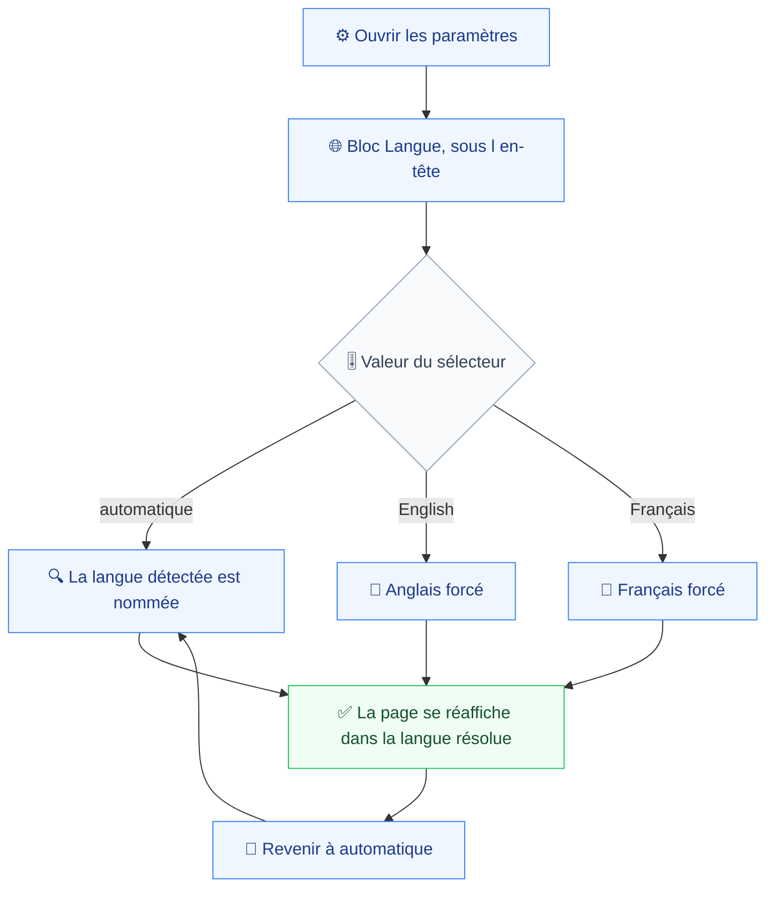
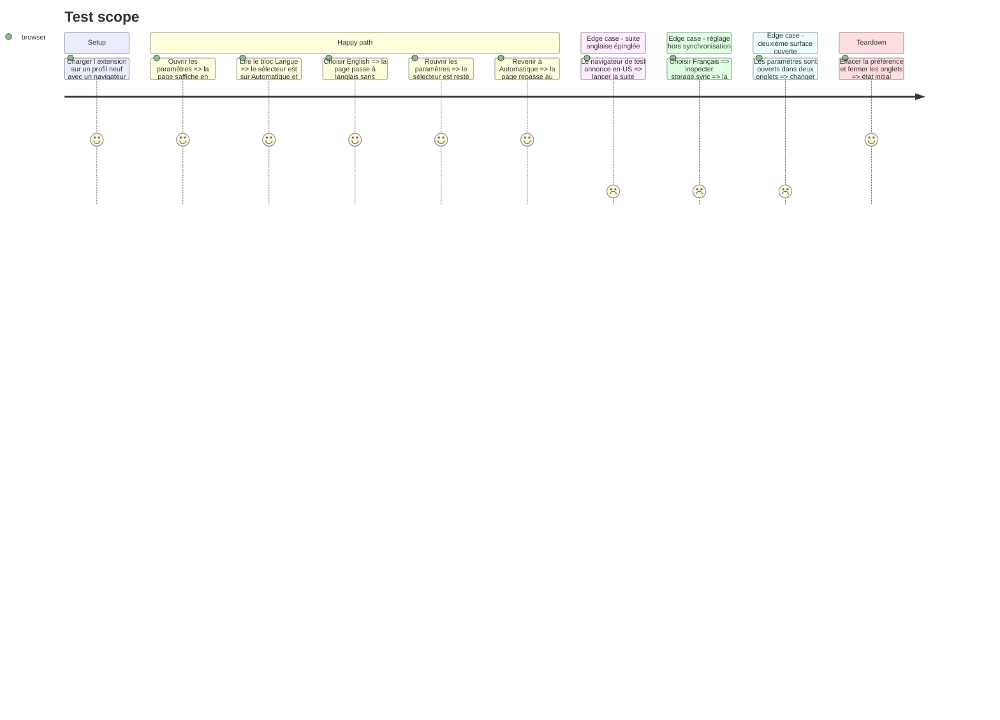

# Instruction: Le sélecteur et les paramètres

La première surface traduite est celle qui porte le réglage, pour que la traduction et son commutateur arrivent ensemble : traduire une surface avant d'avoir de quoi changer de langue rendrait le résultat invérifiable autrement qu'en changeant la langue du système.

Le sélecteur se place directement sous l'en-tête, avant la liste des domaines. Le critère est « visible depuis les paramètres seuls, sans écran intermédiaire » (`prd.md:89`), et un réglage qui demande de faire défiler une liste de domaines de longueur inconnue n'est pas visible. Le bloc tient sur une ligne, il ne repousse donc presque pas ce qui le suit.

Cette phase règle aussi la dépendance « recette adossée aux libellés anglais » (`prd.md:136`). Les neuf specs qui assertent de l'anglais, dont dix-huit assertions dans `popup-export.spec.ts` à elle seule, continuent de passer si le navigateur de test annonce l'anglais et que la préférence reste Automatique. Le lancement de `e2e/fixtures/extension.ts:48` reçoit donc `--lang=en-US`, ce qui épingle la suite sans toucher une seule assertion, et une spec dédiée porte le français.

## Architecture projection

> Tree of the final files. ✅ create · ✏️ modify · ❌ delete

```txt
.
├── apps/
│   └── extension/
│       └── src/
│           ├── i18n/catalogs/
│           │   ├── ✏️ en.ts                      # clés des paramètres et du sélecteur
│           │   └── ✏️ fr.ts
│           └── entrypoints/
│               └── options/
│                   ├── ✅ LanguageSetting.tsx    # trois valeurs, engendrées depuis le registre
│                   ├── ✏️ main.tsx               # monte I18nProvider
│                   ├── ✏️ App.tsx                # intro, titres, état de chargement, ancrage du bloc
│                   ├── ✏️ AddDomainForm.tsx      # trois erreurs, aria-label, placeholder, libellé
│                   ├── ✏️ WatchedDomainList.tsx  # état vide, deux états d accès, avertissement, deux boutons
│                   └── ✏️ StoredData.tsx         # bytes() et ageOfOldest() rendent des phrases
└── e2e/
    ├── fixtures/
    │   └── ✏️ extension.ts                       # --lang=en-US, la suite existante reste anglaise
    └── specs/
        └── ✅ ui-language.spec.ts                # défaut, choix explicite, retour à automatique, à chaud
```

## User Journey



## Test Scope



## Wireframe

```txt
┌────────────────────────────────────────────────────────┐
│ (1) En-tête : nom du produit · phrase de cadrage        │
├────────────────────────────────────────────────────────┤
│ (2) Langue                                              │
│     ┌──────────────────────────┐                        │
│     │ (3) Sélecteur            │  (4) mention détectée   │
│     └──────────────────────────┘                        │
├────────────────────────────────────────────────────────┤
│ (5) Domaines surveillés                                 │
│     ┌────────────────────────────────────────────────┐  │
│     │ (6) Domaine · état d'accès · retrait            │  │
│     └────────────────────────────────────────────────┘  │
│     ┌──────────────────────────────┐ ┌──────┐           │
│     │ (7) Champ de saisie          │ │ (8)  │           │
│     └──────────────────────────────┘ └──────┘           │
├────────────────────────────────────────────────────────┤
│ (9) Données stockées                                    │
├────────────────────────────────────────────────────────┤
│ (10) Ce que Vigie enregistre                            │
│      (11) Divulgation                                   │
│      (12) Accès à l'écran complet                       │
└────────────────────────────────────────────────────────┘
```

1. En-tête : inchangé, le nom du produit ne se traduit pas.
2. Nouveau bloc, placé avant la liste des domaines pour être visible sans défilement.
3. Trois entrées, engendrées depuis le registre des langues et non écrites en dur.
4. Mention affichée sur la seule valeur automatique : elle nomme la langue détectée.
5. à 8. Le bloc des domaines, inchangé dans sa structure, traduit dans ses textes.
6. Le stockage, inchangé dans sa structure.
7. à 12. La divulgation rappelée, traduite en phase 4 et non ici.

## Tasks to do

### `1)` Le bloc Langue

> Trois valeurs, une ligne, aucun écran intermédiaire.

1. `LanguageSetting.tsx` rend un sélecteur dont les entrées viennent de `LOCALES`, précédées de la valeur automatique. Ajouter une langue ne touche pas ce fichier (`prd.md:125`).
2. Chaque langue s'affiche sous son nom natif, `English` et `Français`, dans les deux langues d'interface : c'est le nom que reconnaît celui qui la cherche.
3. Sur automatique, et sur elle seule, une mention nomme la langue détectée (`prd.md:85`).
4. Le changement écrit la préférence et rien d'autre. Le réaffichage vient de l'abonnement du provider, pas du gestionnaire de clic.
5. Le bloc s'insère dans `options/App.tsx` entre l'en-tête et la section des domaines, hors du verrou de consentement : la langue doit être réglable avant d'accepter.

### `2)` Traduire les paramètres

> Libellés, textes d'aide, messages d'erreur, états vides et de chargement (`prd.md:93`).

1. `options/main.tsx` monte `I18nProvider` autour de `App`.
2. `App.tsx` : phrase de cadrage, titres des sections, état de chargement.
3. `AddDomainForm.tsx` : les trois messages d'erreur, l'`aria-label`, le placeholder et le libellé du bouton. Le placeholder `example.com` reste tel quel, c'est un nom de domaine.
4. `WatchedDomainList.tsx` : état vide, les deux états d'accès, l'avertissement d'irréversibilité, les deux libellés de bouton, l'`aria-label` de retrait.
5. `StoredData.tsx` : `bytes()` garde ses unités `B`, `kB`, `MB`, qui sont des symboles ; `ageOfOldest()` rend des phrases et passe par le traducteur.
6. Le glossaire de la phase 1 est la seule source du vocabulaire. Aucune formulation ne s'invente ici.

### `3)` Épingler la recette existante

> Trente-six assertions anglaises, dans neuf specs, doivent continuer de passer.

1. Ajouter `--lang=en-US` aux arguments de lancement de `e2e/fixtures/extension.ts:48`.
2. Ne toucher aucune assertion existante : le navigateur annonce l'anglais, la préférence reste Automatique, donc l'interface reste anglaise.
3. Lancer la suite complète pour prouver que l'épinglage suffit, avant d'écrire la moindre spec française.

### `4)` La spec de la langue

> Ce qui n'est vérifiable que dans un vrai navigateur.

1. `ui-language.spec.ts` lance un contexte avec `--lang=fr-FR` et vérifie que les paramètres s'affichent en français sans réglage.
2. Il vérifie le choix explicite dans les deux sens, et le retour à Automatique.
3. Il vérifie qu'un second onglet des paramètres suit le changement sans rechargement.
4. Il vérifie l'absence de la clé de langue dans `storage.sync`.
5. Les phases 4 à 6 étendent cette spec plutôt que d'en créer d'autres.

## Test acceptance criteria

| Task | Acceptance criteria                                                                                                                        |
| ---- | ------------------------------------------------------------------------------------------------------------------------------------------ |
| 1    | Le sélecteur affiche trois valeurs, Automatique est la valeur initiale et nomme la langue détectée, et le choix survit à la fermeture de l'onglet |
| 2    | Sur un navigateur français, aucun texte anglais ne subsiste dans les paramètres hors noms de domaine et symboles d'unité                     |
| 3    | La suite de bout en bout existante passe entièrement, sans qu'une seule assertion ait été modifiée                                          |
| 4    | Un navigateur français affiche les paramètres en français sans réglage ; un choix explicite l'emporte et un retour à Automatique le défait   |
