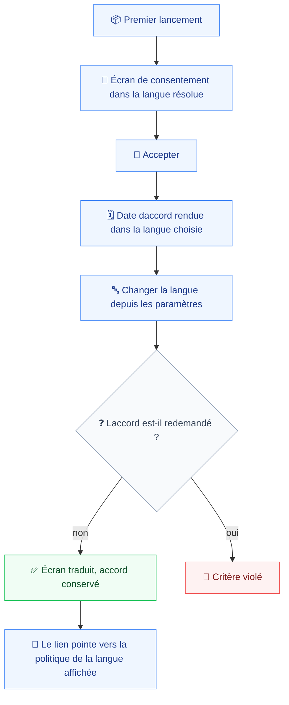
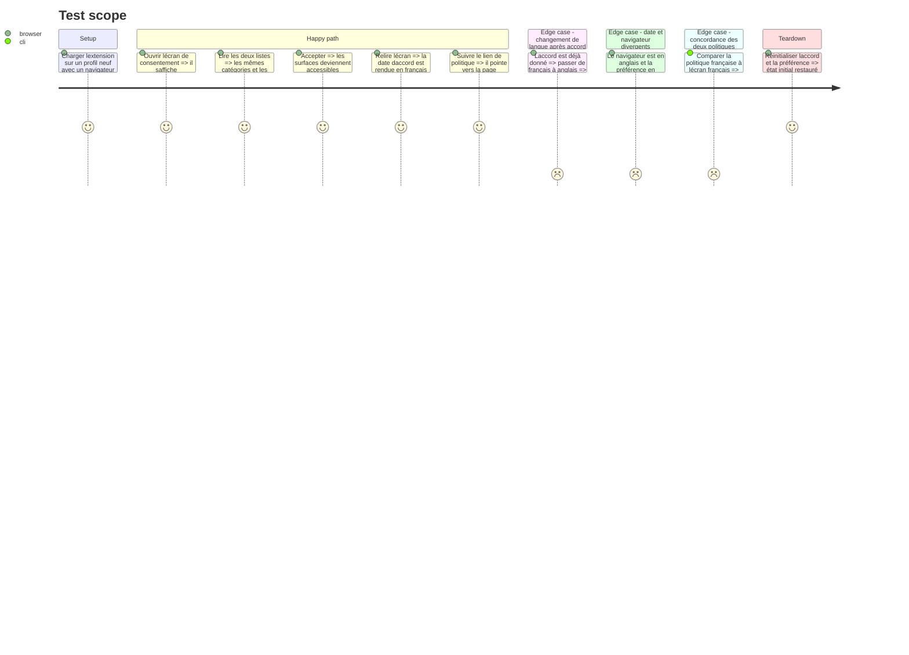

# Instruction: Le consentement et la politique française

C'est la surface qui justifie le chantier. Un utilisateur qui accepte sans avoir compris n'a pas consenti, quelle que soit la case cochée (`prd.md:21`), et l'écran énumère des en-têtes portant des jetons d'authentification et du contenu console pouvant inclure des données personnelles.

Une règle du dépôt est explicitement contredite ici, et il faut la requalifier plutôt que la contourner. Le commentaire de `consent/text.ts` impose de porter `CONSENT_TEXT_VERSION` dans le même commit qu'une phrase modifiée. Le PRD interdit que traduire redemande le consentement à quiconque (`prd.md:108`). Les deux se concilient en énonçant ce que la version suit réellement : **ce qui est capté**, pas les mots qui le disent. Une catégorie ajoutée porte la version ; une phrase rendue dans une autre langue ne la porte pas. La version reste donc à `2`, la valeur que la phase 1 lui a donnée.

La politique française n'est pas une traduction libre. Elle doit être concordante mot pour mot avec l'écran (`prd.md:110`), et l'écran français doit pointer vers elle (`prd.md:111`). Une divulgation produit et une politique publiée qui divergent sont un motif de rejet à elles seules (`prd.md:138`).

## Architecture projection

> Tree of the final files. ✅ create · ✏️ modify · ❌ delete

```txt
.
├── apps/
│   └── extension/
│       └── src/
│           ├── i18n/catalogs/
│           │   ├── ✏️ en.ts                       # clés du consentement, reprises de text.ts
│           │   └── ✏️ fr.ts
│           ├── consent/
│           │   ├── ✏️ text.ts                     # constantes vers clés, URL de politique par locale, version figée à 2
│           │   ├── ✏️ Disclosure.tsx              # titres, deux listes, libellé du lien
│           │   └── ✏️ ConsentRequired.tsx         # quatre phrases et le libellé daction
│           └── entrypoints/
│               └── consent/
│                   ├── ✏️ main.tsx                # monte I18nProvider
│                   └── ✏️ App.tsx                 # toLocaleDateString reçoit la locale résolue
├── ✅ docs/politique-de-confidentialite.md         # jumelle française, concordante mot pour mot
└── e2e/
    └── specs/
        └── ✏️ ui-language.spec.ts                 # traduire ne redemande rien, le lien suit la langue
```

## User Journey



## Test Scope



## Tasks to do

### `1)` Requalifier la règle de version

> La version suit ce qui est capté, pas les mots qui le disent.

1. Réécrire le commentaire de `consent/text.ts` : une catégorie captée ajoutée, retirée ou élargie porte la version ; une traduction ne la porte pas.
2. Laisser `CONSENT_TEXT_VERSION` à `2`, la valeur posée en phase 1. Aucun changement dans cette phase ne la touche.
3. Ajouter un test qui échoue si la version bouge en même temps qu'un catalogue est modifié sans que la liste des catégories ait changé.

### `2)` Traduire la divulgation

> Les mêmes catégories et les mêmes limites, dans les deux langues (`prd.md:109`).

1. `text.ts` cesse d'exporter des phrases et exporte des clés : `CONSENT_HEADING`, `CONSENT_PROMISE`, `CONSENT_ACCEPT_LABEL`, et les `id` de `CAPTURED` et `NOT_CAPTURED` deviennent les racines de leurs clés.
2. Les `id` existants — `network`, `console`, `error`, `local`, `scope`, `hour` — sont conservés tels quels : ce sont eux qui garantissent que les deux langues énumèrent le même ensemble.
3. `PRIVACY_POLICY_URL` devient une fonction de la locale, avec l'anglaise en repli comme partout ailleurs.
4. `Disclosure.tsx` et `ConsentRequired.tsx` rendent les clés. Aucune phrase ne reste écrite dans un composant.
5. `consent/main.tsx` monte `I18nProvider`.

### `3)` La date d'acceptation

> Elle suit la langue choisie, pas celle du navigateur (`prd.md:96`).

1. `consent/App.tsx:20` passe la locale résolue à `toLocaleDateString` en lieu et place de `undefined`.
2. `undefined` signifie « locale du navigateur » : c'est le seul appel du dépôt sensible à la locale, et il est aujourd'hui faux au regard du critère.
3. La phrase qui l'enveloppe passe elle aussi par le traducteur, avec la date en paramètre nommé.

### `4)` La politique française

> Concordante mot pour mot, et publiée avant la soumission.

1. Créer `docs/politique-de-confidentialite.md`, jumelle de `docs/privacy-policy.md` réconcilié en phase 1.
2. Chaque promesse de l'écran français a sa phrase dans la politique française, et réciproquement.
3. Nommer l'adresse française et la câbler dans `text.ts`. La publication effective est vérifiée en phase 7, `deployment.md:33` exigeant qu'elle soit joignable avant toute soumission.
4. Consigner que la relecture humaine du consentement français reste due avant mise en ligne (`prd.md:134`) : c'est une dépendance externe, pas une tâche de code.

## Test acceptance criteria

| Task | Acceptance criteria                                                                                                                       |
| ---- | ------------------------------------------------------------------------------------------------------------------------------------------- |
| 1    | Un utilisateur ayant accepté avant la traduction ne se voit rien redemander après ; le commentaire de `text.ts` énonce ce que la version suit |
| 2    | L'écran français et l'écran anglais énumèrent les mêmes six entrées, et aucun texte anglais ne subsiste dans la version française            |
| 3    | Avec un navigateur anglais et la préférence française, la date d'accord s'affiche en français                                                |
| 4    | L'écran français renvoie vers la politique française, et les deux documents énoncent les mêmes promesses sans divergence                     |
