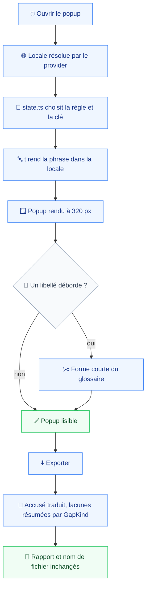
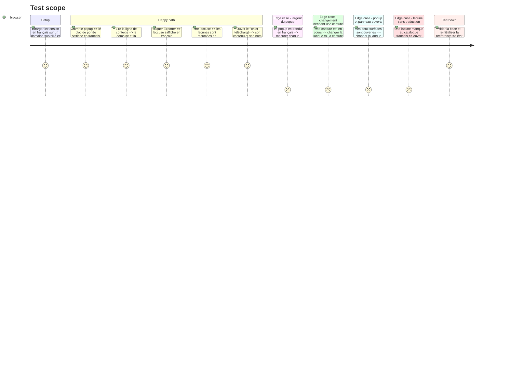

# Instruction: Le popup

Le popup est la surface la plus étroite du produit, 320 px fixés par `w-80` dans `popup/App.tsx`, et la plus dense en texte. C'est là que la règle d'abrègement de la phase 1 s'applique réellement : aucun libellé français ne doit y déborder ni s'y tronquer (`prd.md:98`).

Le module central est `popup/state.ts`, 446 lignes qui produisent toutes les phrases du popup **et** celles que le panneau latéral partage avec lui. Il reçoit un traducteur en paramètre et continue de rendre des phrases finies : la solution inverse, renvoyer des clés au composant, réécrirait quatre composants et l'ensemble des tests unitaires du module pour le même résultat à l'écran. Son commentaire d'ouverture revendique que la règle et la phrase vivent ensemble ; c'est toujours vrai, la règle choisit désormais la clé et le catalogue tient les mots.

Une frontière du contrat est franchie ici. `packages/contract/src/report.ts` porte deux jeux de formulations pour les mêmes quatre lacunes : `GAP_STATEMENTS`, rendu **dans le rapport**, et `GAP_SUMMARIES`, rendu **dans le popup** par `downloadAcknowledgement`. Le premier reste anglais, le rapport étant hors périmètre (`prd.md:55`) ; le second doit être traduit. La séparation passe par `GapKind` : le popup s'indexe sur le type, jamais sur la chaîne anglaise.

Le panneau latéral appelle `state.ts` lui aussi. Changer la signature l'oblige à suivre dans la même phase, sinon le projet ne compile pas ; il reçoit donc son provider et ses deux libellés propres ici, et ses composants de thread arrivent en phase 6.

## Architecture projection

> Tree of the final files. ✅ create · ✏️ modify · ❌ delete

```txt
.
├── apps/
│   └── extension/
│       └── src/
│           ├── i18n/catalogs/
│           │   ├── ✏️ en.ts                       # clés du popup, formes courtes du glossaire incluses
│           │   └── ✏️ fr.ts
│           └── entrypoints/
│               ├── popup/
│               │   ├── ✏️ state.ts                # toutes les fonctions reçoivent t, les tests construisent un t anglais
│               │   ├── ✏️ main.tsx                # monte I18nProvider
│               │   ├── ✏️ App.tsx                 # phrase derreur littérale et état de chargement
│               │   ├── ✏️ PopupHeader.tsx         # aria-label et title
│               │   ├── ✏️ ScopeStatus.tsx         # le libellé de laction de portée
│               │   └── ✏️ ExportButton.tsx        # titre, libellé, aria-label, unité de minutes
│               └── sidepanel/
│                   ├── ✏️ main.tsx                # monte I18nProvider
│                   └── ✏️ App.tsx                 # passe t aux fonctions partagées, traduit ses deux libellés
├── packages/
│   └── contract/
│       └── src/
│           └── ✏️ report.ts                       # GAP_SUMMARIES devient indexable par GapKind côté surface
└── e2e/
    └── specs/
        └── ✏️ ui-language.spec.ts                 # popup français, aucun débordement, capture intacte
```

## User Journey



## Test Scope



## Wireframe

```txt
┌──────────────────────────────┐
│ (1) En-tête · accès réglages │
├──────────────────────────────┤
│ (2) Bandeau d'interruption   │
├──────────────────────────────┤
│ (3) Bloc de portée           │
│     (4) Action de portée     │
├──────────────────────────────┤
│ (5) Ligne de contexte        │
├──────────────────────────────┤
│ (6) Couche profonde          │
├──────────────────────────────┤
│ (7) Export                   │
│  ┌────────────────┐┌───────┐ │
│  │ (8) Bouton     ││ (9) ▾ │ │
│  └────────────────┘└───────┘ │
├──────────────────────────────┤
│ (10) Accusé d'export         │
└──────────────────────────────┘
```

1. En-tête : le nom du produit, qui ne se traduit pas, et l'accès aux paramètres dont seuls l'`aria-label` et le `title` changent.
2. Bandeau conditionnel, apparaît une seule fois après une interruption.
3. Le bloc de portée, quatre états, le plus long libellé de la surface.
4. L'action de portée, qui interpole un nom de domaine et ne peut donc pas être mesurée à vide.
5. Une ligne de contexte, la plus exposée au débordement : elle porte domaine, onglet et profondeur.
6. Le contrôle de la couche profonde, quatre états et un libellé d'action.
7. à 9. Le bloc d'export : un titre, un bouton portant une durée, un déclencheur de choix de profondeur.
8. L'accusé, qui porte un nom de fichier non traduit et des résumés de lacunes traduits.

## Tasks to do

### `1)` Injecter le traducteur dans `state.ts`

> La règle choisit la clé, le catalogue tient les mots.

1. Chaque fonction qui rend du texte prend `t` en dernier paramètre : `scopeStatus`, `depthAvailability`, `tabContextLine`, `workingFeedback`, `exportFailure`, `downloadAcknowledgement`, `interruptionNotice`, `deepLayerView`.
2. `IDLE_FEEDBACK`, aujourd'hui une constante, devient une fonction de `t` : une constante figée ne peut pas changer de langue.
3. Le pluriel de `entry` et `entries` passe par les deux clés explicites du traducteur, pas par une concaténation.
4. Les tests unitaires construisent un `t` depuis le catalogue anglais et gardent leurs assertions de prose telles quelles.
5. Le commentaire d'ouverture du module est réécrit pour dire où vivent désormais les mots, sans renier la raison qui l'a écrit.

### `2)` Séparer les deux publics du contrat

> Une même lacune, deux formulations, deux destinataires.

1. `GAP_STATEMENTS` ne bouge pas : il est rendu dans le rapport, qui reste anglais (`prd.md:120`).
2. `downloadAcknowledgement` cesse de lire `GAP_SUMMARIES` et construit sa clé depuis `GapKind`.
3. `GAP_SUMMARIES` reste exporté pour tout consommateur hors extension, avec un commentaire qui dit lequel des deux jeux traverse une interface.
4. Les quatre `GapKind` ont leur clé dans les deux catalogues, et la parité les couvre.

### `3)` Traduire les composants du popup

> Ceux qui portent une phrase à eux, et eux seuls.

1. `popup/main.tsx` monte `I18nProvider`.
2. `App.tsx` : la phrase d'erreur littérale de la ligne 249 et l'état de chargement de la portée.
3. `PopupHeader.tsx` : `aria-label` et `title`. Le titre `Vigie` reste tel quel.
4. `ScopeStatus.tsx` : le libellé de l'action, qui interpole le domaine proposé.
5. `ExportButton.tsx` : titre, libellé du bouton, `aria-label` du déclencheur, et l'unité de minutes.
6. `ExportFeedback.tsx`, `InterruptionNotice.tsx`, `TabContextLine.tsx` et `DeepLayerControl.tsx` ne sont pas touchés : ils ne portent aucune chaîne propre et rendent ce que `state.ts` leur donne.

### `4)` Faire suivre le panneau latéral

> Il appelle `state.ts` ; la signature change, il change avec elle.

1. `sidepanel/main.tsx` monte `I18nProvider`.
2. `sidepanel/App.tsx` passe `t` à `scopeStatus`, `tabContextLine` et `interruptionNotice`, et traduit son état de chargement de portée.
3. Ses composants propres, `EntryRow`, `Timeline` et `WindowEdge`, restent anglais jusqu'à la phase 6 : le repli les rend lisibles entre-temps.

### `5)` Tenir la largeur

> Le critère est observable, il se vérifie et ne se suppose pas.

1. Étendre `ui-language.spec.ts` : rendre le popup en français dans chacun de ses états et comparer, pour chaque libellé, la largeur rendue à celle de son conteneur.
2. Tout dépassement se corrige par la forme courte du glossaire, jamais par une largeur augmentée.
3. Un terme dont la forme courte manque au glossaire renvoie à la phase 1 : la formulation ne s'improvise pas ici.

## Test acceptance criteria

| Task | Acceptance criteria                                                                                                                        |
| ---- | ------------------------------------------------------------------------------------------------------------------------------------------- |
| 1    | Le popup rendu en français ne laisse subsister aucune phrase anglaise ; les tests unitaires du module passent sans qu'une assertion ait changé |
| 2    | Le rapport téléchargé énonce ses lacunes en anglais tandis que l'accusé du popup les résume en français, pour la même capture                |
| 3    | Chaque libellé, `aria-label` et `title` du popup change de langue avec le réglage, `Vigie` excepté                                          |
| 4    | Le panneau latéral affiche sa portée et sa ligne de contexte en français, popup et panneau se répondant mot pour mot                        |
| 5    | Aucun libellé français ne dépasse la largeur de son conteneur dans le popup, dans aucun de ses états                                        |
