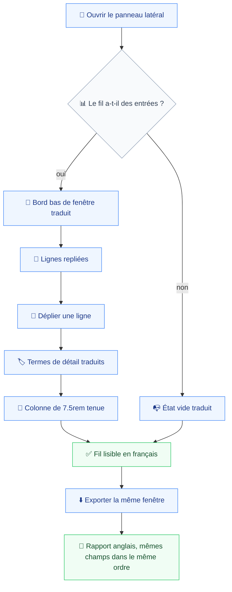
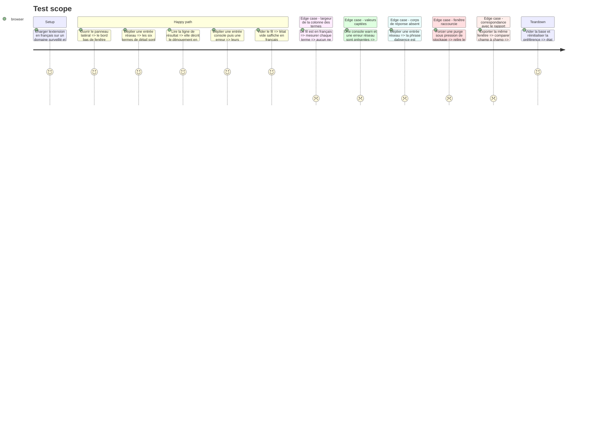

# Instruction: Le panneau latéral

Le fil est la surface la plus dense en vocabulaire technique du produit. Trois composants restent anglais après la phase 5 : `EntryRow.tsx`, qui porte douze termes de détail et trois formulations de résultat, `Timeline.tsx` et `WindowEdge.tsx`. C'est ici que le glossaire de la phase 1 travaille vraiment.

Une conséquence assumée doit être énoncée avant d'écrire la première clé. Le commentaire d'ouverture de `EntryRow.tsx` revendique que le détail est « le contenu du rapport lui-même, disposé pour un écran » (`export/markdown.ts:194`), et que lire ici prédit l'export. Traduire le panneau tout en gardant le rapport anglais (`prd.md:55`) casse cette correspondance mot pour mot. Elle est remplacée par une correspondance de structure : les mêmes champs, dans le même ordre, sous des noms que le glossaire apparie. Le glossaire est donc le seul endroit où un lecteur retrouve quel terme français désigne quel champ du rapport, et il doit le dire.

Une contrainte de largeur propre à cette surface s'ajoute à celle du popup. La grille de détail est `grid-cols-[7.5rem_1fr]` en `text-xs` (`EntryRow.tsx:177`) : la colonne des termes est figée. Un terme français plus long que l'anglais y passe à la ligne. La règle est la même qu'ailleurs, la traduction s'abrège et la colonne ne s'élargit pas.

Ce qui ne se traduit pas est nommé explicitement : les marques `⇅`, `›`, `✗` sont des formes et non des mots (`design.md:28`), les niveaux de console et les sources d'erreur sont des valeurs captées, `webRequest` est un nom d'API, et l'horloge de `clock()` est un format fixe que le rapport partage.

## Architecture projection

> Tree of the final files. ✅ create · ✏️ modify · ❌ delete

```txt
.
├── apps/
│   └── extension/
│       └── src/
│           ├── i18n/catalogs/
│           │   ├── ✏️ en.ts                     # douze termes de détail, résultats, bords de fenêtre
│           │   └── ✏️ fr.ts
│           └── entrypoints/
│               └── sidepanel/
│                   ├── ✏️ EntryRow.tsx          # label, outcomeText, les dt, les notes, le badge
│                   ├── ✏️ Timeline.tsx          # état vide et bouton den afficher plus
│                   └── ✏️ WindowEdge.tsx        # deux titres et deux phrases de bord
└── e2e/
    └── specs/
        └── ✏️ ui-language.spec.ts               # fil français, largeur de la colonne des termes
```

## User Journey



## Test Scope



## Wireframe

```txt
┌──────────────────────────────────────────┐
│ (1) Vigie                                │
│ (2) Portée · (3) ligne de contexte       │
├──────────────────────────────────────────┤
│ ┌ (4) Bord bas de la fenêtre             │
│   (5) Motif : heure tenue ou raccourcie  │
├──────────────────────────────────────────┤
│ (6) Afficher les plus anciennes — N      │
├──────────────────────────────────────────┤
│ (7) 14:02:11.043 ⇅ 200  GET /a  [8]      │
│ (7) 14:02:11.208 ›  warn ...             │
│ (7) 14:02:12.001 ✗  window  ...          │
│   ▼ déplié                               │
│   ┌──────────┬─────────────────────────┐ │
│   │ (9) terme│ (10) valeur             │ │
│   │  7.5rem  │                         │ │
│   └──────────┴─────────────────────────┘ │
└──────────────────────────────────────────┘
```

1. à 3. En-tête, portée et ligne de contexte, déjà traduits en phase 5.
2. Le bord bas, deux titres possibles selon que l'heure a été tenue ou non.
3. La phrase de motif, qui interpole une durée dans le cas raccourci.
4. Le bouton d'affichage des plus anciennes, qui interpole un compte et se décline au pluriel.
5. La ligne repliée : horloge, marque, résultat court, titre. Seul le résultat court se traduit.
6. Le badge d'absence de corps, avec son `title`. Le plus court libellé de la surface, donc le plus contraint.
7. La colonne des termes, figée à 7.5rem : c'est elle qui arbitre les abrègements.
8. La colonne des valeurs, qui porte des données captées et ne se traduit jamais.

## Tasks to do

### `1)` Les termes du détail

> Douze termes, une colonne figée, et le rapport pour référence de structure.

1. Traduire les termes de `Line`, `Block` et `Headers` : `outcome`, `url`, `request headers`, `request body`, `response headers`, `response body`, `level`, `text`, `note`, `source`, `message`, `stack`.
2. Chaque terme prend son équivalent du glossaire, et sa forme courte si le français dépasse 7.5rem en `text-xs`.
3. `url` reste `url` : c'est un identifiant technique, exclu de la traduction (`prd.md:95`).
4. L'ordre des champs ne change pas. C'est lui, désormais, qui porte la correspondance avec le rapport.
5. Consigner dans le glossaire l'appariement terme français vers champ du rapport, pour chacun des douze.

### `2)` Les formulations de résultat

> Trois issues, une phrase chacune, et des valeurs captées qui traversent intactes.

1. `label()` traduit `failed`, `pending` et `no status`. Un code de statut numérique traverse tel quel, comme un niveau de console ou une source d'erreur.
2. `outcomeText()` passe par le traducteur pour ses trois branches, avec durée et type de ressource en paramètres nommés. Le type de ressource est une valeur du navigateur et ne se traduit pas.
3. L'unité `ms` reste un symbole, au même titre que `B`, `kB` et `MB` en phase 3.
4. La phrase d'absence de corps de réponse est traduite en conservant `webRequest` écrit tel quel : c'est le nom de l'API qui explique l'absence.
5. Les deux notes de troncature sont traduites, en gardant la distinction que fait l'anglais entre le texte tronqué et l'entrée tronquée.
6. Le badge `no body` et son `title` sont traduits, le badge par sa forme la plus courte.

### `3)` Le fil et ses bords

> Ce que le lecteur voit quand il n'y a rien, et quand il arrive au bout.

1. `Timeline.tsx` : l'état vide, en deux phrases comme aujourd'hui, la seconde disant que la suite apparaîtra seule.
2. Le bouton d'affichage des plus anciennes interpole un compte et se décline au singulier et au pluriel, par les deux clés explicites de la phase 2.
3. `WindowEdge.tsx` : les deux titres de bord, tenu et raccourci, restent distinguables au premier coup d'œil dans les deux langues.
4. Les deux phrases de motif sont traduites, celle du cas raccourci gardant sa durée et son plancher de 60 minutes en paramètres.
5. La phrase du cas nominal doit continuer de dire que c'est une suppression et non un trou de capture : c'est la raison d'être du composant (`WindowEdge.tsx:9`).

### `4)` Ce qui ne bouge pas

> Le nommer évite qu'un relecteur le traduise par zèle.

1. `MARK` : `⇅`, `›`, `✗` sont des formes, pas des mots.
2. `clock()` garde son format fixe `HH:MM:SS.mmm`. Le rapport le partage, et les assertions de la recette s'y adossent.
3. Les niveaux de console, les sources d'erreur, les méthodes HTTP, les URL et les en-têtes sont des données captées : les rendre traduits serait falsifier ce qui a été observé.
4. Les commentaires de code des trois fichiers restent en anglais, comme partout dans le dépôt.

## Test acceptance criteria

| Task | Acceptance criteria                                                                                                                        |
| ---- | ------------------------------------------------------------------------------------------------------------------------------------------ |
| 1    | Une entrée dépliée en français n'affiche aucun terme anglais hors `url`, et aucun ne déborde la colonne de 7.5rem                          |
| 2    | Les trois issues réseau se lisent en français tandis que codes de statut, niveaux, sources et types de ressource traversent inchangés        |
| 3    | État vide, bouton des plus anciennes et les deux bords de fenêtre s'affichent en français, le cas raccourci conservant sa durée              |
| 4    | Marques, horloge et données captées sont identiques dans les deux langues, à l'octet près                                                   |
