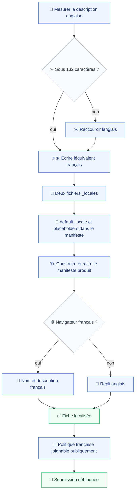
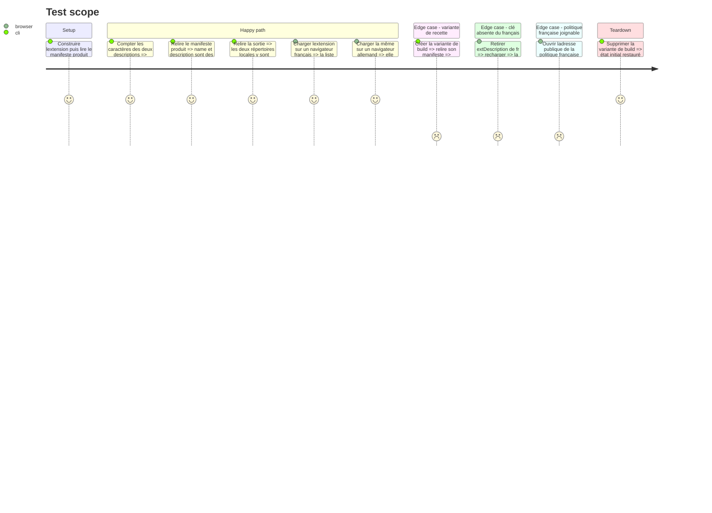

# Instruction: Le manifeste et la fiche du store

C'est ici que le second mécanisme apparaît, et lui seul. `chrome.i18n` résout au chargement, suit la langue du navigateur et n'accepte aucune surcharge : inutilisable pour les quatre surfaces, mais c'est exactement ce que Chrome exige pour un nom et une description de manifeste, et c'est la seule voie par laquelle la fiche du store se localise (`prd.md:115`). Les deux mécanismes ne se croisent nulle part.

Une limite est à assumer et à écrire noir sur blanc : le nom et la description affichés dans la liste des extensions de Chrome suivent la langue du navigateur, pas la préférence Vigie. Un utilisateur au navigateur anglais qui force le français dans les paramètres verra une interface française et une description anglaise dans `chrome://extensions`. Chrome résout les placeholders au chargement de l'extension ; aucun code de notre côté n'y change quoi que ce soit. Le PRD ne couvre que les quatre surfaces et la fiche, donc le critère tient, mais la conséquence doit être connue.

Un défaut préexistant est découvert à la mesure et bloque la soumission. La description du manifeste fait **135 caractères** (`wxt.config.ts:9`) alors que Chrome en documente 132 au maximum : « A plain text string (no HTML or other formatting; no more than 132 characters) that describes the extension. » L'anglais doit donc être raccourci avant d'être traduit, et le français doit tenir sous le même plafond, ce qui est la contrainte la plus dure de la phase — le français rend rarement l'anglais plus court.

La phase referme aussi les dépendances externes du PRD et remet à jour la mémoire du projet, qui ignore encore l'existence du module de traduction.

## Architecture projection

> Tree of the final files. ✅ create · ✏️ modify · ❌ delete

```txt
.
├── aidd_docs/
│   ├── memory/
│   │   ├── ✏️ architecture.md                        # les deux mécanismes, et pourquoi ils sont disjoints
│   │   └── ✏️ codebase-map.md                        # src/i18n dans les zones
│   └── tasks/2026_08/2026_08_06_extension-scope/
│       └── ✏️ cws-submission.md                      # fiche bilingue, un seul jeu de captures
└── apps/
    └── extension/
        ├── public/_locales/
        │   ├── ✅ en/messages.json                    # extName et extDescription, sous 132 caractères
        │   └── ✅ fr/messages.json
        └── ✏️ wxt.config.ts                           # default_locale, placeholders, description raccourcie
```

`e2e/fixtures/build-variant.ts` n'apparaît pas : la vérification faite en tâche 3 montre qu'il n'a rien à changer.

## User Journey



## Test Scope



## Tasks to do

### `1)` Tenir les 132 caractères, dans les deux langues

> Le défaut existe déjà en anglais ; le français ne fait que le rendre visible.

1. Raccourcir la description anglaise de `wxt.config.ts:9` sous 132 caractères, sans perdre les trois choses qu'elle annonce : ce qui est capté, que c'est limité aux domaines désignés, et que la sortie est un rapport Markdown.
2. Écrire l'équivalent français sous le même plafond, en s'appuyant sur les formes courtes du glossaire.
3. Mesurer les deux, pas les estimer. C'est un compte de caractères, il se vérifie en une commande.
4. Le nom `Vigie` est identique dans les deux fichiers : le nom du produit ne se traduit pas (`prd.md:61`).

### `2)` Les deux fichiers de messages

> Un jeu minuscule et disjoint du catalogue d'exécution.

1. Créer `public/_locales/en/messages.json` et `public/_locales/fr/messages.json`, avec `extName` et `extDescription` uniquement.
2. Le répertoire est bien `apps/extension/public/`, résolu depuis la racine de l'application et non depuis `srcDir` (`wxt/dist/core/resolve-config.mjs:65`).
3. Ces clés ne rejoignent jamais les catalogues de la phase 2 : deux mécanismes, deux jeux, aucune parité à tenir entre eux.
4. Chaque message porte sa `description`, que WXT reprend dans les types générés (`wxt/dist/core/generate-wxt-dir.mjs:108`).

### `3)` Le manifeste

> `default_locale` est obligatoire dès qu'un `_locales` existe.

1. Ajouter `default_locale: 'en'` et remplacer `name` et `description` par `__MSG_extName__` et `__MSG_extDescription__`.
2. Construire, puis relire le manifeste produit et le contenu de `.output/chrome-mv3/_locales/`. Le placeholder non résolu dans le fichier est le comportement attendu, Chrome le résout au chargement.
3. Vérifier que `createBuildVariant` préserve l'ensemble : la copie est récursive (`build-variant.ts:56`) et la réécriture ne touche que `host_permissions` sur un objet parsé (`build-variant.ts:60`). Aucun changement n'est attendu ; s'il en faut un, il se limite à ce fichier.
4. Charger la variante dans la recette existante pour confirmer que l'épinglage `--lang=en-US` de la phase 3 continue de produire une interface anglaise.

### `4)` La fiche du store

> Deux langues, un seul produit, un seul jeu de captures.

1. Mettre à jour `cws-submission.md` : la ligne « Langue de la fiche | English » devient bilingue, et le tableau porte le nom et la description dans les deux langues.
2. Les deux fiches décrivent le même produit et les mêmes permissions (`prd.md:117`). Toute divergence entre elles est un motif de rejet au même titre qu'une divergence avec la politique.
3. Un seul jeu de captures d'écran, partagé par les deux fiches. La tâche humaine de la ligne 124 ne se dédouble pas.
4. Consigner que la fiche française se saisit dans la console développeur, dépendance externe non réglée (`prd.md:130`).

### `5)` Rouvrir les dépendances et remettre la mémoire à jour

> Ce qui reste dû avant mise en ligne, et ce que le dépôt doit désormais savoir de lui-même.

1. Vérifier que `docs/politique-de-confidentialite.md` est publiquement joignable : `deployment.md:33` en fait un préalable accepté à toute soumission, et la version française n'existait pas quand cette règle a été écrite.
2. Rappeler la relecture humaine du consentement français, toujours due (`prd.md:134`).
3. `codebase-map.md` : ajouter `apps/extension/src/i18n/` à la liste des zones, entre `consent/` et `ui/`, avec la phrase qui dit ce qu'il porte.
4. `architecture.md` : consigner en décision la séparation des deux mécanismes, et en écueil la résolution au chargement de `chrome.i18n` — c'est le piège qui ferait recommencer l'analyse à quiconque tenterait de tout faire avec `_locales`.
5. Ne pas toucher aux autres fichiers de mémoire : rien de ce qui y est écrit n'a été invalidé par ce chantier.

## Test acceptance criteria

| Task | Acceptance criteria                                                                                                            |
| ---- | -------------------------------------------------------------------------------------------------------------------------------- |
| 1    | Les deux descriptions mesurent 132 caractères ou moins, et chacune annonce ce qui est capté, la limite aux domaines et le rapport |
| 2    | Les deux `messages.json` portent les mêmes deux clés, et la sortie de build contient les deux répertoires `_locales`             |
| 3    | Un navigateur français affiche nom et description en français dans la liste des extensions, un navigateur allemand les affiche en anglais |
| 4    | `cws-submission.md` porte les deux fiches avec des permissions identiques et un seul jeu de captures                            |
| 5    | La politique française répond à son adresse publique, et la mémoire du projet décrit `src/i18n/` et la séparation des mécanismes |
